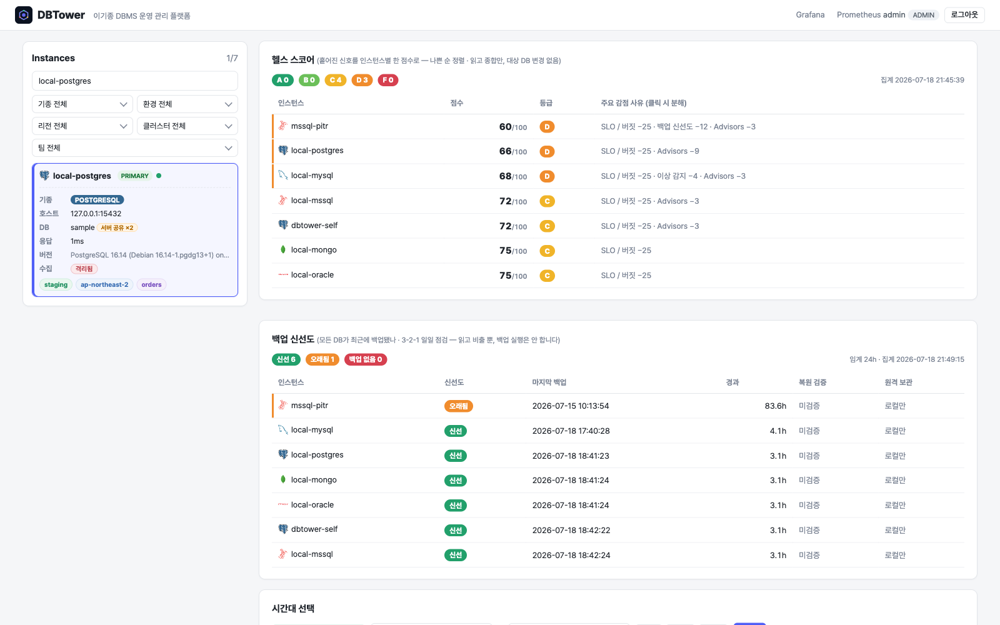
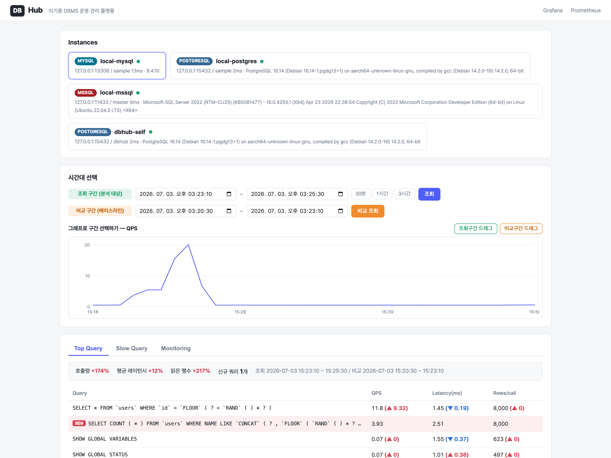
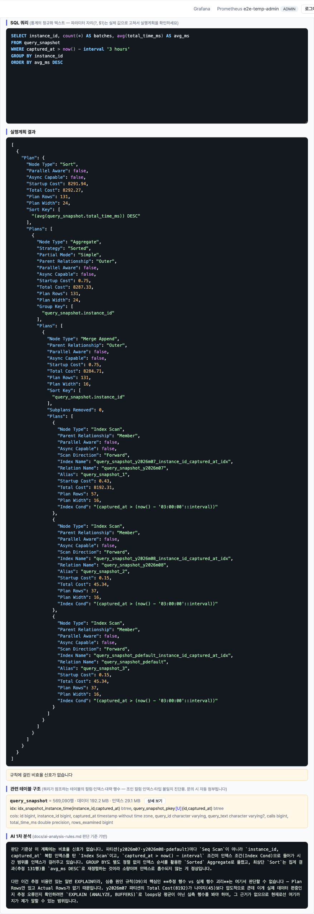
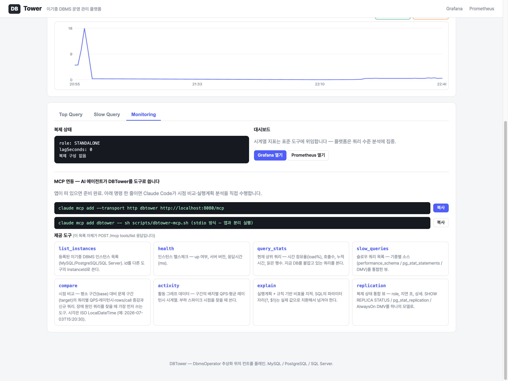
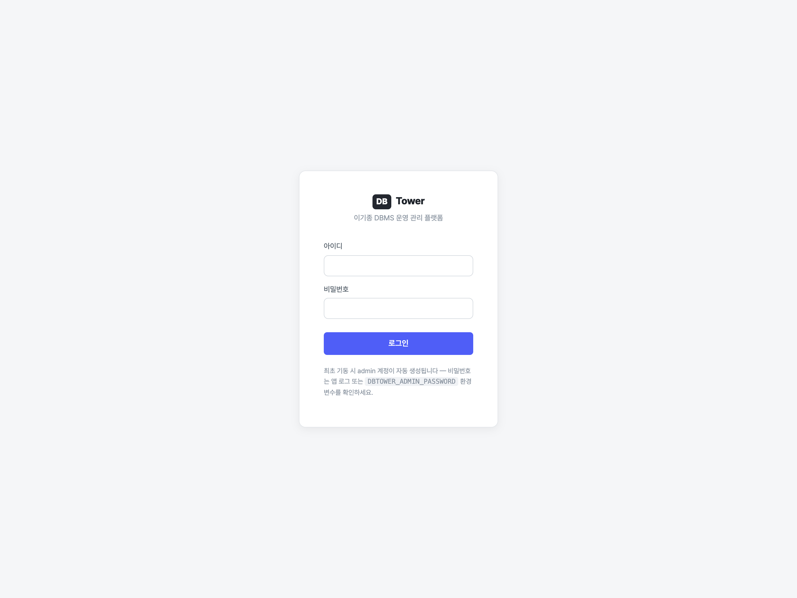

# DBTower — 이기종 DBMS 운영 관리 플랫폼

[](https://github.com/dj258255/dbtower/actions/workflows/ci.yml)

MySQL / PostgreSQL / SQL Server / Oracle / MongoDB를 하나의 인터페이스(`DbmsOperator`) 뒤에
등록하고, 모니터링 -> 시점 비교 -> 실행계획 분석 -> 회귀 자동 감지 -> 알림까지 한 곳에서
처리하는 컨트롤 플레인(관제탑)입니다. Java 21 + Spring Boot 4.

같은 "쿼리 통계"와 "백업"이라도 기종마다 소스와 실행 방식이 전부 다릅니다:

| | 쿼리 통계 소스 | 실행계획 | 백업 실행 모델 |
|---|---|---|---|
| MySQL | performance_schema | EXPLAIN FORMAT=JSON | 외부 CLI(mysqldump) + 비밀번호는 env |
| PostgreSQL | pg_stat_statements | EXPLAIN (FORMAT TEXT) | 외부 CLI(pg_dump) + 비밀번호는 env |
| SQL Server | DMV(dm_exec_query_stats) | 플랜 캐시 XML | 서버 사이드 SQL(BACKUP DATABASE) |
| Oracle | V$SQL | DBMS_XPLAN 텍스트 표 | 서버 사이드 API(DBMS_DATAPUMP) |
| MongoDB | system.profile | explain 명령의 JSON | 외부 CLI(mongodump) + 비밀번호는 stdin |

DBTower는 이 차이를 인터페이스 뒤로 숨겨, 플랫폼 코드와 사용자는 추상화된 정책만 다룹니다.



## 왜 만들었나

DB 이슈가 나면 개발자는 지표가 흩어진 여러 도구를 오가다 결국 DBA에게 문의하게 되고,
DBA는 같은 질문에 반복해서 답하게 됩니다. 정형화된 운영 작업을 플랫폼으로 자동화하면
관리 대상 DB가 늘어도 필요한 사람 손이 선형으로 늘지 않습니다(DBRE).
당근 KDMS 등 사내 DB 플랫폼 사례의 문제 정의를 출발점으로, 핵심 메커니즘을 직접 구현했습니다.

## 무엇이 되나

| 기능 | 설명 |
|---|---|
| 이기종 등록 | 인스턴스를 등록하면 기종에 맞는 Operator가 연결 (등록 시 접속 검증) |
| 통합 쿼리 통계 | 기종별 통계 소스를 하나의 API로 — load%(시간 점유율)·호출수·읽은 행수 |
| 시점 비교 | 평소 구간 vs 문제 구간의 쿼리별 QPS·레이턴시·rows/call 증감 + 신규 쿼리 감지 |
| 실행계획 분석 | EXPLAIN + 기종별 비효율 판단 규칙 자동 지적 (규칙마다 근거·예외 문서화) |
| AI 1차 분석 | 판단 기준 문서를 프롬프트로 쓰는 일관 판정 — API 키 또는 claude CLI 자동 선택 |
| 회귀 자동 감지 | 신규 쿼리·QPS 급증·레이턴시 회귀·rows/call 폭증을 폴러가 잡아 Discord/Slack 웹훅 |
| 백업 정책 | "30분 주기 전체 백업" 같은 추상 정책을 기종별 실행 방식으로 번역 |
| 통합 모니터링 | Prometheus + Grafana + 복제 상태 통합 뷰 |
| 웹 콘솔 | 활동 그래프 드래그로 구간 선택 -> 증감 표 -> 클릭 한 번에 EXPLAIN + AI 분석 |
| MCP 서버 | AI 에이전트가 위 기능들을 도구로 직접 사용 (stdio / HTTP) |

### 확장성 증명 — 새 기종 추가 = 구현체 1개

3기종으로 만들었던 플랫폼에 Oracle과 MongoDB를 추가하면서 실측했습니다
([VERIFICATION 18절](docs/VERIFICATION.md)). 새로 만든 것은 Operator 구현체와
클라이언트 캐시뿐이고, 기존 코드 수정은 enum 값과 팩토리 case 등 몇 줄이 전부입니다.
스냅샷 수집·시점 비교·회귀 감지·웹 콘솔·MCP는 **0줄 수정**으로 5기종을 처리합니다.

특히 MongoDB는 SQL도 JDBC도 없는 기종입니다. explain 입력이 SQL 대신 명령 JSON이고
통계 소스가 시스템 뷰가 아니라 프로파일러 컬렉션이어도, `DbmsOperator` 인터페이스가
그 차이를 흡수합니다 — 추상화 경계가 SQL이 아니라 "운영 행위"에 그어져 있기 때문입니다.

### 시점 비교 — 장애 원인 쿼리를 찾는 핵심 기능

상위 쿼리 목록만으로는 원인을 못 찾습니다. 평소에도 높던 쿼리일 수 있고, 낮던 쿼리가
튄 것일 수 있고, 새로 유입된 쿼리일 수도 있기 때문입니다. 그래서 두 구간을 쿼리 단위로
비교합니다 — 누적 카운터 스냅샷의 구간 차분, QPS 정규화, 신규 쿼리 표시.



부하 실측: 베이스라인 대비 급증 구간에서 호출량 +461%, 읽은 행수 +852%,
신규 LIKE 풀스캔 쿼리 1건이 NEW로 잡힙니다.

### 실행계획 + AI 1차 분석

쿼리를 클릭하면 해당 DB에 접속해 EXPLAIN을 실행하고, 기종별 규칙(access_type=ALL,
Seq Scan, Clustered Index Scan, TABLE ACCESS FULL, COLLSCAN 등)으로 비효율 신호를
지적합니다. AI 분석은 [판단 기준 문서](docs/ai-analysis-rules.md)를 시스템 프롬프트로 넣어
같은 입력에 일관된 판정이 나오게 하고, 근거가 없으면 모른다고 답하게 합니다.



### MCP — AI 에이전트의 채널

웹 콘솔이 사람의 채널이라면 MCP는 AI 에이전트의 채널입니다. 회귀 감지가 push(플랫폼이
사람에게 민다)라면 MCP는 pull(에이전트가 필요할 때 당겨쓴다) — 같은 코어를 채널만 바꿔
노출합니다. JSON-RPC 2.0을 직접 구현했고 stdio/HTTP 두 전송이 프로토콜 코어를 공유합니다.

```bash
claude mcp add --transport http dbtower http://localhost:8080/mcp
```



## 보안 — 사람은 세션, 기계는 토큰

DB 접속정보를 다루는 관리 도구라 인증 없이는 운영에 못 들어갑니다 (Phase A1):

- **사람**: 폼 로그인(BCrypt) + CSRF 쿠키 패턴. 역할 2개 — 진단(조회·EXPLAIN)은 VIEWER부터,
  대상 DB를 바꾸는 행위(등록/삭제/백업)는 ADMIN만
- **기계(MCP·자동화)**: Bearer 서비스 토큰. 미설정 시 기동마다 랜덤 생성(fail-closed) —
  ADMIN이 로그인하면 MCP 카드가 토큰 포함 등록 명령을 완성해 줍니다
- 최초 기동 시 admin 계정 자동 생성 — 비밀번호는 `DBTOWER_ADMIN_PASSWORD` 또는 로그의 랜덤값



## 아키텍처 경계는 빌드가 지킨다 (Spring Modulith)

패키지 = 모듈(8개: registry·operator·insight·alert·analysis·backup·mcp·security)로 선언하고,
모듈 간 순환 의존을 테스트(ModularityTests)가 빌드에서 실패시킵니다. 도입 첫 실행에서
실제로 순환 2개(registry<->operator, insight<->alert)를 잡아 의존 역전으로 해소했습니다 —
과정은 [VERIFICATION 20절](docs/VERIFICATION.md), 모듈 다이어그램은 [docs/modules/](docs/modules/).

## 기존 모니터링 스택과의 관계

exporter + Prometheus + Grafana(또는 Telegraf + InfluxDB + Grafana)는 이미 검증된
메트릭 모니터링 스택이고, DBTower도 그 층을 직접 만들지 않고 **그대로 씁니다** —
docker compose에 mysqld-exporter/postgres-exporter/Prometheus/Grafana가 포함되어 있고
DBTower 자신의 지표도 /actuator/prometheus로 같은 스택에 노출합니다.

DBTower가 맡는 것은 그 위의 다른 층입니다:

- **메트릭 스택이 답하는 질문**: "CPU가 언제 튀었나, 커넥션이 몇 개인가" — 인스턴스 수준 시계열
- **DBTower가 답하는 질문**: "그 시각에 어떤 쿼리가 원인이고, 실행계획이 왜 나쁘고,
  무엇을 해야 하나" — 쿼리 수준 진단과 조치(EXPLAIN·백업·비교), 그리고 그 행위의 채널화(웹/MCP/웹훅)

같은 구분이 상용 서비스에도 있습니다. AWS는 인프라 메트릭(CloudWatch) 위에 쿼리 수준
분석([RDS Performance Insights](https://aws.amazon.com/rds/performance-insights/))을 별도
층으로 얹고, 당근 KDMS도 사내에서 같은 층을 직접 만들었습니다. 또 pg_stat_statements의
대표적 한계가 "리셋 이후 누적치만 있고 시간 구간별 조회가 안 된다"는 것인데
([Percona의 pg_stat_monitor가 이걸 버킷팅으로 푼 이유](https://www.percona.com/blog/grafana-dashboards-implementing-the-postgresql-extension-pg_stat_monitor/)),
DBTower의 스냅샷 + 구간 차분(시점 비교)이 정확히 이 한계를 겨냥합니다.

## 성능 개선 기록 (전부 실측, 재현 로그: [VERIFICATION.md](docs/VERIFICATION.md))

| # | 문제 | 개선 | 실측 |
|---|---|---|---|
| 1 | 수집마다 새 커넥션 | 인스턴스별 HikariCP 풀 | 수집 47.1 -> 11.8ms (4.0배) |
| 2 | JPA saveAll 행별 INSERT | JDBC batchUpdate + reWriteBatchedInserts | 행당 1.51 -> 0.11ms (13.8배) |
| 3 | 스냅샷 조회 Seq Scan | 복합 인덱스 (등치 컬럼 선두) | 50만 행 21.269 -> 0.062ms (343배) |
| 4 | 긴 쿼리 digest 병합 | max_digest_length 1024 -> 4096 | side-by-side 재현·해소 |
| 5 | 전체 부하 검증 | k6 10 VU 30s | 2,832 req/s, P95 5.86ms, 실패 0 |

3번은 도그푸딩입니다 — DBTower 자신을 관리 대상으로 등록하고, DBTower의 explain API로
자기 쿼리의 풀스캔을 진단해 고쳤습니다.

## 실행

```bash
docker compose up -d                     # 관리 대상 DB 5종 + Prometheus/Grafana
DBTOWER_WEBHOOK_URL="" DBTOWER_ADMIN_PASSWORD=devpass ./gradlew bootRun
open http://localhost:8080               # 웹 콘솔 -> admin / devpass 로그인
```

인스턴스 등록 (API — 웹 콘솔은 조회·진단 전용):

```bash
curl -X POST localhost:8080/api/instances -H 'Content-Type: application/json' -d '{
  "name": "local-mysql", "type": "MYSQL",
  "host": "127.0.0.1", "port": 13306, "dbName": "sample",
  "username": "root", "password": "dbtower1234"
}'
# type: MYSQL | POSTGRESQL | MSSQL | ORACLE | MONGODB
# Oracle은 dbName에 서비스명(FREEPDB1), MongoDB는 admin 인증 계정 사용 — docker/ 시드 참고
```

주요 API:

```
GET  /api/instances                     등록 목록
GET  /api/instances/{id}/health         헬스체크 (버전·응답시간)
GET  /api/instances/{id}/query-stats    쿼리별 통계 상위 N (load% 랭킹)
GET  /api/instances/{id}/slow-queries   슬로우 쿼리 상위 N
GET  /api/instances/{id}/table-stats    테이블/컬렉션 크기 상위 N
GET  /api/instances/{id}/compare        시점 비교 (base 구간 vs target 구간)
GET  /api/instances/{id}/activity       활동 그래프 시계열 (QPS·평균 레이턴시)
POST /api/instances/{id}/explain        실행계획 + 규칙 기반 비효율 지적
POST /api/instances/{id}/ai-analysis    실행계획 + 규칙 + AI 1차 분석
POST /api/instances/{id}/backup         즉시 백업 (기종별 실행 방식으로 번역)
GET  /api/instances/{id}/replication    복제 상태 통합 뷰
POST /mcp                                MCP (Streamable HTTP)
```

## 문서

- [PRESENTATION.md](docs/PRESENTATION.md) — 문제 정의부터 설계·실측·교훈까지 전체 서사
- [DESIGN.md](docs/DESIGN.md) — 인터페이스 경계, 시점 비교 데이터 모델
- [VERIFICATION.md](docs/VERIFICATION.md) — 18개 절의 실측 기록 (명령·출력·스크린샷)
- [ai-analysis-rules.md](docs/ai-analysis-rules.md) — 기종별 실행계획 판단 규칙: 근거와 예외
- [operations.md](docs/operations.md) — 운영 규칙: 통계 소스의 함정과 대응 (digest 포화·PS 가시성·AAS)
- [ROADMAP.md](docs/ROADMAP.md) — 완료 단계와 3단계 구현 로드맵(운영 안전 -> DBA 진단 심화 -> 프로비저닝 연동)

## 기술 선택 근거 (요약)

- **Operator 계층은 JPA가 아니라 JDBC 직접** — 세 가지 이유. (1) 대상이 런타임에 등록되는
  N개의 동적 데이터소스라 부팅 시점에 고정되는 EntityManager와 맞지 않고, (2) 조회 대상이
  performance_schema·DMV·V$SQL 같은 시스템 뷰라 매핑할 엔티티도 생명주기도 없으며,
  (3) EXPLAIN PLAN FOR·BACKUP DATABASE·DBMS_DATAPUMP는 ORM의 영역이 아닌 관리 명령이기
  때문. 인젝션 방어는 API 선택이 아니라 바인딩의 문제라 JDBC에서도 동일하다 — 값은 전부
  PreparedStatement 바인드, 식별자는 이스케이프 + 등록 시 패턴 검증, explain은 읽기 전용
  allowlist. 플랫폼 자기 메타데이터(인스턴스·스냅샷)는 JPA, 스냅샷 대량 쓰기는 JDBC batch
  (실측 13.8배) — 적재적소
- **Lombok 미사용** — 값 객체는 전부 Java 21 record. JPA 엔티티에 @Data/@ToString은
  lazy 연관관계 지뢰라 명시적 코드를 유지
- **프론트는 의존성 0 정적 SPA** — 백엔드가 본질. java -jar 하나로 API부터 Web까지
- **AI는 판단자가 아니라 1차 분석기** — 판단 기준은 사람이 문서로 정하고, AI는 그 위에서만 판정
