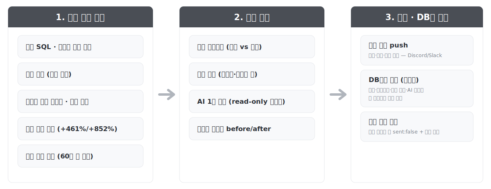
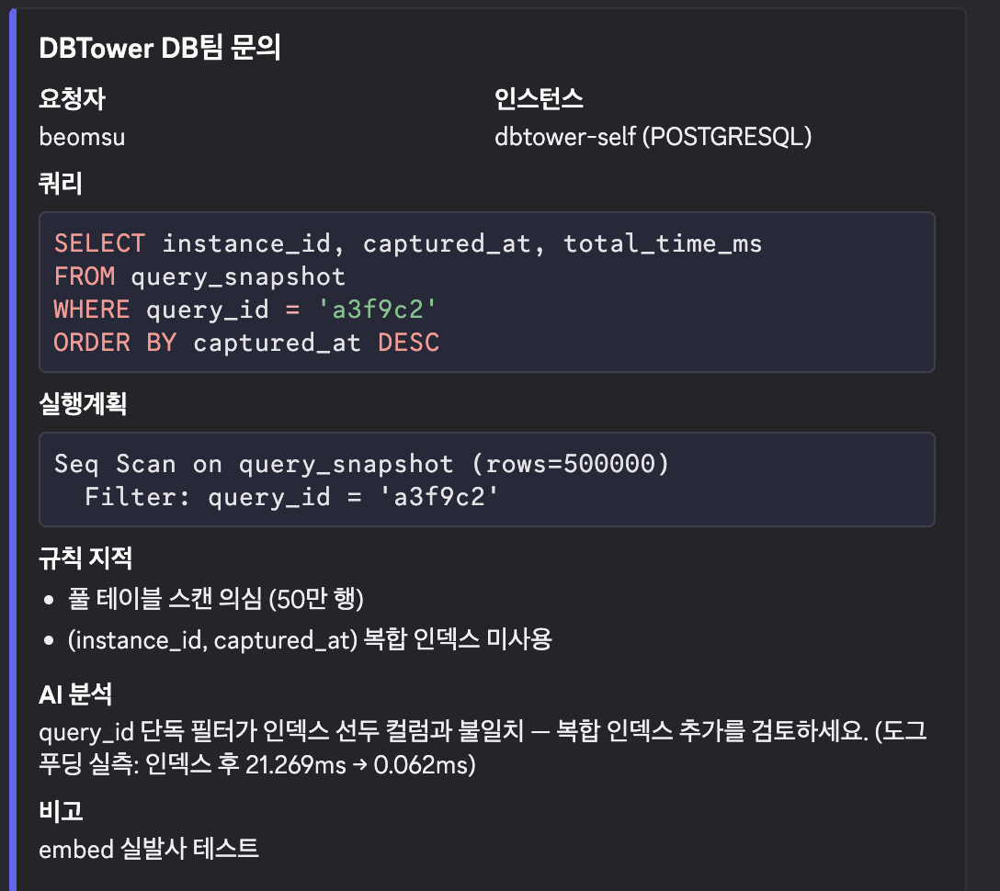
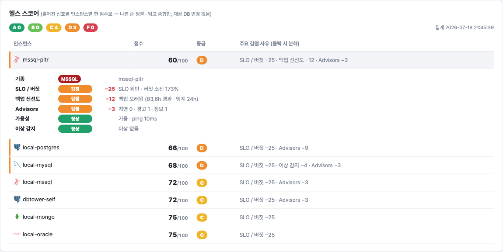
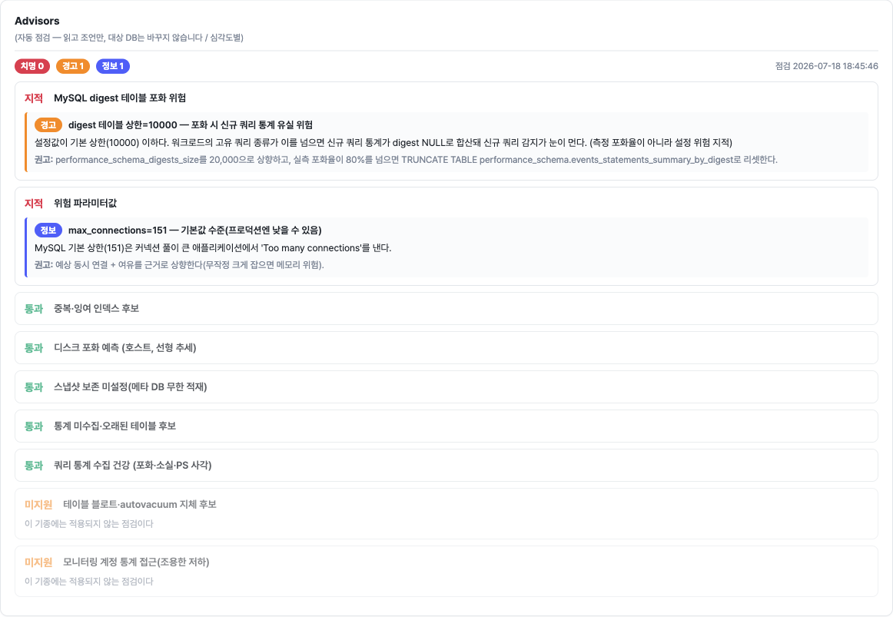
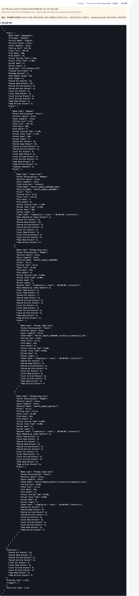
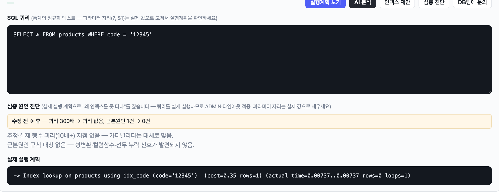
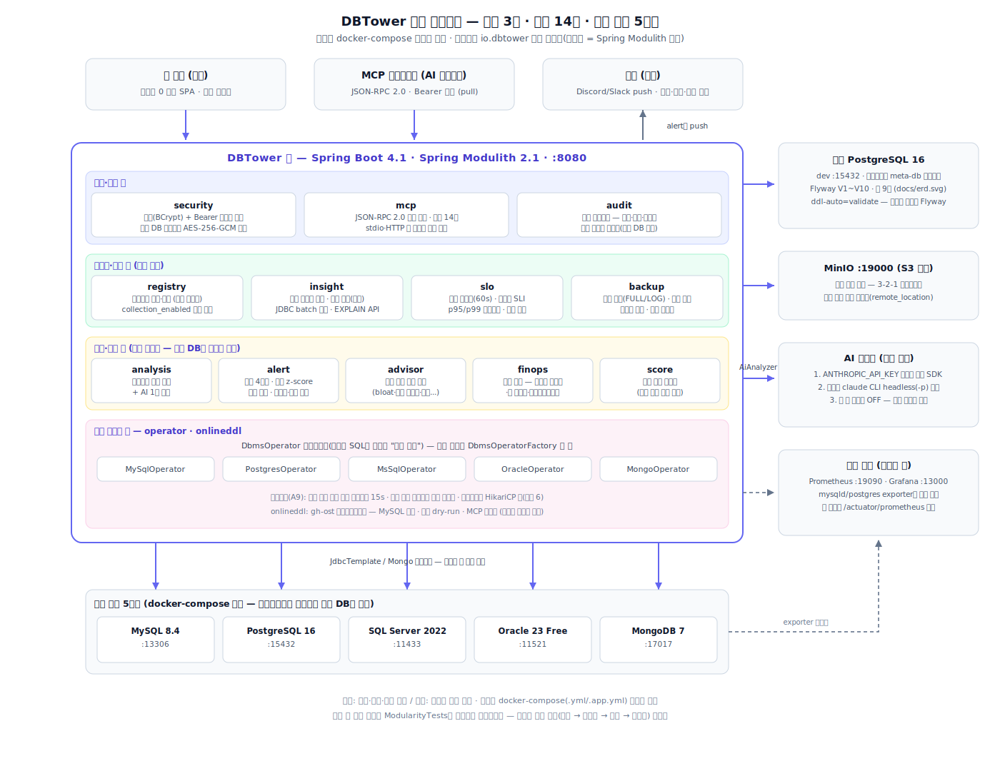
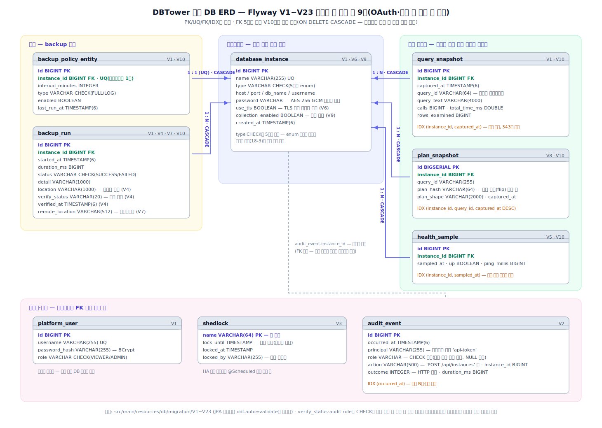

#  DBTower — 이기종 DBMS 운영 관리 플랫폼

[](https://github.com/dj258255/dbtower/actions/workflows/ci.yml)

MySQL / PostgreSQL / SQL Server / Oracle / MongoDB를 하나의 인터페이스(`DbmsOperator`) 뒤에
등록하고, 모니터링 -> 시점 비교 -> 실행계획 분석 -> 회귀 자동 감지 -> 알림, 나아가 이상 자동 감지 ->
통합 헬스 스코어 -> 심층 원인 진단(왜 인덱스를 못 타나)까지 한 곳에서 처리하는
컨트롤 플레인(관제탑)입니다. Java 21 + Spring Boot 4.

같은 "쿼리 통계"와 "백업"이라도 기종마다 소스와 실행 방식이 전부 다릅니다:

| | 쿼리 통계 소스 | 실행계획 | 백업 실행 모델 |
|---|---|---|---|
| MySQL | performance_schema | EXPLAIN FORMAT=JSON | 외부 CLI(mysqldump) + 비밀번호는 env |
| PostgreSQL | pg_stat_statements | EXPLAIN (FORMAT TEXT) | 외부 CLI(pg_dump) + 비밀번호는 env |
| SQL Server | DMV(dm_exec_query_stats) | 플랜 캐시 XML | 서버 사이드 SQL(BACKUP DATABASE) |
| Oracle | V$SQL | DBMS_XPLAN 텍스트 표 | 서버 사이드 API(DBMS_DATAPUMP) |
| MongoDB | system.profile | explain 명령의 JSON | 외부 CLI(mongodump) + 비밀번호는 stdin |

DBTower는 이 차이를 인터페이스 뒤로 숨겨, 플랫폼 코드와 사용자는 추상화된 정책만 다룹니다.


## 왜 만들었나

DB 이슈가 나면 개발자는 지표가 흩어진 여러 도구를 오가다 결국 DBA에게 문의하게 되고,
DBA는 같은 질문에 반복해서 답하게 됩니다. 정형화된 운영 작업을 플랫폼으로 자동화하면
관리 대상 DB가 늘어도 필요한 사람 손이 선형으로 늘지 않습니다(DBRE).
레퍼런스 등 사내 DB 플랫폼 사례의 문제 정의를 출발점으로, 핵심 메커니즘을 직접 구현했습니다.

## 무엇이 되나

| 기능 | 설명 |
|---|---|
| 이기종 등록 | 인스턴스를 등록하면 기종에 맞는 Operator가 연결 (등록 시 접속 검증) |
| 통합 쿼리 통계 | 기종별 통계 소스를 하나의 API로 — load%(시간 점유율)·호출수·읽은 행수 |
| 시점 비교 | 평소 구간 vs 문제 구간의 쿼리별 QPS·레이턴시·rows/call 증감 + 신규 쿼리 감지 |
| 실행계획 분석 | EXPLAIN + 기종별 비효율 판단 규칙 자동 지적 (규칙마다 근거·예외 문서화) |
| AI 1차 분석 | 판단 기준 문서를 프롬프트로 쓰는 일관 판정 — API 키 또는 claude CLI 자동 선택 |
| 회귀 자동 감지 | 신규 쿼리·QPS 급증·레이턴시 회귀·rows/call 폭증을 폴러가 잡아 Discord/Slack 웹훅 — Discord는 리치 embed(맥락·AI 분석·진단 딥링크 구조화), Slack·미설정은 텍스트 폴백 |
| 플랜 변경 감지 | "쿼리는 그대로인데 느려짐 = 옵티마이저가 플랜을 갈아탐"을 5기종에서 확인 — 회귀 쿼리만 계획 shape 비교(PG GENERIC_PLAN·MySQL 샘플·MSSQL Query Store·Oracle plan_hash_value·Mongo profile) |
| 복제 슬롯 감시 | 비활성 슬롯이 WAL을 무한 보존해 디스크를 채우는 사각을 잡는다(PG) — pg_stat_replication이 못 보는 lost/unreserved/보존량 |
| 백업 정책 | "30분 주기 전체 백업" 같은 추상 정책을 기종별 실행 방식으로 번역 + S3 호환 원격 보관(3-2-1 오프사이트) |
| 통합 모니터링 | CPU·Connections 그래프 내장(Prometheus exporter 직접 조회, 미수집 사유 정직 표기) + Grafana 연동 + 복제 상태 통합 뷰 |
| 웹 콘솔 | QPS·CPU 그래프 드래그로 구간 선택 -> 증감 표 -> 클릭 한 번에 EXPLAIN + AI 분석 |
| 테이블 상세 | CREATE TABLE 전문·크기 통계·인덱스 카디널리티(5기종) — DDL 출처를 NATIVE/재구성으로 정직 구분, PG는 FK·CHECK까지 재조립 |
| MCP 서버 | AI 에이전트가 위 기능들을 도구로 직접 사용 (stdio / HTTP) |
| Wait Event 분석 | 그 시간에 무엇을 기다렸나(CPU/IO/Lock) — 5기종 통합, load%와 짝 |
| 세션·블로킹 | 활성 세션과 블로킹 트리 조회, 세션 종료(ADMIN) — PG는 cancel/terminate 구분 |
| 인덱스 어드바이저 | HypoPG 가상 인덱스로 생성 전 비용 비교(PG), 타 기종은 UNSUPPORTED 정직 표기 |
| 온라인 DDL | gh-ost 연동(MySQL) — 기본 dry-run, 실행은 ADMIN + execute 명시 |
| 드리프트 감지 | 파라미터 diff·Schema Diff — "같아야 할 두 인스턴스가 어디부터 다른가" |
| 이상 자동 감지 | (요일x시간대) 동적 베이스라인 z-score — 고정 임계 없이 "평소와 다름"을 감지 |
| Advisors | 운영 모범규칙 자동 점검(백업 없음·복제 미구성·통계 노후 등) — 근거 문서 링크 |
| 자연어 진단 | "이 DB 왜 느려?" -> AI가 read-only 도구 화이트리스트를 자동 연쇄 호출해 답변 |
| 레이턴시 p95/p99 | 기종별 원자료 차이를 source로 구분 — MySQL 구간(히스토그램 차분)·Mongo 히스토그램(프로파일러 무관)·PG/MSSQL 추정·Oracle 미지원. 값이 아니라 신뢰 등급을 표기 |
| 데드락 감지 | DB가 남긴 흔적을 설정 변경 0으로 — MSSQL system_health XE·MySQL INNODB STATUS(victim·문장·리소스), PG는 카운터 델타 알림 |
| 스케일 제어 | 수집 병렬화(워커 풀)·스케줄러 풀 분리·알림 폭주 제어(분당 상한+묶음 요약)·인스턴스 수집 격리 토글·헬스 스코어 캐시 |
| SLO / 에러 버짓 | p95 기반 SLI·가용성·번 레이트 — Google SRE 모델을 DB 운영에 적용 |
| FinOps 신호 | 미사용·중복 인덱스 실측 신호 (금액 추정은 지어내지 않고 신호만) |
| 데이터 마스킹 | 외부(웹훅·MCP)로 나가는 SQL의 리터럴만 ?로 — 식별자·구조는 보존(진단력 유지), AI 프롬프트는 선택 토글 |
| 수집 건강 점검 | "수집이 조용히 거짓말하는" 사각 실측 — MySQL digest 포화·소실, PS 익명 부하, PG evict. 조치는 명령 안내까지만 |
| 팀 라벨·딥링크 | 인스턴스별 담당 팀 배지 + 콘솔 링크(PI·Grafana 등 자유 URL), 알림에 진단 딥링크(질문 프리필) |
| 팀 스코핑(LBAC) | 팀 사용자는 자기 팀 + 전역 인스턴스만 — 강제는 단일 경계(RegistryService), 스코프 밖은 404(존재 노출 방지) |
| 공유 세션 | 세션을 메타 DB에 저장(spring-session-jdbc) — 재시작·다중 노드에서 로그인 생존 |
| MCP OAuth 로그인 | MCP 클라이언트가 정적 토큰 대신 브라우저 로그인으로 토큰 자동 발급 — OAuth 2.1(PKCE·동적 등록·refresh), 기존 로그인 재사용 |
| Discord 봇 진단 | 알림 메시지에 돋보기 이모지를 달면 그 인스턴스를 AI가 진단해 답글 — 발사 시점 message_id 매핑으로 특권 인텐트 0개, 슬래시 커맨드(Ed25519 서명 검증) 병행, 채널·유저 화이트리스트 기본 거부 |
| 로그 백업·PITR | 5기종 로그 백업(binlog·WAL·BACKUP LOG·oplog ts 증분·아카이브) + 물리 앵커(pg_basebackup·XtraBackup·RMAN) + pg_receivewal 상시 스트리밍(복제 슬롯·자동 재시작) + 복원 가능 창·문안 생성, MSSQL·PG 실복원 e2e |
| 백업 암호화 | 백업 산출물 AES-256-GCM 스트리밍 암호화 — 복원 검증이 GCM 태그로 변조까지 잡는다(키 없이는 원격 보관소가 뚫려도 데이터 무의미) |
| Vault 동적 자격증명 | 대상 DB 계정을 Vault가 TTL로 발급·자동 갱신(username `vault:` 접두) — 유출 창이 "발각부터 수동 회전까지"에서 TTL로 줄어든다 |
| 디스크 포화 예측 | "지금 여유"가 아니라 "이 속도면 며칠 뒤 차는가" — 선형 추세 ETA(3일 치명/14일 경고), 소스 추상화: Prometheus(node_exporter) 또는 CloudWatch(RDS), 인스턴스-노드 매핑(nodeFilter) |
| 서버 공유 인지 | 같은 host:port의 DB 묶음 — 서버 전역 경보(세션·복제·데드락)는 그룹당 1회+공유 명시, 위험 귀속(점수)은 각자 유지 |
| 수평 확장 | 수집 샤딩(샤드별 분산 락 — 노드 여럿이면 나눠 들고 한 노드면 전 샤드 인수), 공유 세션·분산 로그인 잠금(노드를 오간 실패도 하나의 임계) |
| 메타DB 자기 관리 | 최대 볼륨 테이블 월별 파티셔닝 — 보존 정리 DELETE 1.9초 → DROP 12.8ms(블로트 0), 커넥션 온디맨드(격리 대상 유휴 커넥션 0 수렴) |
| 백업 신선도 | 마지막 성공 백업 경과 시간 FRESH/STALE/NO_BACKUP — 3-2-1 원칙의 감시 축 |
| 통합 헬스 스코어 | 흩어진 신호를 인스턴스별 0~100 + 등급으로 합산, 나쁜 순 정렬 — 아침 첫 화면 |
| 심층 원인 진단 | EXPLAIN ANALYZE 실제 실행 계획으로 추정 vs 실제 괴리 -> 근본 원인 5종 지목 |
| 운영 안전 | 인증·RBAC, 비밀번호 암호화, 감사 로그, 스키마 마이그레이션, HA 분산 락, 백업 복원 검증 |
| 분석 보호장치 | 모든 대상 DB 조회에 쿼리 타임아웃 + 수집 폴러 지수 백오프 — 진단이 부하 유발자가 되지 않게 |
| 감사 로그 검색 | 사용자·action·결과·기간 동적 필터 (Spring Data Specification) |
| 프로비저닝 연동 | K8s(CloudNativePG)·Terraform·Ansible로 생성한 DB를 멱등 PUT으로 자동 등록 |

<details>
<summary><b>DB팀 문의 — 진단 결과를 원클릭으로 웹훅 채널에</b> (Discord embed 실물)</summary>

웹 콘솔의 "DB팀에 문의" 버튼은 현재 패널의 쿼리·실행계획·규칙 지적·AI 분석을 embed 카드 한 장으로 묶어 보낸다.
자동 경보가 "플랫폼이 사람에게 미는 push"라면, 문의는 방향은 같되 트리거가 사람인 push라 같은 웹훅 어댑터를 재사용한다.





</details>

### DBA 운영 직무 지도 — 하는 것, 위임하는 것, 안 하는 것

DBMS 운영(설치·패치·장애조치·백업/복구·오브젝트·용량)의 전통적 직무 축에 DBTower를 대면:

| 직무 축 | DBTower가 하는 것 | 위임/범위 밖 (이유) |
|---|---|---|
| 설치·프로비저닝 | 생성 즉시 멱등 PUT으로 관제 편입 — K8s(CloudNativePG)·Ansible·Terraform 연동 e2e | 생성 자체는 Operator/IaC 몫 — 이미 잘 푼 문제를 다시 풀지 않음 |
| 패치·업그레이드 | 버전 가시화(health), 패치 전후 검증 — 파라미터 드리프트·Schema Diff로 형상 변화, 시점 비교로 성능 회귀 확인 | 엔진 패치 실행은 범위 밖 — 대상을 바꾸는 행위이자 플랫폼별 도구(Operator 롤링·RDS 유지관리)의 영역 |
| 장애조치 | 감지(헬스 스코어 down 수렴·이상 감지·웹훅)부터 원인(Wait Event·블로킹 트리·심층 진단)과 수동 개입(세션 kill, ADMIN)까지 | 자동 페일오버는 안 함 — HA 토폴로지 소유자(Operator/managed)의 일. 관제 도구가 개입하면 스플릿 브레인 위험 |
| 백업·복구 | 추상 정책 → 기종별 실행, 즉시 백업, **복원 검증 3값**(테스트 안 한 백업은 백업이 아니다), S3 호환 원격 보관(오프사이트 — 업로드 실패는 백업 실패가 아니라 별개 사실로 기록), 신선도 감시 — 3-2-1 완성 | — |
| 오브젝트 관리 | 스키마·파티션·인덱스 사용 통계 조회, Schema Diff, 인덱스 어드바이저(가상 인덱스), 온라인 DDL(gh-ost, 기본 dry-run) | 자동 인덱스 생성·파티션 자동 관리는 범위 밖 — 조회·조언까지가 정체성 |
| 용량 관리 | 테이블/컬렉션 크기 상위, 오버프로비저닝 신호(FinOps), 메타 DB 자체 보존 정책(7일) | OS/디스크 사용률 시계열은 메트릭 층(exporter+Prometheus) 위임 — 아래 "기존 모니터링 스택과의 관계" |
| 계정·권한 | 기종별 최소 권한 모니터링 계정 실측 가이드, Ansible 플레이북이 계정 생성까지 | 대상 DB 계정 CRUD UI는 안 함 — 대상을 바꾸는 행위 최소화 |
| 모니터링·튜닝 | 본진 — 쿼리 통계(load%)·시점 비교·Wait Event·실행계획+AI·심층 원인 진단·SLO·자율 감시 | — |

원칙은 하나입니다: **읽고 판단하는 것은 깊게, 대상을 바꾸는 것은 최소한으로(전부 ADMIN 경계),
바꾸는 주체가 따로 있는 일은 그 주체와 잇는다.**

### 확장성 증명 — 새 기종 추가 = 구현체 1개

3기종으로 만들었던 플랫폼에 Oracle과 MongoDB를 추가하면서 실측했습니다
([VERIFICATION 18절](docs/VERIFICATION.md)). 새로 만든 것은 Operator 구현체와
클라이언트 캐시뿐이고, 기존 코드 수정은 enum 값과 팩토리 case 등 몇 줄이 전부입니다.
스냅샷 수집·시점 비교·회귀 감지·웹 콘솔·MCP는 **0줄 수정**으로 5기종을 처리합니다.

특히 MongoDB는 SQL도 JDBC도 없는 기종입니다. explain 입력이 SQL 대신 명령 JSON이고
통계 소스가 시스템 뷰가 아니라 프로파일러 컬렉션이어도, `DbmsOperator` 인터페이스가
그 차이를 흡수합니다 — 추상화 경계가 SQL이 아니라 "운영 행위"에 그어져 있기 때문입니다.

### 시점 비교 — 장애 원인 쿼리를 찾는 핵심 기능

상위 쿼리 목록만으로는 원인을 못 찾습니다. 평소에도 높던 쿼리일 수 있고, 낮던 쿼리가
튄 것일 수 있고, 새로 유입된 쿼리일 수도 있기 때문입니다. 그래서 두 구간을 쿼리 단위로
비교합니다 — 누적 카운터 스냅샷의 구간 차분, QPS 정규화, 신규 쿼리 표시.


부하 실측: 베이스라인 대비 급증 구간에서 호출량 +461%, 읽은 행수 +852%,
신규 LIKE 풀스캔 쿼리 1건이 NEW로 잡힙니다.

### 실행계획 + AI 1차 분석

쿼리를 클릭하면 해당 DB에 접속해 EXPLAIN을 실행하고, 기종별 규칙(access_type=ALL,
Seq Scan, Clustered Index Scan, TABLE ACCESS FULL, COLLSCAN 등)으로 비효율 신호를
지적합니다. AI 분석은 [판단 기준 문서](docs/ai-analysis-rules.md)를 시스템 프롬프트로 넣어
같은 입력에 일관된 판정이 나오게 하고, 근거가 없으면 모른다고 답하게 합니다.


### 자율 진단 — 사람이 보기 전에 플랫폼이 먼저 본다

흩어진 신호(헬스·이상 감지·Advisors·SLO·백업 신선도)를 인스턴스별 0~100점으로 합산해
나쁜 순으로 정렬합니다 — 대시보드가 아니라 "어디부터 볼지"를 알려주는 분류(triage) 큐입니다.



운영 규칙 자동 점검(Advisors)은 operations.md의 실측 규칙을 코드로 옮긴 것입니다.
기종에 적용 불가한 점검은 "미지원"으로 정직하게 표기합니다.



심층 원인 진단은 EXPLAIN(추정)이 아니라 실제 실행 계획으로 "왜 인덱스를 못 탔나"를 짚습니다 —
아래는 숫자 리터럴 하나가 암시적 형변환으로 인덱스를 무력화한 사례를 정확히 지목한 화면입니다.



처방을 말로만 하지 않습니다 — 기계적으로 안전한 수정(숫자 리터럴에 따옴표)이 가능한 경우
수정안 SQL을 함께 만들어, 버튼 한 번으로 재진단해 before/after를 비교합니다.



### MCP — AI 에이전트의 채널

웹 콘솔이 사람의 채널이라면 MCP는 AI 에이전트의 채널입니다. 회귀 감지가 push(플랫폼이
사람에게 민다)라면 MCP는 pull(에이전트가 필요할 때 당겨쓴다) — 같은 코어를 채널만 바꿔
노출합니다. JSON-RPC 2.0을 직접 구현했고 stdio/HTTP 두 전송이 프로토콜 코어를 공유합니다.

```bash
claude mcp add --transport http dbtower http://localhost:8080/mcp
```


## 보안 — 사람은 세션, 기계는 토큰

DB 접속정보를 다루는 관리 도구라 인증 없이는 운영에 못 들어갑니다 (Phase A1):

- **사람**: 폼 로그인(BCrypt) + CSRF 쿠키 패턴. 역할 2개 — 진단(조회·EXPLAIN)은 VIEWER부터,
  대상 DB를 바꾸는 행위(등록/삭제/백업)는 ADMIN만
- **기계(MCP·자동화)**: Bearer 서비스 토큰. 미설정 시 기동마다 랜덤 생성(fail-closed) —
  ADMIN이 로그인하면 MCP 카드가 토큰 포함 등록 명령을 완성해 줍니다
- 최초 기동 시 admin 계정 자동 생성 — 비밀번호는 `DBTOWER_ADMIN_PASSWORD` 또는 로그의 랜덤값


## 아키텍처 경계는 빌드가 지킨다 (Spring Modulith)

패키지 = 모듈(8개: registry·operator·insight·alert·analysis·backup·mcp·security)로 선언하고,
모듈 간 순환 의존을 테스트(ModularityTests)가 빌드에서 실패시킵니다. 도입 첫 실행에서
실제로 순환 2개(registry<->operator, insight<->alert)를 잡아 의존 역전으로 해소했습니다 —
과정은 [VERIFICATION 20절](docs/VERIFICATION.md), 모듈 다이어그램은 [docs/modules/](docs/modules/).
(모듈은 이후 페이즈에서 advisor·finops·score·slo·audit·onlineddl이 더해져 현재 14개입니다.)

### 상세 아키텍처

채널 3종부터 모듈 14개, 기종 어댑터, 외부 의존(메타 PG·MinIO·AI 백엔드·관측 스택)까지 —
실제 모듈명(io.dbtower 하위 패키지)과 docker-compose 포트 기준의 상세도입니다.



### 메타 DB ERD

메타 DB 스키마의 단일 권위는 Flyway 마이그레이션(V1~V10)입니다. 표 9개와 관계(FK 5개는 전부
V10에서 ON DELETE CASCADE로 일괄 추가 — 인스턴스 삭제 시 자식 데이터 자동 정리)를 정리했습니다.



## 기존 모니터링 스택과의 관계

exporter + Prometheus + Grafana(또는 Telegraf + InfluxDB + Grafana)는 이미 검증된
메트릭 모니터링 스택이고, DBTower도 그 층을 직접 만들지 않고 **그대로 씁니다** —
docker compose에 mysqld-exporter/postgres-exporter/Prometheus/Grafana가 포함되어 있고
DBTower 자신의 지표도 /actuator/prometheus로 같은 스택에 노출합니다.

DBTower가 맡는 것은 그 위의 다른 층입니다:

- **메트릭 스택이 답하는 질문**: "CPU가 언제 튀었나, 커넥션이 몇 개인가" — 인스턴스 수준 시계열
- **DBTower가 답하는 질문**: "그 시각에 어떤 쿼리가 원인이고, 실행계획이 왜 나쁘고,
  무엇을 해야 하나" — 쿼리 수준 진단과 조치(EXPLAIN·백업·비교), 그리고 그 행위의 채널화(웹/MCP/웹훅)

같은 구분이 상용 서비스에도 있습니다. AWS는 인프라 메트릭(CloudWatch) 위에 쿼리 수준
분석([RDS Performance Insights](https://aws.amazon.com/rds/performance-insights/))을 별도
층으로 얹고, 레퍼런스도 사내에서 같은 층을 직접 만들었습니다. 또 pg_stat_statements의
대표적 한계가 "리셋 이후 누적치만 있고 시간 구간별 조회가 안 된다"는 것인데
([Percona의 pg_stat_monitor가 이걸 버킷팅으로 푼 이유](https://www.percona.com/blog/grafana-dashboards-implementing-the-postgresql-extension-pg_stat_monitor/)),
DBTower의 스냅샷 + 구간 차분(시점 비교)이 정확히 이 한계를 겨냥합니다.

## 성능 개선 기록 (전부 실측, 재현 로그: [VERIFICATION.md](docs/VERIFICATION.md))

| # | 문제 | 개선 | 실측 |
|---|---|---|---|
| 1 | 수집마다 새 커넥션 | 인스턴스별 HikariCP 풀 | 수집 47.1 -> 11.8ms (4.0배) |
| 2 | JPA saveAll 행별 INSERT | JDBC batchUpdate + reWriteBatchedInserts | 행당 1.51 -> 0.11ms (13.8배) |
| 3 | 스냅샷 조회 Seq Scan | 복합 인덱스 (등치 컬럼 선두) | 50만 행 21.269 -> 0.062ms (343배) |
| 4 | 긴 쿼리 digest 병합 | max_digest_length 1024 -> 4096 | side-by-side 재현·해소 |
| 5 | 전체 부하 검증 | k6 10 VU 30s | 2,832 req/s, P95 5.86ms, 실패 0 |

3번은 도그푸딩입니다 — DBTower 자신을 관리 대상으로 등록하고, DBTower의 explain API로
자기 쿼리의 풀스캔을 진단해 고쳤습니다.

## 시스템 요구사항

| 항목 | 요구 |
|---|---|
| 실행(셀프호스트) | Docker + Docker Compose. 컨테이너가 JDK·백업 CLI를 모두 담고 있어 별도 설치 불필요 |
| 개발(소스 실행) | JDK 21, Docker(대상 DB·모니터링 스택 기동용) |
| 메모리 | 앱 컨테이너 기준 512MB~1GB 권장(`JAVA_OPTS`의 `-XX:MaxRAMPercentage`로 조절), 메타 DB 별도 |
| 메타 DB | PostgreSQL (compose가 전용 인스턴스를 띄움) |
| 관리 대상 DB(테스트된 버전) | MySQL 8.0+, PostgreSQL 13+, SQL Server 2019+, Oracle 19c/Free, MongoDB 6.0+ (docker/ 시드 기준) |
| 라이선스 | Apache-2.0 ([LICENSE](LICENSE), 번들 재배포 고지는 [NOTICE](NOTICE)) |

기여는 [CONTRIBUTING.md](CONTRIBUTING.md), 이슈·PR은 `.github/`의 템플릿을 참고하세요.

## 셀프호스트 (5분 시작)

Grafana/PMM처럼 자기 인프라에 직접 띄워 자기 DB를 붙이는 모델입니다. 관리 "도구"(앱 + 메타 DB)만
띄우고, 관리 "대상" DB는 웹 UI에서 등록합니다. 이미지에 mysqldump/pg_dump/mongodump가 번들되어
있어(배터리 포함) 백업까지 추가 설치 없이 동작합니다. TLS는 리버스 프록시(Caddy/nginx)가 종단하는
구성을 권장합니다 — 그때 `DBTOWER_COOKIE_SECURE=true`로 쿠키에 Secure 플래그를 켜세요.

```bash
cp .env.example .env                     # DBTOWER_DB_PASSWORD 등을 채운다
# 암호화 키 생성(등록 대상 DB 비밀번호를 이 키로 암호화 저장):
echo "DBTOWER_ENCRYPTION_KEY=$(openssl rand -base64 32)" >> .env

docker compose -f docker-compose.app.yml up -d   # 앱 + 전용 메타 DB
open http://localhost:8080   # admin / .env의 DBTOWER_ADMIN_PASSWORD (비웠다면 최초 기동 로그의 랜덤 비밀번호:
                             #   docker compose -f docker-compose.app.yml logs dbtower | grep 비밀번호)
```

이미지는 [GHCR](https://github.com/dj258255/dbtower/pkgs/container/dbtower)에서 pull하거나
(`ghcr.io/dj258255/dbtower:latest`), 위 compose가 `--build`로 로컬 빌드합니다. 릴리스는 `vX.Y.Z`
태그를 push하면 `release.yml` 워크플로가 이미지를 게시합니다. 버전별 변경은 [CHANGELOG.md](CHANGELOG.md) 참고.

> 5기종 데모 대상까지 한 번에 띄워 둘러보려면: `docker compose up -d`(대상 5종+모니터링)를 함께 쓰고
> 앱은 아래 "개발 모드"로 실행합니다.

## 개발 모드 (소스에서 실행)

```bash
docker compose up -d                     # 관리 대상 DB 5종 + Prometheus/Grafana
DBTOWER_WEBHOOK_URL="" DBTOWER_ADMIN_PASSWORD=devpass \
DBTOWER_ENCRYPTION_KEY=$(openssl rand -base64 32) ./gradlew bootRun
open http://localhost:8080               # 웹 콘솔 -> admin / devpass 로그인
# 암호화 키는 고정 보관하세요 — 등록된 인스턴스 비밀번호가 이 키로 암호화 저장됩니다
```

인스턴스 등록 (API — 웹 콘솔은 조회·진단 전용):

```bash
curl -X POST localhost:8080/api/instances -H 'Content-Type: application/json' -d '{
  "name": "local-mysql", "type": "MYSQL",
  "host": "127.0.0.1", "port": 13306, "dbName": "sample",
  "username": "root", "password": "dbtower1234"
}'
# type: MYSQL | POSTGRESQL | MSSQL | ORACLE | MONGODB
# Oracle은 dbName에 서비스명(FREEPDB1), MongoDB는 admin 인증 계정 사용 — docker/ 시드 참고
# TLS 강제 서비스(Atlas·Azure SQL·RDS force_ssl)는 "useTls": true 추가 —
# 기종별로 sslMode=REQUIRED / sslmode=require / encrypt=true / tcps / sslSettings로 반영.
# 인증서 검증은 JVM truststore 기본을 따르며, 검증을 끄는 옵션은 일부러 없다(사설 CA는 truststore 등록)
```

주요 API (`{base}` = `/api/instances/{id}`):

```
# 등록·상태
GET  /api/instances                등록 목록          PUT  /api/instances        멱등 등록(IaC용 upsert)
GET  {base}/health                 헬스체크           GET  {base}/replication    복제 상태 통합 뷰

# 조회·비교
GET  {base}/query-stats            쿼리 통계 (load% 랭킹)     GET  {base}/slow-queries   슬로우 쿼리
GET  {base}/table-stats            테이블/컬렉션 크기          GET  {base}/activity       활동 시계열
GET  {base}/compare                시점 비교 (base vs target)  GET  {base}/wait-events    Wait Event 분해
GET  {base}/sessions               세션·블로킹 트리            GET  {base}/latency-percentiles  p95/p99
GET  {base}/partitions             파티션 조회                GET  {base}/schema         스키마 조회
GET  /api/schema-diff              스키마 비교                GET  /api/param-diff       파라미터 비교(ADMIN)

# 분석·진단
POST {base}/explain                실행계획 + 규칙 지적        POST {base}/ai-analysis    + AI 1차 분석
POST {base}/index-advisor          가상 인덱스 비용 비교(PG)   POST {base}/diagnose       자연어 진단(AI 도구 연쇄)
POST {base}/deep-diagnose          심층 원인 진단 — 실제 실행 계획·근본원인 (ADMIN)

# 자율 진단 신호
GET  {base}/anomalies              베이스라인 이상 감지        GET  {base}/advisors       운영 규칙 점검
GET  {base}/plan-changes           실행계획 변경(plan flip) 이력 — 회귀 쿼리만 계획 비교
GET  {base}/replication-slots      복제 슬롯 잔량(PG) — wal_status·보존 WAL·safe_wal_size
GET  {base}/deadlocks              최근 데드락(MSSQL XE·MySQL INNODB STATUS) — victim·문장·리소스
GET  {base}/slo                    SLO/에러 버짓              GET  {base}/finops         미사용·중복 인덱스
GET  /api/health-score             전 인스턴스 헬스 스코어(나쁜 순)   GET  /api/backup-freshness  백업 신선도

# 운영 행위 (ADMIN)
POST {base}/backup                 즉시 백업                  POST {base}/backup/verify  복원 검증
PUT  {base}/backup-policy          백업 정책                  POST {base}/online-ddl     gh-ost (기본 dry-run)
POST {base}/sessions/{pid}/kill    세션 종료                  GET  /api/audit            감사 로그 검색

POST /mcp                          MCP (Streamable HTTP) — 도구 13종
```

## 문서

- [PRESENTATION.md](docs/PRESENTATION.md) — 문제 정의부터 설계·실측·교훈까지 전체 서사
- [DESIGN.md](docs/DESIGN.md) — 인터페이스 경계, 시점 비교 데이터 모델
- [VERIFICATION.md](docs/VERIFICATION.md) — 62개 절의 실측 기록 (명령·출력·스크린샷)
- [ai-analysis-rules.md](docs/ai-analysis-rules.md) — 기종별 실행계획 판단 규칙: 근거와 예외
- [operations.md](docs/operations.md) — 운영 규칙: 통계 소스의 함정과 대응 (digest 포화·PS 가시성·AAS)
- [least-privilege.md](docs/least-privilege.md) — 기종별 최소 권한 모니터링 계정 (실측 확정)
- [infra/](infra/) — 프로비저닝 연동(Phase C): K8s(CloudNativePG)·Ansible·Terraform으로 생성→자동 등록
- [ROADMAP.md](docs/ROADMAP.md) — Phase A(운영 안전)~E(셀프호스트 제품화) 전 항목 완료 기록과 "범위 밖" 결정

## 기술 선택 근거 (요약)

- **Lombok·JdbcTemplate·Spring Data를 적재적소** — 값 객체는 record, JPA 엔티티는 Lombok
  @Getter(@Data는 엔티티 지뢰라 배제). 플랫폼 자기 저장소는 Spring Data JPA(파생/@Query/Specification),
  대상 DB 조회는 JdbcTemplate, MongoDB는 드라이버. "JPA/Native Query로 통일"이 아니라 층마다 맞는 도구.
- **Operator 계층은 JPA가 아니라 JDBC 직접** — 세 가지 이유. (1) 대상이 런타임에 등록되는
  N개의 동적 데이터소스라 부팅 시점에 고정되는 EntityManager와 맞지 않고, (2) 조회 대상이
  performance_schema·DMV·V$SQL 같은 시스템 뷰라 매핑할 엔티티도 생명주기도 없으며,
  (3) EXPLAIN PLAN FOR·BACKUP DATABASE·DBMS_DATAPUMP는 ORM의 영역이 아닌 관리 명령이기
  때문. 인젝션 방어는 API 선택이 아니라 바인딩의 문제라 JDBC에서도 동일하다 — 값은 전부
  PreparedStatement 바인드, 식별자는 이스케이프 + 등록 시 패턴 검증, explain은 읽기 전용
  allowlist. 플랫폼 자기 메타데이터(인스턴스·스냅샷)는 JPA, 스냅샷 대량 쓰기는 JDBC batch
  (실측 13.8배) — 적재적소
- **프론트는 의존성 0 정적 SPA** — 백엔드가 본질. java -jar 하나로 API부터 Web까지
- **AI는 판단자가 아니라 1차 분석기** — 판단 기준은 사람이 문서로 정하고, AI는 그 위에서만 판정
