#  DBTower — 이기종 DBMS 운영 관리 플랫폼

[](https://github.com/dj258255/dbtower/actions/workflows/ci.yml)

MySQL / PostgreSQL / SQL Server / Oracle / MongoDB를 하나의 인터페이스(`DbmsOperator`) 뒤에
등록하고, 모니터링 -> 시점 비교 -> 실행계획 분석 -> 회귀 자동 감지 -> 알림, 나아가 이상 자동 감지 ->
통합 헬스 스코어 -> 심층 원인 진단(왜 인덱스를 못 타나)까지 한 곳에서 처리하는
컨트롤 플레인(관제탑)입니다. Java 21 + Spring Boot 4.

같은 "쿼리 통계"와 "백업"이라도 기종마다 소스와 실행 방식이 전부 다릅니다:

| | 쿼리 통계 소스 | 실행계획 | 백업 실행 모델 |
|---|---|---|---|
| MySQL | performance_schema | EXPLAIN FORMAT=JSON | 외부 CLI(mysqldump) + 비밀번호는 env |
| PostgreSQL | pg_stat_statements | EXPLAIN (FORMAT TEXT) | 외부 CLI(pg_dump) + 비밀번호는 env |
| SQL Server | DMV(dm_exec_query_stats) | 플랜 캐시 XML | 서버 사이드 SQL(BACKUP DATABASE) |
| Oracle | V$SQL | DBMS_XPLAN 텍스트 표 | 서버 사이드 API(DBMS_DATAPUMP) |
| MongoDB | system.profile | explain 명령의 JSON | 외부 CLI(mongodump) + 비밀번호는 stdin |

DBTower는 이 차이를 인터페이스 뒤로 숨겨, 플랫폼 코드와 사용자는 추상화된 정책만 다룹니다.

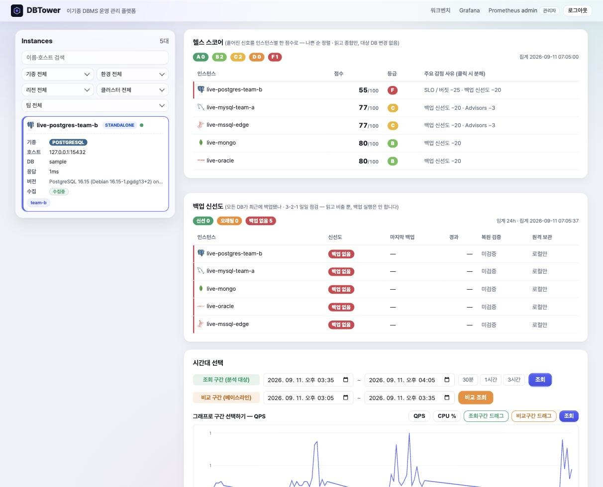

## 3분 요약

**무엇을 하나.** 관제에서 찾은 느린 쿼리를 인덱스 제안, 워크벤치 변경 요청, 승인, 실행, 전후 비교까지 한 플랫폼 안에서 잇습니다.
변경은 승인된 티켓만 변경 전 행 사본과 함께 실행하고, 영향 행 수가 사본과 다르면 커밋하지 않습니다.

**누가 쓰나.** 관제(지표·리포트), 요청자(워크벤치 조회·변경 요청), 승인자(승인·드라이런), 운영자(실행·백업·세션 종료), 관리자.
승인자와 운영자는 서로의 일을 하지 못합니다([사람별 입구](#한-플랫폼-사람별-입구)).


**실측으로 말합니다.**

| 무엇을 | 전 -> 후 | 근거 |
|---|---|---|
| 시점 비교 조회(플랫폼이 자기 자신을 진단해 복합 인덱스) | 21.269 -> 0.062 ms | [VERIFICATION 9절](docs/VERIFICATION.md) |
| 인덱스 티켓 전후 같은 부하(호스트 pgbench, 행 20건 조회) | 평균 46.378 -> 0.521 ms | 132절 |
| 연결만 받고 말이 없는 대상 하나가 폴러 전체를 멈추던 결함 | 25초 초과 -> 약 2초 | 134절 |
| 실시간 세션 화면을 10명이 볼 때 대상 DB가 받는 조회(30초, pg_stat_statements) | 브라우저 각자 폴링 150회 -> 서버 허브 14회 | 140절 |

**더 읽기.** [한 장 요약](docs/PORTFOLIO-ONEPAGER.md) · [면접 예상 질문](docs/INTERVIEW-QA.md) · [AX 사례 10개](docs/PORTFOLIO-AX.md) · [검증 기록](docs/VERIFICATION.md)

## 왜 만들었나

DB 이슈가 나면 개발자는 지표가 흩어진 여러 도구를 오가다 결국 DBA에게 문의하게 되고,
DBA는 같은 질문에 반복해서 답하게 됩니다. 정형화된 운영 작업을 플랫폼으로 자동화하면
관리 대상 DB가 늘어도 필요한 사람 손이 선형으로 늘지 않습니다(DBRE).
레퍼런스 등 사내 DB 플랫폼 사례의 문제 정의를 출발점으로, 핵심 메커니즘을 직접 구현했습니다.

## 무엇이 되나

<details>
<summary><b>기능 전체 표</b> (관제·진단·백업·HA·보안·변경 관리, 펼쳐 보기)</summary>

| 기능 | 설명 |
|---|---|
| 이기종 등록 | 인스턴스를 등록하면 기종에 맞는 Operator가 연결 (등록 시 접속 검증) |
| 통합 쿼리 통계 | 기종별 통계 소스를 하나의 API로 — load%(시간 점유율)·호출수·읽은 행수 |
| 시점 비교 | 평소 구간 vs 문제 구간의 쿼리별 QPS·레이턴시·rows/call 증감 + 신규 쿼리 감지 |
| 실행계획 분석 | EXPLAIN + 기종별 비효율 판단 규칙 자동 지적 (규칙마다 근거·예외 문서화) |
| AI 1차 분석 | 판단 기준 문서를 프롬프트로 쓰는 일관 판정 — API 키 또는 claude CLI 자동 선택 |
| 회귀 자동 감지 | 신규 쿼리·QPS 급증·레이턴시 회귀·rows/call 폭증을 폴러가 잡아 Discord/Slack 웹훅 — Discord는 리치 embed(맥락·AI 분석·진단 딥링크 구조화), Slack·미설정은 텍스트 폴백 |
| 플랜 변경 감지 | "쿼리는 그대로인데 느려짐 = 옵티마이저가 플랜을 갈아탐"을 5기종에서 확인 — 회귀 쿼리만 계획 shape 비교(PG GENERIC_PLAN·MySQL 샘플·MSSQL Query Store·Oracle plan_hash_value·Mongo profile) |
| 복제 슬롯 감시 | 비활성 슬롯이 WAL을 무한 보존해 디스크를 채우는 사각을 잡는다(PG) — pg_stat_replication이 못 보는 lost/unreserved/보존량 |
| 복제 지연 실측 | 5기종 전부 실제 복제를 걸어 apply/replay 지연을 잰다(MEASURED) — MySQL·PG·Mongo·MSSQL AlwaysOn·Oracle Data Guard. "못 잰다"와 "지금 못 읽었다"를 같은 값으로 뭉개지 않는다(3-값) |
| HA 관측 | failover를 실행하지 않고 관측한다 — 역할이 뒤집히면(승격/강등) failover 신호로, 같은 클러스터에 쓰기 가능 노드가 둘이면 split-brain으로 경보. 실행(펜싱·정족수)은 클러스터 매니저 몫 |
| 동기 내구성 정직 표기 | "설정은 동기인데 지금 실제로는 async"를 SQL 4기종에서 드러낸다 — PG synchronous_standby_names·MySQL 반동기 폴백·MSSQL NOT SYNCHRONIZED·Oracle protection_level 저하. 운영자가 무손실이라 믿는 침묵을 잡는다 |
| 대상별 운영 종합 | 정체(기종·환경·클러스터)+헬스 스코어+복제(RPO 노출)+백업을 한 대상에 모아 선택 즉시 카드로 — DBRE의 "관측을 DB 대상 단위에 귀속" |
| 백업 정책 | 추상 정책을 기종별 실행 방식으로 번역 — (인스턴스, 타입)별 병행 스케줄(FULL 앵커 6시간 + LOG 체인 15분이 정석), 신선도는 앵커 기준(LOG 성공이 FULL 실패를 못 가림) + S3 호환 원격 보관(3-2-1 오프사이트) |
| 통합 모니터링 | CPU·Connections 그래프 내장(Prometheus exporter 직접 조회, 미수집 사유 정직 표기) + Grafana 연동 + 복제 상태 통합 뷰 |
| 웹 콘솔 | QPS·CPU 그래프 드래그로 구간 선택 -> 증감 표 -> 클릭 한 번에 EXPLAIN + AI 분석 |
| 테이블 상세 | CREATE TABLE 전문·크기 통계·인덱스 카디널리티(5기종) — DDL 출처를 NATIVE/재구성으로 정직 구분, PG는 FK·CHECK까지 재조립 |
| MCP 서버 | AI 에이전트가 위 기능들을 도구로 직접 사용 (stdio / HTTP) |
| Wait Event 분석 | 그 시간에 무엇을 기다렸나(CPU/IO/Lock) — 5기종 통합, load%와 짝 |
| 세션·블로킹 | 활성 세션과 블로킹 트리 조회, 세션 종료(운영자) — PG는 cancel/terminate 구분 |
| 인덱스 어드바이저 | HypoPG 가상 인덱스로 생성 전 비용 비교(PG), 타 기종은 UNSUPPORTED 정직 표기 |
| 온라인 DDL | gh-ost 연동(MySQL) — 기본 dry-run, 실행은 운영자 + execute 명시 |
| 드리프트 감지 | 파라미터 diff·Schema Diff — "같아야 할 두 인스턴스가 어디부터 다른가" |
| 이상 자동 감지 | (요일x시간대) 동적 베이스라인 z-score — 고정 임계 없이 "평소와 다름"을 감지 |
| Advisors | 운영 모범규칙 자동 점검(백업 없음·복제 미구성·통계 노후 등) — 근거 문서 링크 |
| 자연어 진단 | "이 DB 왜 느려?" -> AI가 read-only 도구 화이트리스트를 자동 연쇄 호출해 답변 |
| 레이턴시 p95/p99 | 기종별 원자료 차이를 source로 구분 — MySQL 구간(히스토그램 차분)·Mongo 히스토그램(프로파일러 무관)·PG/MSSQL 추정·Oracle 미지원. 값이 아니라 신뢰 등급을 표기 |
| 데드락 감지 | DB가 남긴 흔적을 설정 변경 0으로 — MSSQL system_health XE·MySQL INNODB STATUS(victim·문장·리소스), PG는 카운터 델타 알림 |
| 스케일 제어 | 수집 병렬화(워커 풀)·스케줄러 풀 분리·알림 폭주 제어(분당 상한+묶음 요약)·인스턴스 수집 격리 토글·헬스 스코어 캐시 |
| SLO / 에러 버짓 | p95 기반 SLI·가용성·번 레이트 — Google SRE 모델을 DB 운영에 적용 |
| FinOps 신호 | 미사용·중복 인덱스 실측 신호 (금액 추정은 지어내지 않고 신호만) |
| 데이터 마스킹 | 외부(웹훅·MCP)로 나가는 SQL의 리터럴만 ?로 — 식별자·구조는 보존(진단력 유지), AI 프롬프트는 선택 토글 |
| 수집 건강 점검 | "수집이 조용히 거짓말하는" 사각 실측 — MySQL digest 포화·소실, PS 익명 부하, PG evict. 조치는 명령 안내까지만 |
| 팀 라벨·딥링크 | 인스턴스별 담당 팀 배지 + 콘솔 링크(PI·Grafana 등 자유 URL), 알림에 진단 딥링크(질문 프리필) |
| 팀 스코핑(LBAC) | 팀 사용자는 자기 팀 + 전역 인스턴스만 — 강제는 단일 경계(RegistryService), 스코프 밖은 404(존재 노출 방지) |
| 공유 세션 | 세션을 메타 DB에 저장(spring-session-jdbc) — 재시작·다중 노드에서 로그인 생존 |
| MCP OAuth 로그인 | MCP 클라이언트가 정적 토큰 대신 브라우저 로그인으로 토큰 자동 발급 — OAuth 2.1(PKCE·동적 등록·refresh), 기존 로그인 재사용 |
| Discord 봇 진단 | 알림 메시지에 돋보기 이모지를 달면 그 인스턴스를 AI가 진단해 답글 — 발사 시점 message_id 매핑으로 특권 인텐트 0개, 슬래시 커맨드(Ed25519 서명 검증) 병행, 채널·유저 화이트리스트 기본 거부 |
| 로그 백업·PITR | 5기종 로그 백업(binlog·WAL·BACKUP LOG·oplog ts 증분·아카이브) + 물리 앵커(pg_basebackup·XtraBackup·RMAN) + pg_receivewal 상시 스트리밍(복제 슬롯·자동 재시작) + 복원 가능 창·문안 생성, MSSQL·PG 실복원 e2e |
| 백업 암호화 | 백업 산출물 AES-256-GCM 스트리밍 암호화 — 복원 검증이 GCM 태그로 변조까지 잡는다(키 없이는 원격 보관소가 뚫려도 데이터 무의미) |
| Vault 동적 자격증명 | 대상 DB 계정을 Vault가 TTL로 발급·자동 갱신(username `vault:` 접두) — 유출 창이 "발각부터 수동 회전까지"에서 TTL로 줄어든다 |
| 디스크 포화 예측 | "지금 여유"가 아니라 "이 속도면 며칠 뒤 차는가" — 선형 추세 ETA(3일 치명/14일 경고), 소스 추상화: Prometheus(node_exporter) 또는 CloudWatch(RDS), 인스턴스-노드 매핑(nodeFilter) |
| 서버 공유 인지 | 같은 host:port의 DB 묶음 — 서버 전역 경보(세션·복제·데드락)는 그룹당 1회+공유 명시, 위험 귀속(점수)은 각자 유지 |
| 수평 확장 | 수집 샤딩(샤드별 분산 락 — 노드 여럿이면 나눠 들고 한 노드면 전 샤드 인수), 공유 세션·분산 로그인 잠금(노드를 오간 실패도 하나의 임계) |
| 메타DB 자기 관리 | 최대 볼륨 테이블 월별 파티셔닝 — 보존 정리 DELETE 1.9초 → DROP 12.8ms(블로트 0), 커넥션 온디맨드(격리 대상 유휴 커넥션 0 수렴) |
| 백업 신선도 | 마지막 성공 백업 경과 시간 FRESH/STALE/NO_BACKUP — 3-2-1 원칙의 감시 축 |
| 통합 헬스 스코어 | 흩어진 신호를 인스턴스별 0~100 + 등급으로 합산, 나쁜 순 정렬 — 아침 첫 화면 |
| 심층 원인 진단 | EXPLAIN ANALYZE 실제 실행 계획으로 추정 vs 실제 괴리 -> 근본 원인 5종 지목 |
| 운영 안전 | 인증·RBAC, 비밀번호 암호화, 감사 로그, 스키마 마이그레이션, HA 분산 락, 백업 복원 검증 |
| 분석 보호장치 | 모든 대상 DB 조회에 쿼리 타임아웃 + 수집 폴러 지수 백오프 — 진단이 부하 유발자가 되지 않게 |
| 감사 로그 검색 | 사용자·action·결과·기간 동적 필터 (Spring Data Specification) |
| 프로비저닝 연동 | K8s(CloudNativePG)·Terraform·Ansible로 생성한 DB를 멱등 PUT으로 자동 등록 |
| 설정 변경 이력 | 파라미터 diff의 시간축 — "언제부터 무엇이 바뀌었나"를 주기 수집·변경분만 기록(폭증 방지), 변경 시 웹훅. "누가"는 대상 DB 감사 로그의 몫이라 미표기(정직) |
| 스키마 변경 리뷰 게이트 | 배포 전 DDL/대량 DML을 규칙으로 자동 판정(락·NOT NULL·DROP·WHERE 없음)+실행수 락 확정+AI 소견 → 승인자 승인/반려·자동 감사. 승인된 티켓의 실행은 워크벤치에서 운영자가(사본·되돌리기와 함께) |
| 인시던트 리포트 | 장애 구간을 주면 시점 비교·설정 변경·플랜 플립·대기·가용성을 한 장으로 재구성 + AI 요약(재료 내 사실만). 신규 수집 0, 마크다운 발행 |
| 월간 점검 리포트 | 헬스 스코어·백업 신선도·Advisor·용량 예측·낭비 신호·설정 변경을 한 장으로 매월 자동 발행 + 수동 생성 |
| 인덱스 사용 이력 | 인덱스 스캔 통계 주기 영속(5기종, Oracle 미지원 정직) — 미사용 인덱스 신호에 "관측 기간" 라벨, 분기 단위 장기 판정(lakehouse)의 원료 |

</details>

<details>
<summary><b>DB팀 문의 — 진단 결과를 원클릭으로 웹훅 채널에</b> (Discord embed 실물)</summary>

웹 콘솔의 "DB팀에 문의" 버튼은 현재 패널의 쿼리·실행계획·규칙 지적·AI 분석을 embed 카드 한 장으로 묶어 보낸다.
자동 경보가 "플랫폼이 사람에게 미는 push"라면, 문의는 방향은 같되 트리거가 사람인 push라 같은 웹훅 어댑터를 재사용한다.



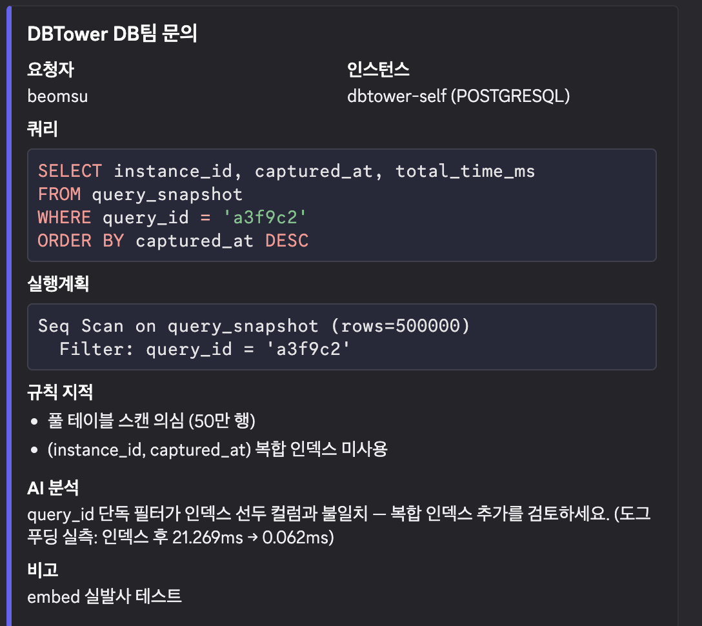

</details>

<details>
<summary><b>운영 병목 알람 카드</b> (설정 변경·변경 리뷰·인시던트 — Discord embed 실물)</summary>

읽고 판정·기록까지가 몫이고 대상 DB는 바꾸지 않는다. 리뷰 게이트의 승인·반려는 승인자가, 인시던트 리포트의 실행은 운영자가 — 전부 사람이 한다.

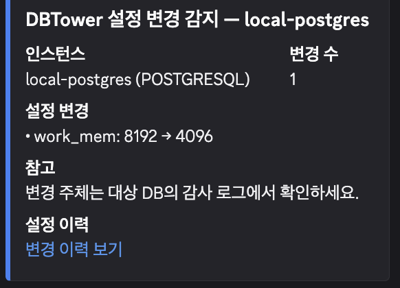

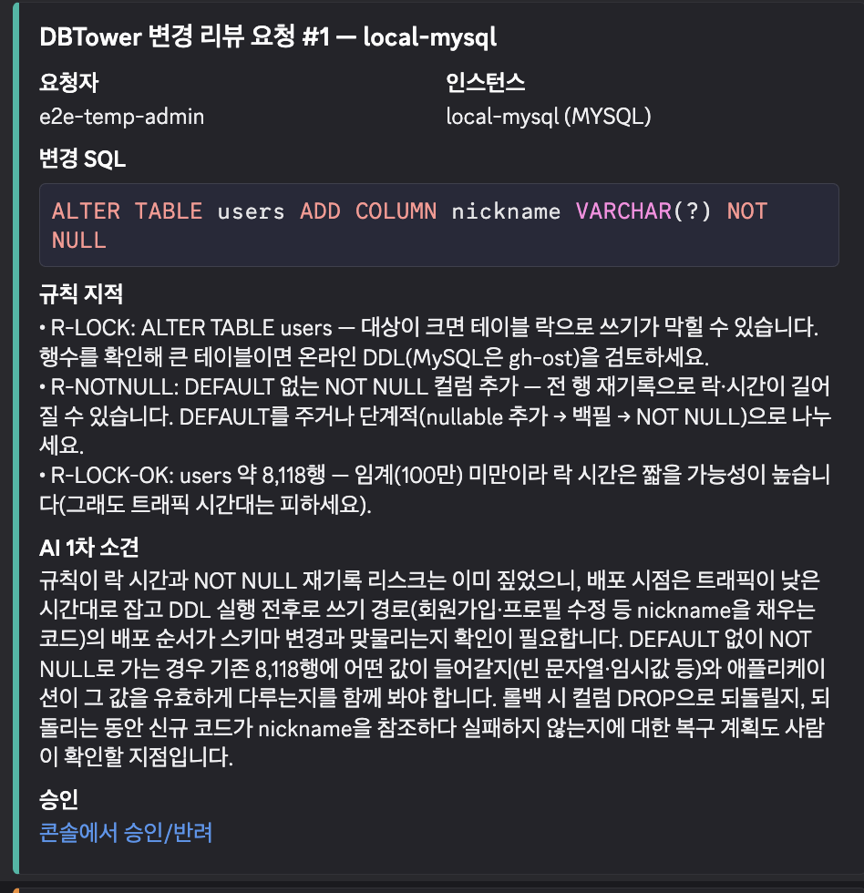

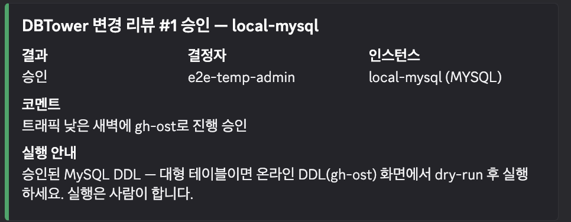

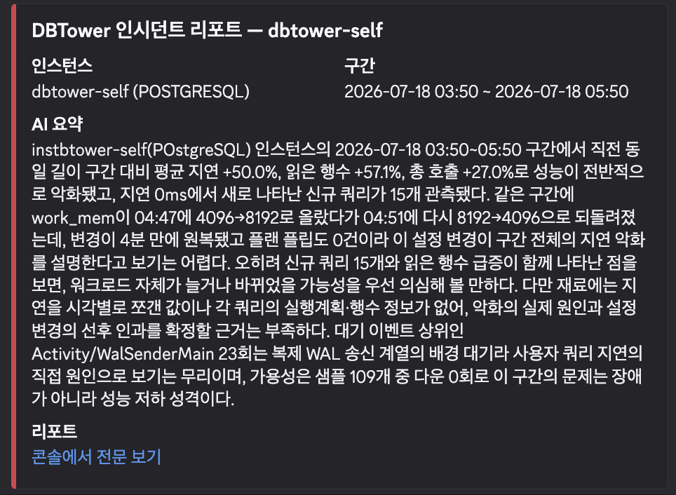

</details>

### DBA 운영 직무 지도 — 하는 것, 위임하는 것, 안 하는 것

DBMS 운영(설치·패치·장애조치·백업/복구·오브젝트·용량)의 전통적 직무 축에 DBTower를 대면:

| 직무 축 | DBTower가 하는 것 | 위임/범위 밖 (이유) |
|---|---|---|
| 설치·프로비저닝 | 생성 즉시 멱등 PUT으로 관제 편입 — K8s(CloudNativePG)·Ansible·Terraform 연동 e2e | 생성 자체는 Operator/IaC 몫 — 이미 잘 푼 문제를 다시 풀지 않음 |
| 패치·업그레이드 | 버전 가시화(health), 패치 전후 검증 — 파라미터 드리프트·Schema Diff로 형상 변화, 시점 비교로 성능 회귀 확인 | 엔진 패치 실행은 범위 밖 — 대상을 바꾸는 행위이자 플랫폼별 도구(Operator 롤링·RDS 유지관리)의 영역 |
| 장애조치 | 감지(헬스 스코어 down 수렴·이상 감지·웹훅)부터 원인(Wait Event·블로킹 트리·심층 진단)과 수동 개입(세션 kill, 운영자)까지 | 자동 페일오버는 안 함 — HA 토폴로지 소유자(Operator/managed)의 일. 관제 도구가 개입하면 스플릿 브레인 위험 |
| 백업·복구 | 추상 정책 → 기종별 실행, 즉시 백업, **복원 검증 3값**(테스트 안 한 백업은 백업이 아니다), S3 호환 원격 보관(오프사이트 — 업로드 실패는 백업 실패가 아니라 별개 사실로 기록), 신선도 감시 — 3-2-1 완성 | — |
| 오브젝트 관리 | 스키마·파티션·인덱스 사용 통계 조회, Schema Diff, 인덱스 어드바이저(가상 인덱스), 온라인 DDL(gh-ost, 기본 dry-run), 미사용 인덱스 분기 판정(lakehouse 장기 창) | 자동 인덱스 생성·파티션 자동 관리는 범위 밖 — 조회·조언까지가 정체성 |
| 변경 관리 | 스키마 변경 리뷰 게이트 — DDL/대량 DML을 규칙으로 판정·AI 소견·승인자 승인, 승인된 티켓만 운영자가 워크벤치에서 실행(변경 전 사본·되돌리기·전후 비교)·자동 감사 | 승인 없는 실행은 안 함, 승인한 사람이 실행까지 겸하지 않음(승인자와 운영자 역할 분리) |
| 용량 관리 | 테이블/컬렉션 크기 상위, 오버프로비저닝 신호(FinOps), 메타 DB 자체 보존 정책(7일) | OS/디스크 사용률 시계열은 메트릭 층(exporter+Prometheus) 위임 — 아래 "기존 모니터링 스택과의 관계" |
| 계정·권한 | 기종별 최소 권한 모니터링 계정 실측 가이드, Ansible 플레이북이 계정 생성까지 | 대상 DB 계정 CRUD UI는 안 함 — 대상을 바꾸는 행위 최소화 |
| 모니터링·튜닝 | 본진 — 쿼리 통계(load%)·시점 비교·Wait Event·실행계획+AI·심층 원인 진단·SLO·자율 감시 | — |

원칙은 하나입니다: **읽고 판단하는 것은 깊게, 대상을 바꾸는 것은 최소한으로(승인하는 사람과 실행하는 사람을 나눈 경계),
바꾸는 주체가 따로 있는 일은 그 주체와 잇는다.**

### 확장성 증명 — 새 기종 추가 = 구현체 1개

3기종으로 만들었던 플랫폼에 Oracle과 MongoDB를 추가하면서 실측했습니다
([VERIFICATION 18절](docs/VERIFICATION.md)). 새로 만든 것은 Operator 구현체와
클라이언트 캐시뿐이고, 기존 코드 수정은 enum 값과 팩토리 case 등 몇 줄이 전부입니다.
스냅샷 수집·시점 비교·회귀 감지·웹 콘솔·MCP는 **0줄 수정**으로 5기종을 처리합니다.

특히 MongoDB는 SQL도 JDBC도 없는 기종입니다. explain 입력이 SQL 대신 명령 JSON이고
통계 소스가 시스템 뷰가 아니라 프로파일러 컬렉션이어도, `DbmsOperator` 인터페이스가
그 차이를 흡수합니다 — 추상화 경계가 SQL이 아니라 "운영 행위"에 그어져 있기 때문입니다.

### 실시간 세션 관제 — 보는 사람이 늘어도 대상 조회는 늘지 않게

세션/블로킹 카드에서 "실시간 켜기"를 누르면 누가 누구를 막고 있는지가 2초마다 바뀝니다. 화면마다 폴링하면 장애 때 모두가 같은 대상을 열어
관측이 곧 부하가 되므로, 서버가 대상마다 한 번만 조회해 보는 사람 전원에게 SSE로 나눕니다. 아무도 안 보면 조회도 멈춥니다.
10명이 30초 볼 때 대상 PostgreSQL이 받은 조회는 브라우저 각자 폴링 150회, 허브 14회였습니다([VERIFICATION 140절](docs/VERIFICATION.md)).
탭이 숨으면 연결을 닫고, 표 위에 포인터가 있으면 kill 버튼을 잘못 누르지 않게 표 갱신을 미룹니다.
앱을 여러 대 띄워도 대상마다 한 노드만 조회권(메타 DB 락)을 쥐고 나머지는 올라온 프레임을 넘겨, 두 노드·노드마다 5명일 때 대상 조회가 30회에서 15회가 됐습니다.
세션 쿼리의 실값(`WHERE email = '...'`)은 알림·AI 도구 인자와 같은 규칙으로 `?`로 가립니다([144절](docs/VERIFICATION.md)).

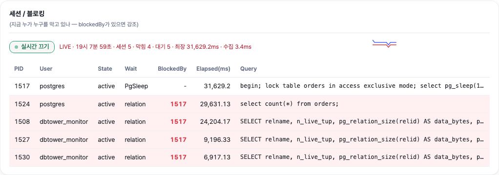

### 시점 비교 — 장애 원인 쿼리를 찾는 핵심 기능

상위 쿼리 목록만으로는 원인을 못 찾습니다. 평소에도 높던 쿼리일 수 있고, 낮던 쿼리가
튄 것일 수 있고, 새로 유입된 쿼리일 수도 있기 때문입니다. 그래서 두 구간을 쿼리 단위로
비교합니다 — 누적 카운터 스냅샷의 구간 차분, QPS 정규화, 신규 쿼리 표시.

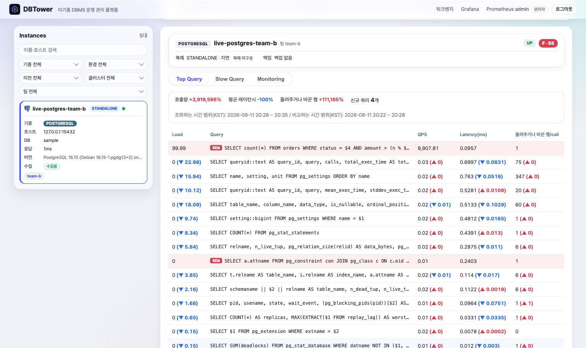

부하 실측: 베이스라인 대비 급증 구간에서 호출량 +461%, 읽은 행수 +852%,
신규 LIKE 풀스캔 쿼리 1건이 NEW로 잡힙니다.

### 실행계획 + AI 1차 분석

쿼리를 클릭하면 해당 DB에 접속해 EXPLAIN을 실행하고, 기종별 규칙(access_type=ALL,
Seq Scan, Clustered Index Scan, TABLE ACCESS FULL, COLLSCAN 등)으로 비효율 신호를
지적합니다. AI 분석은 [판단 기준 문서](docs/ai-analysis-rules.md)를 시스템 프롬프트로 넣어
같은 입력에 일관된 판정이 나오게 하고, 근거가 없으면 모른다고 답하게 합니다.
AI 답은 수십 초 걸리므로 흘려 받습니다. 실행계획과 규칙 지적은 AI를 기다리지 않고 0.02~0.05초에 먼저 보이고, AI 글은 쓰이는 대로 이어집니다
(한 번에 받을 때는 38~39초 동안 계획도 안 보였습니다 — [143절](docs/VERIFICATION.md)).

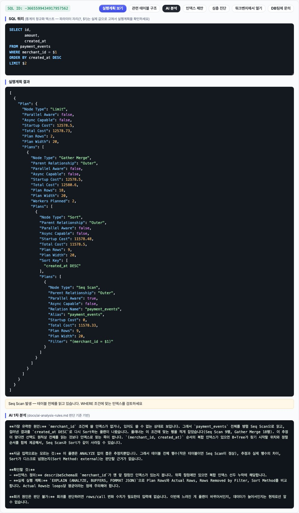

### 자율 진단 — 사람이 보기 전에 플랫폼이 먼저 본다

흩어진 신호(헬스·이상 감지·Advisors·SLO·백업 신선도)를 인스턴스별 0~100점으로 합산해
나쁜 순으로 정렬합니다 — 대시보드가 아니라 "어디부터 볼지"를 알려주는 분류(triage) 큐입니다.

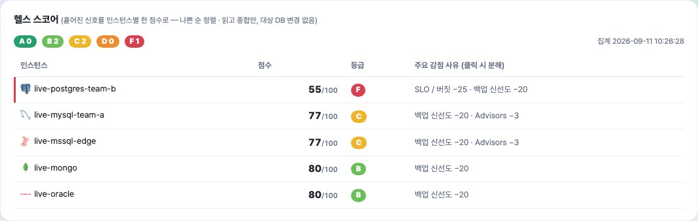

운영 규칙 자동 점검(Advisors)은 operations.md의 실측 규칙을 코드로 옮긴 것입니다.
기종에 적용 불가한 점검은 "미지원"으로 정직하게 표기합니다.

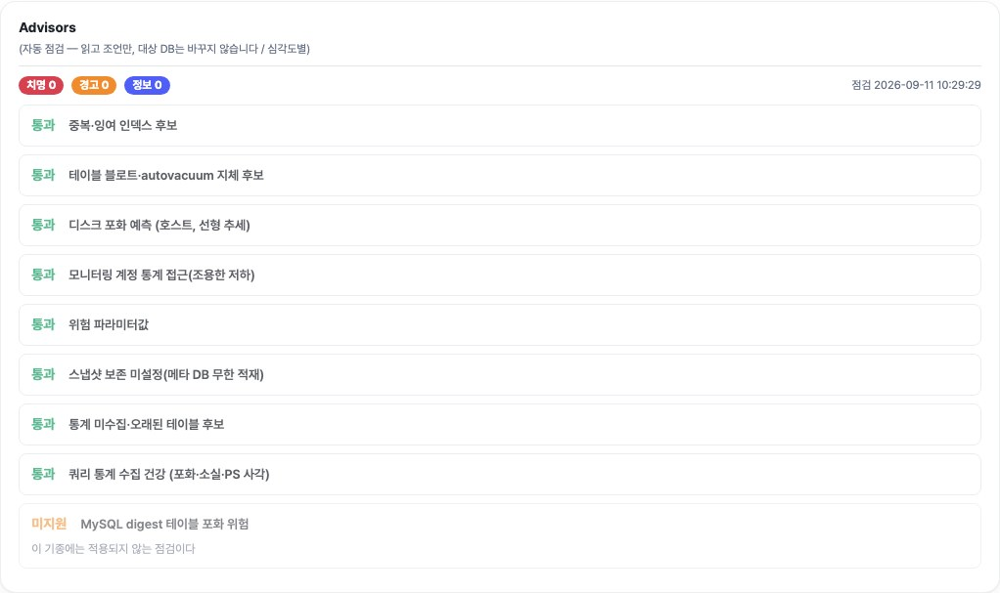

심층 원인 진단은 EXPLAIN(추정)이 아니라 실제 실행 계획으로 "왜 인덱스를 못 탔나"를 짚습니다 —
아래는 숫자 리터럴 하나가 암시적 형변환으로 인덱스를 무력화한 사례를 정확히 지목한 화면입니다.

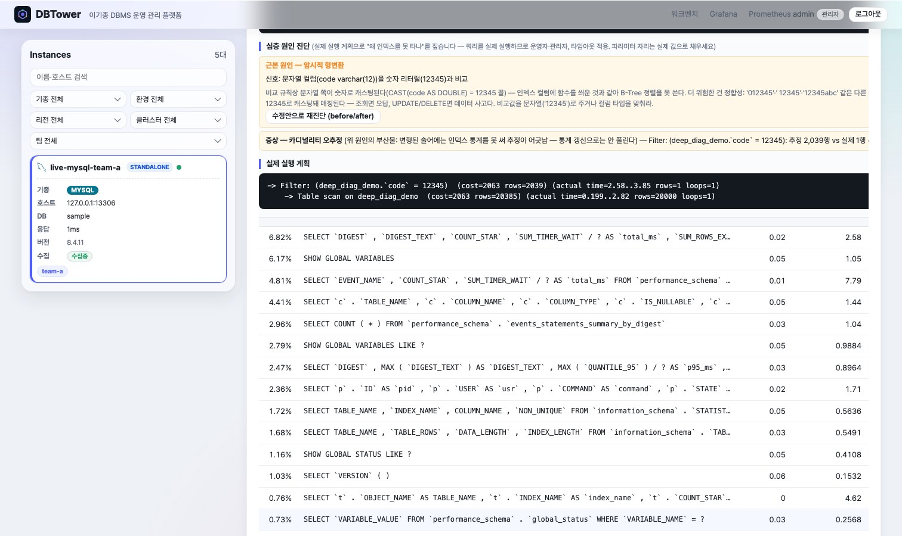

처방을 말로만 하지 않습니다 — 기계적으로 안전한 수정(숫자 리터럴에 따옴표)이 가능한 경우
수정안 SQL을 함께 만들어, 버튼 한 번으로 재진단해 before/after를 비교합니다.

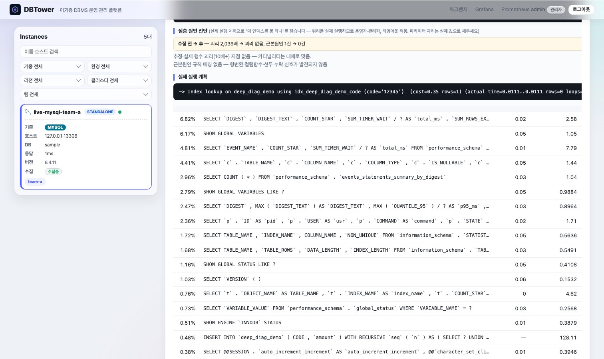

### 거버넌스 SQL 워크벤치 — 자유 SQL, 경계는 플랫폼이

DBeaver처럼 스키마 트리·탭 편집기·자동완성·결과 그리드로 대상 DB를 직접 조회하되, 정책은 플랫폼 코드가 강제합니다.
외부 DB 클라이언트를 붙이지 않은 이유가 이 정책 계층입니다(그 도구들은 DB에 직접 붙어 마스킹·팀 범위·감사를 우회).

- **문장 분류**: 읽기는 즉시, 변경은 승인 티켓으로, 트랜잭션 제어·다중문·부작용 함수는 차단(허용 목록)
- **콘솔 계정 분리**: 모니터 계정과 다른 조회(READ)·변경(WRITE) 계정, 저장 전 실제 접속 검증, 응답에 비밀번호 없음
- **읽기 전용 실행**: 콘솔 전용 풀 + 읽기 전용 트랜잭션(Oracle은 `SET TRANSACTION READ ONLY`) + 타임아웃 + 행 상한 + 항상 롤백
- **결과 마스킹**: 개인정보 컬럼 기본 규칙, 별칭(`email AS e`)까지 추적. 표현식 우회는 컬럼 GRANT가 막는다는 역할 분담을 실측으로 확인
- **실행 기록**: 거부·오류 포함, 리터럴을 가린 문장과 행 수·가린 열·CSV 사유

"읽기 전용"은 쓰기 권한 계정으로 INSERT를 넣어 3기종에서 따로 증명했습니다 — 같은 JDBC 호출이 Oracle에서는 아무것도 막지 않았고,
그걸 고쳤습니다([VERIFICATION 128절](docs/VERIFICATION.md), [AX 케이스 스터디](docs/PORTFOLIO-AX.md)).

화면은 세 칸입니다. 왼쪽 유리 사이드바에 인스턴스와 그 스키마 트리·워크시트, 가운데 불투명 작업면에 편집기와 결과·테이블 상세·인스턴스 비교·변경 티켓·실행 기록 탭,
오른쪽에 늘 보이는 AI 어시스턴트. 처음에는 오른쪽 탭 하나에 채팅·스키마·변경 티켓을 넣어 서로를 가렸고, 스키마의 테이블을 질문에 붙이는 데
탭을 오가며 4번 눌렀습니다. 칸을 나눈 뒤 같은 스크립트로 2번, 티켓 상세 칸은 398px -> 524px입니다([VERIFICATION 147절](docs/VERIFICATION.md)).

관제 대시보드와 워크벤치는 한 페이지의 두 모드입니다. 상단 [관제 | 워크벤치]로 전환하고, 관제 모드 오른쪽에는 자연어 근본원인 진단 AI 칸이 늘 보입니다.
관제 쿼리 상세의 "워크벤치에서 열기"는 새 탭 대신 같은 페이지의 워크벤치 모드로 넘깁니다(탭 2개 -> 1개, 넘길 때 문서 로드 1회 -> 0회, [VERIFICATION 149절](docs/VERIFICATION.md)).
왼쪽 스키마 트리는 데이터베이스 -> 테이블/뷰 -> 열(기본키 표시)·인덱스까지 펼칩니다. 뷰가 테이블처럼 섞이던 기종(PostgreSQL·SQL Server)을 나누고, 5기종 모두 기본키를 표시합니다([VERIFICATION 150절](docs/VERIFICATION.md)).

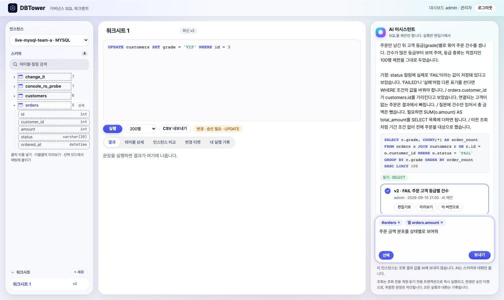

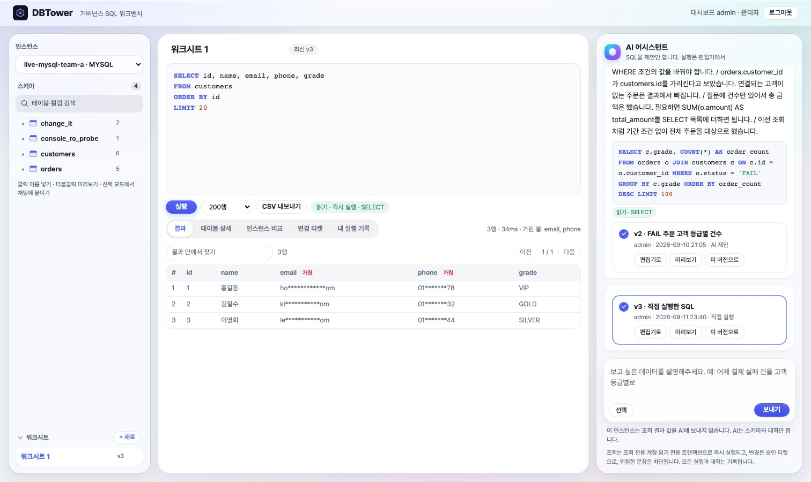

**워크시트와 AI 제안** — 사내 AI 화면 생성 도구(TOI Studio)처럼 워크시트마다 대화와 체크포인트(버전) 카드가 쌓입니다.
AI는 SQL을 **제안만** 하고 실행 도구가 없습니다. 제안마다 서버가 분류(읽기/승인 필요/차단)와 스키마에 없는 테이블을 표시하고,
"선택" 모드로 결과 열이나 스키마 테이블을 눌러 질문에 붙입니다. 조회 결과 값은 인스턴스 설정(ADMIN)이 켜진 경우에만 AI로 나갑니다.
정확도는 AI SQL을 실제로 실행한 결과로 채점합니다(`scripts/eval-workbench-nl2sql.py`, 데모 12문항 lenient 12/12 · strict 7/12).
답은 흘려 받습니다. 설명과 SQL이 쓰이는 대로 보이고(같은 질문 셋에서 첫 설명 4.45·10.01·4.55초, 완성 10.85·19.96·12.10초), 저장·분류·버전은 완성본으로 만듭니다.
자연어 진단도 도구를 부를 때마다 단계가 먼저 보입니다(첫 도구 6.38초, 결과 108.16초 — [VERIFICATION 141절](docs/VERIFICATION.md)).

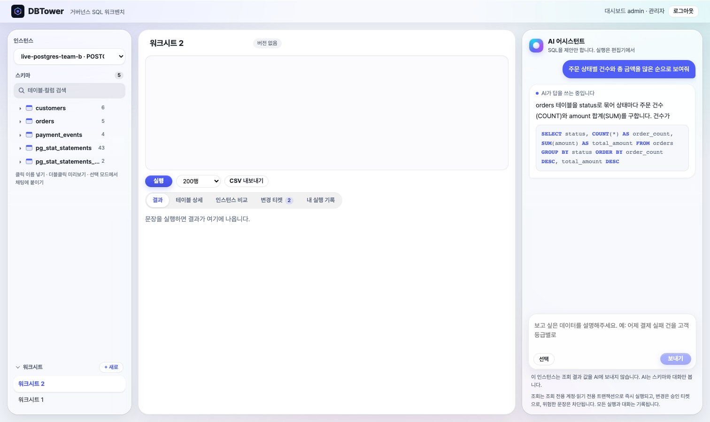

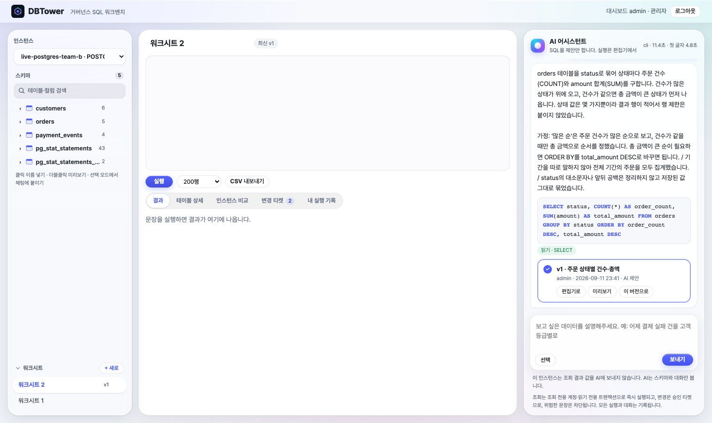

**승인 티켓 실행과 전후 비교** — 변경 문장은 워크벤치에서 바로 실행되지 않고 "변경 요청으로 올리기"로 리뷰 게이트에 올라갑니다.
올리는 동안 규칙 판정(락 위험·스키마 대조 포함)이 0.01~0.05초에 먼저 보이고 AI 1차 소견은 쓰이는 대로 이어집니다([146절](docs/VERIFICATION.md)).
승인 전에도 드라이런(실제로 실행한 뒤 롤백)으로 바뀔 행과, 커밋 전 인덱스가 반영된 실행계획을 봅니다. 승인된 티켓만 변경 계정으로 실행하고,
실행권은 조건부 UPDATE로 한 요청만 얻습니다. 실행은 같은 트랜잭션에서 변경 전 행 사본을 락과 함께 잡아 영향 행 수가 사본과 같을 때만 커밋하고,
되돌리기는 실행 직후 사본과 지금 행이 같을 때만 파라미터 바인딩으로 씁니다. 실행마다 행 diff·구조 diff·검증 조회 실행계획 전후·실행 시각 기준
워크로드 비교가 남고, 같은 조회를 두 인스턴스에서 돌려 행 단위로 비교할 수도 있습니다. MySQL·PostgreSQL·Oracle 실DB로 실행·되돌리기·
드리프트 충돌·불변식 위반을 증명했습니다([VERIFICATION 130절](docs/VERIFICATION.md), [AX 사례 5](docs/PORTFOLIO-AX.md)).

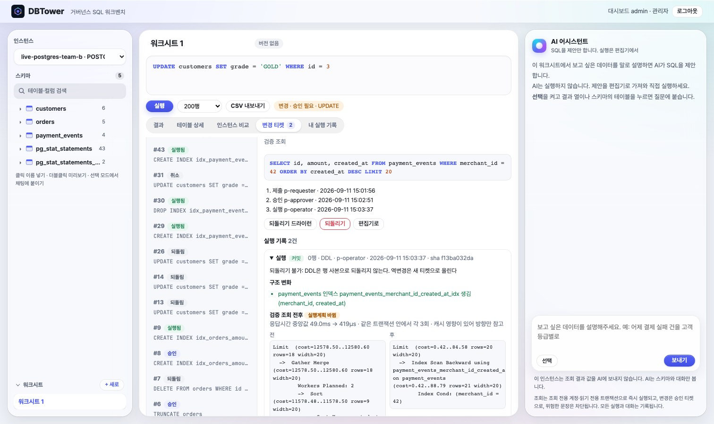

**티켓의 출구와 5기종 확장** — 승인된 채 실행하지 않을 티켓은 요청자나 승인자·운영자가 취소하고, 커밋 여부를 모른 채 멈춘 티켓은 운영자가
대상 DB를 무엇으로 확인했는지 근거를 적어 정리합니다. DDL 실행 기록에는 생긴 구조만 지우는 역변경 문장을 기종 문법으로 제안하고
(실행이 아니라 새 티켓으로 올리기), 스키마 트리에서 테이블 상세(행 수·크기·인덱스 카디널리티·DDL)를 엽니다. 변경 실행은 SQL Server
(Apple Silicon 로컬은 `docker-compose.arm64.yml`의 Azure SQL Edge, Rosetta가 있으면 Rosetta VM의 실제 SQL Server 2022 RTM-CU26)와
MongoDB(복제셋 트랜잭션 안의 문서 사본)까지 5기종으로 넓혔고, MCP에는 변경 요청·상태·조회 도구만 열었습니다(조회는 인스턴스의 결과 값
AI 공유 설정이 켜진 경우만). Oracle은 인스턴스를 등록할 때 `appSchema`를(없으면 전역 `dbtower.oracle.app-schema`를) 주면 모니터 계정이 앱 스키마의 테이블 상세·스키마 트리를 봅니다.

100만 행 표에 pgbench로 같은 부하를 인덱스 티켓 전후에 걸었습니다. 컨테이너 안·합계 한 줄 조회로는 평균 지연 49.634 ms -> 0.029 ms였고,
호스트에서 포트 포워딩 TCP로 붙어 행 20건을 돌려주는 조회로 다시 재면 46.378 ms -> 0.521 ms입니다. 서버 안 실행 시간은 0.0325 ms이고
같은 경로의 `SELECT 1`이 0.539 ms라, 남은 지연은 거의 전부 왕복 비용입니다([VERIFICATION 131~133절](docs/VERIFICATION.md)).
Apple Silicon에는 SQL Server를 네이티브로 돌릴 경로가 없어(공식 지원은 x86-64 호스트뿐), 같은 Rosetta VM에서 PostgreSQL arm64와 amd64를 맞붙여
번역 비용(처리량 약 0.7배)을 따로 쟀습니다. 네이티브 x64 수치는 GitHub Actions x64 러너의 SQL Server 2022에서 같은 IT와 같은 부하 측정기
(`scripts/MssqlLoad.java`, `.github/workflows/mssql-x64.yml`)로 잽니다. 러너 두 번의 인덱스 전후 서버 실행은 53,052 -> 75.1 µs와
122,541 -> 173.0 µs로 실행마다 두 배 넘게 흔들렸고(Rosetta VM 70,858 -> 145.0 µs), 흔들리지 않은 것은 실행계획과 논리 읽기(3,973 -> 63)였습니다.
그래서 환경 사이의 µs 비교는 근거로 쓰지 않습니다.

측정을 정리하다 결함 하나를 찾아 고쳤습니다. 연결만 받고 아무 말도 하지 않는 대상(죽은 포트 포워드 등) 하나에서 SQL Server·Oracle 풀 생성이 무기한
매달렸고, 그 생성이 풀 맵의 락을 쥔 채라 모든 대상의 운영 경보·헬스 스코어 폴러와 인스턴스 삭제 API가 함께 멈췄습니다. 풀은 첫 연결을 늦게 열고,
두 기종은 로그인 단계에만 읽기 제한을 걸었다가 로그인 뒤 풀어 긴 서버 사이드 백업을 끊지 않습니다(재현 테스트 25초 초과 -> 2초,
[VERIFICATION 134절](docs/VERIFICATION.md)). 비교 화면의 행 지표는 기종마다 세는 것이 달라(PostgreSQL은 돌려준 행,
SQL Server는 논리 읽기 페이지 등) 오퍼레이터가 알려준 이름으로 적습니다.

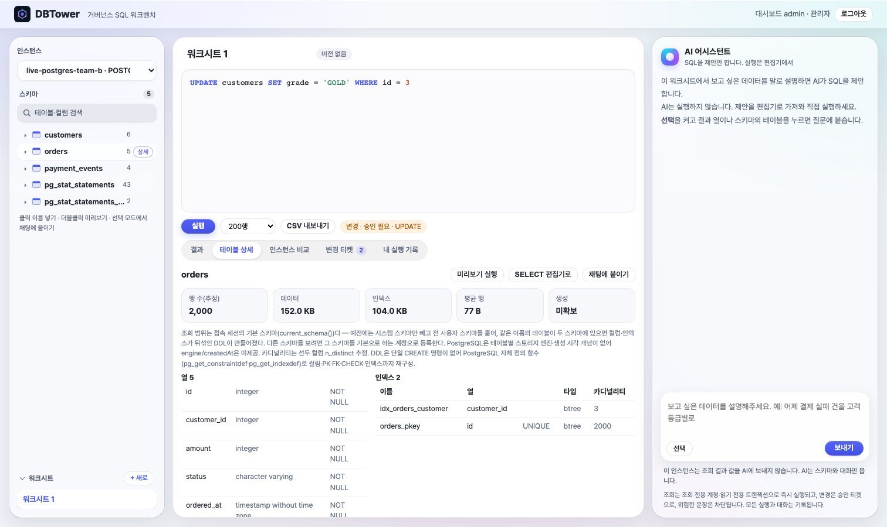

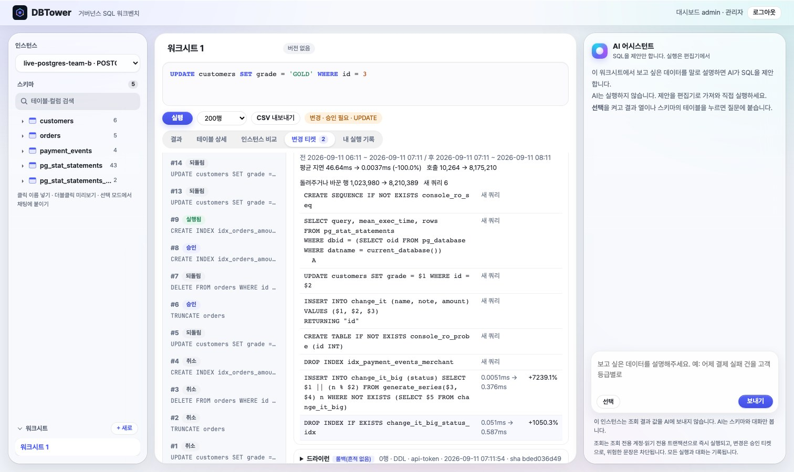

### MCP — AI 에이전트의 채널

웹 콘솔이 사람의 채널이라면 MCP는 AI 에이전트의 채널입니다. 회귀 감지가 push(플랫폼이
사람에게 민다)라면 MCP는 pull(에이전트가 필요할 때 당겨쓴다) — 같은 코어를 채널만 바꿔
노출합니다. JSON-RPC 2.0을 직접 구현했고 stdio/HTTP 두 전송이 프로토콜 코어를 공유합니다.

```bash
claude mcp add --transport http dbtower http://localhost:8080/mcp
```

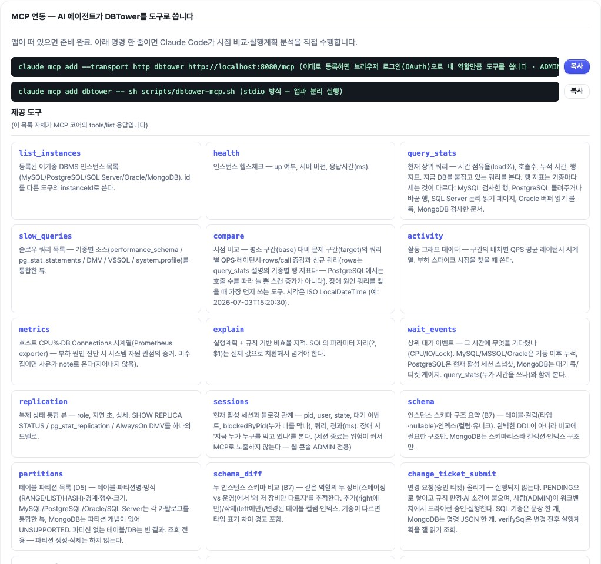

HTTP 전송은 도구 호출을 서비스 토큰이 아니라 그 요청을 인증한 호출자의 토큰으로 REST에 위임합니다. 서비스 토큰으로 위임하던 때는
관리자가 MCP로 올린 변경 요청의 요청자가 `api-token`으로 남아, 같은 사람이 화면에서 자기 요청을 승인해도 요청자·승인자 분리가
막지 못했습니다(수정 전 HTTP 200 APPROVED, 수정 뒤 409, [VERIFICATION 132절](docs/VERIFICATION.md)).

## 보안 — 사람은 세션, 기계는 토큰

DB 접속정보를 다루는 관리 도구라 인증 없이는 운영에 못 들어갑니다 (Phase A1):

- **사람**: 폼 로그인(BCrypt) + CSRF 쿠키 패턴. 역할은 쓰는 사람 기준 5개(아래 표)
- **기계(MCP·자동화)**: Bearer 서비스 토큰. 미설정 시 기동마다 랜덤 생성(fail-closed) —
  ADMIN이 로그인하면 MCP 카드가 토큰 포함 등록 명령을 완성해 줍니다. 사람은 헤더 없이 등록해 브라우저 로그인(OAuth)으로
  자기 역할만큼 도구를 씁니다(도구 호출은 호출자 토큰으로 REST에 위임)
- 최초 기동 시 admin 계정 자동 생성 — 비밀번호는 `DBTOWER_ADMIN_PASSWORD` 또는 로그의 랜덤값. 역할별 계정은
  `DBTOWER_{VIEWER|REQUESTER|APPROVER|OPERATOR}_PASSWORD`를 준 것만 만들고, 이후는 ADMIN이 대시보드의 사용자·역할 카드에서 만든다

### 한 플랫폼, 사람별 입구

관제 대시보드와 거버넌스 워크벤치는 인스턴스·팀 범위·감사·티켓을 공유하므로 제품을 나누지 않고, 쓰는 사람마다 입구와 버튼을 나눕니다.
화면은 역할 이름이 아니라 `/api/me`의 능력(capabilities)으로 버튼을 가르고, 최종 인가는 서버가 합니다([VERIFICATION 135절](docs/VERIFICATION.md)).

| 역할 | 누구 | 첫 화면 | 할 수 있는 일 |
|---|---|---|---|
| 관제 VIEWER | 온콜·팀장·보안 담당 | 대시보드 | 지표·시점 비교·리포트 조회, 추정 실행계획. 대상 DB의 행 값은 보지 않는다(워크벤치 없음) |
| 요청자 REQUESTER | 개발자·데이터 요청자 | 워크벤치 | + 워크벤치 조회(조회 계정·마스킹), 변경 요청 제출·자기 요청 취소 |
| 승인자 APPROVER | DBA 리드 | 대시보드 | + 변경 요청 승인·반려, 승인 전 드라이런 |
| 운영자 OPERATOR | DBA 운영 | 대시보드 | + 승인 티켓 실행·되돌리기·커밋 불명 정리, 백업·복원 검증·세션 종료·심층 진단·온라인 DDL·파라미터 |
| 관리자 ADMIN | 플랫폼 관리자 | 대시보드 | 위 전부 + 인스턴스·접속 계정·보안·감사·사용자 역할 |

승인자와 운영자는 서로를 포함하지 않습니다 — 한 사람이 변경을 승인하고 실행까지 하지 않게 역할에서부터 나눕니다.
화면 사이의 넘김은 세 가지입니다: 대시보드의 쿼리 상세 -> 워크벤치 새 워크시트, 인덱스 제안 -> 워크벤치 변경 요청 창,
워크벤치의 실행 기록 -> 대시보드의 실행 시각 앞뒤 30분 시점 비교. 로그인 뒤에는 가려던 주소(딥링크·OAuth 인가)가 있으면 그곳이, 없으면 역할의 첫 화면이 열립니다.

같은 승인된 티켓을 승인자와 운영자가 볼 때 — 승인자에게는 실행 버튼이 없고, 운영자에게는 승인 버튼이 없습니다([VERIFICATION 136절](docs/VERIFICATION.md)):

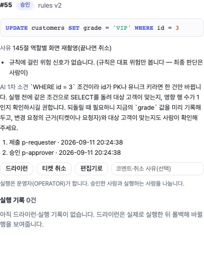 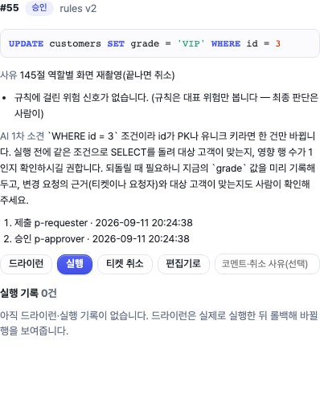

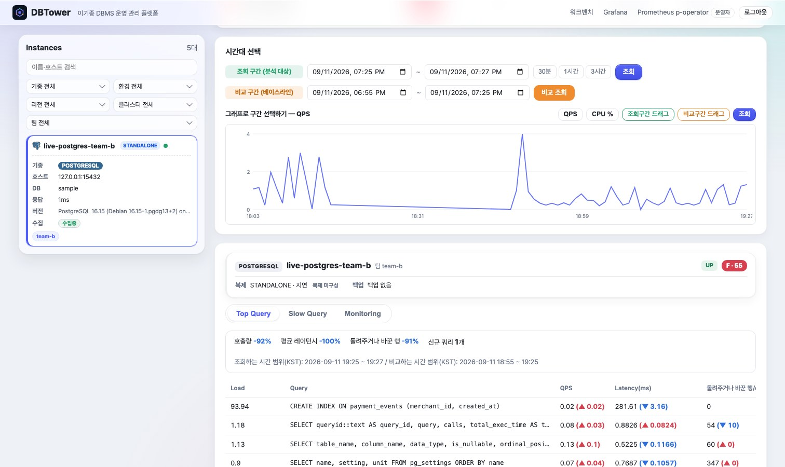

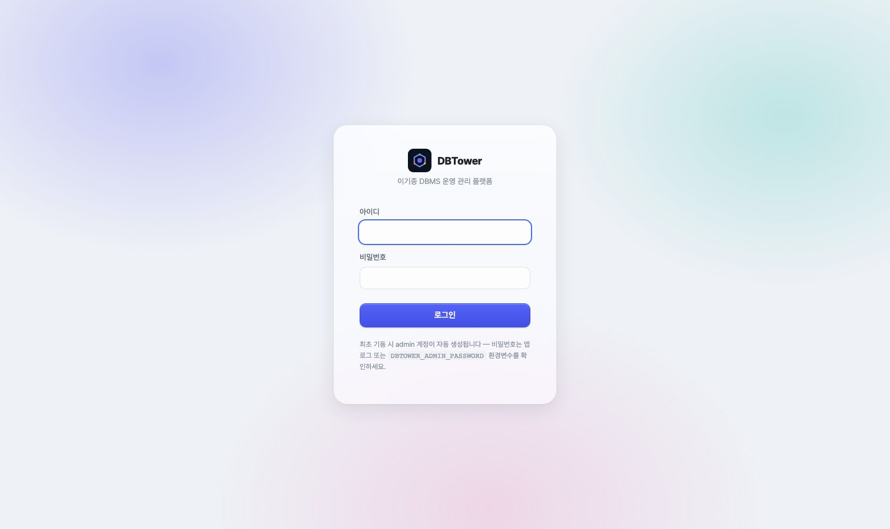

## 아키텍처 경계는 빌드가 지킨다 (Spring Modulith)

패키지 = 모듈(8개: registry·operator·insight·alert·analysis·backup·mcp·security)로 선언하고,
모듈 간 순환 의존을 테스트(ModularityTests)가 빌드에서 실패시킵니다. 도입 첫 실행에서
실제로 순환 2개(registry<->operator, insight<->alert)를 잡아 의존 역전으로 해소했습니다 —
과정은 [VERIFICATION 20절](docs/VERIFICATION.md), 모듈 다이어그램은 [docs/modules/](docs/modules/).
(모듈은 이후 페이즈에서 advisor·finops·score·slo·audit·onlineddl이 더해져 현재 15개(review 추가)입니다.)

### 상세 아키텍처

채널 3종부터 모듈 15개, 기종 어댑터, 외부 의존(메타 PG·MinIO·AI 백엔드·관측 스택)까지 —
실제 모듈명(io.dbtower 하위 패키지)과 docker-compose 포트 기준의 상세도입니다.


### 메타 DB ERD

메타 DB 스키마의 단일 권위는 Flyway 마이그레이션(V1~V29)입니다. ERD는 그중 핵심 표 9개와
관계(FK는 ON DELETE CASCADE — 인스턴스 삭제 시 자식 데이터 자동 정리)를 정리한 것이고,
이후 확장 표(로그인 잠금·OAuth·알림 매핑·파티션 자식 등)는 그림에서 생략했습니다.



## 기존 모니터링 스택과의 관계

exporter + Prometheus + Grafana(또는 Telegraf + InfluxDB + Grafana)는 이미 검증된
메트릭 모니터링 스택이고, DBTower도 그 층을 직접 만들지 않고 **그대로 씁니다** —
docker compose에 mysqld-exporter/postgres-exporter/Prometheus/Grafana가 포함되어 있고
DBTower 자신의 지표도 /actuator/prometheus로 같은 스택에 노출합니다.

DBTower가 맡는 것은 그 위의 다른 층입니다:

- **메트릭 스택이 답하는 질문**: "CPU가 언제 튀었나, 커넥션이 몇 개인가" — 인스턴스 수준 시계열
- **DBTower가 답하는 질문**: "그 시각에 어떤 쿼리가 원인이고, 실행계획이 왜 나쁘고,
  무엇을 해야 하나" — 쿼리 수준 진단과 조치(EXPLAIN·백업·비교), 그리고 그 행위의 채널화(웹/MCP/웹훅)

같은 구분이 상용 서비스에도 있습니다. AWS는 인프라 메트릭(CloudWatch) 위에 쿼리 수준
분석([RDS Performance Insights](https://aws.amazon.com/rds/performance-insights/))을 별도
층으로 얹고, 레퍼런스도 사내에서 같은 층을 직접 만들었습니다. 또 pg_stat_statements의
대표적 한계가 "리셋 이후 누적치만 있고 시간 구간별 조회가 안 된다"는 것인데
([Percona의 pg_stat_monitor가 이걸 버킷팅으로 푼 이유](https://www.percona.com/blog/grafana-dashboards-implementing-the-postgresql-extension-pg_stat_monitor/)),
DBTower의 스냅샷 + 구간 차분(시점 비교)이 정확히 이 한계를 겨냥합니다.

## 성능 개선 기록 (전부 실측, 재현 로그: [VERIFICATION.md](docs/VERIFICATION.md))

| # | 문제 | 개선 | 실측 |
|---|---|---|---|
| 1 | 수집마다 새 커넥션 | 인스턴스별 HikariCP 풀 | 수집 47.1 -> 11.8ms (4.0배) |
| 2 | JPA saveAll 행별 INSERT | JDBC batchUpdate + reWriteBatchedInserts | 행당 1.51 -> 0.11ms (13.8배) |
| 3 | 스냅샷 조회 Seq Scan | 복합 인덱스 (등치 컬럼 선두) | 50만 행 21.269 -> 0.062ms (343배) |
| 4 | 긴 쿼리 digest 병합 | max_digest_length 1024 -> 4096 | side-by-side 재현·해소 |
| 5 | 전체 부하 검증 | k6 10 VU 30s | 2,832 req/s, P95 5.86ms, 실패 0 |

3번은 도그푸딩입니다 — DBTower 자신을 관리 대상으로 등록하고, DBTower의 explain API로
자기 쿼리의 풀스캔을 진단해 고쳤습니다.

## 시스템 요구사항

| 항목 | 요구 |
|---|---|
| 실행(셀프호스트) | Docker + Docker Compose. 컨테이너가 JDK·백업 CLI를 모두 담고 있어 별도 설치 불필요 |
| 개발(소스 실행) | JDK 21, Docker(대상 DB·모니터링 스택 기동용) |
| 메모리 | 앱 컨테이너 기준 512MB~1GB 권장(`JAVA_OPTS`의 `-XX:MaxRAMPercentage`로 조절), 메타 DB 별도 |
| 메타 DB | PostgreSQL (compose가 전용 인스턴스를 띄움) |
| 관리 대상 DB(테스트된 버전) | MySQL 8.0+, PostgreSQL 13+, SQL Server 2019+, Oracle 19c/Free, MongoDB 6.0+ (docker/ 시드 기준) |
| 라이선스 | Apache-2.0 ([LICENSE](LICENSE), 번들 재배포 고지는 [NOTICE](NOTICE)) |

기여는 [CONTRIBUTING.md](CONTRIBUTING.md), 이슈·PR은 `.github/`의 템플릿을 참고하세요.

## 셀프호스트 (5분 시작)

Grafana/PMM처럼 자기 인프라에 직접 띄워 자기 DB를 붙이는 모델입니다. 관리 "도구"(앱 + 메타 DB)만
띄우고, 관리 "대상" DB는 웹 UI에서 등록합니다. 이미지에 mysqldump/pg_dump/mongodump가 번들되어
있어(배터리 포함) 백업까지 추가 설치 없이 동작합니다. TLS는 리버스 프록시(Caddy/nginx)가 종단하는
구성을 권장합니다 — 그때 `DBTOWER_COOKIE_SECURE=true`로 쿠키에 Secure 플래그를 켜세요.
프록시는 `X-Forwarded-Proto: https`를 전달해야 합니다(앱은 `forward-headers-strategy: framework`로
이를 읽어 세션 쿠키 Secure·리다이렉트 scheme을 맞춥니다). 프록시 뒤 공개 URL이 있으면
`DBTOWER_BASE_URL`(예: `https://dbtower.example.com`)도 주세요 — MCP OAuth 메타데이터의 절대 URL 기준입니다.

```bash
cp .env.example .env                     # DBTOWER_DB_PASSWORD 등을 채운다
# 암호화 키 생성(등록 대상 DB 비밀번호를 이 키로 암호화 저장):
echo "DBTOWER_ENCRYPTION_KEY=$(openssl rand -base64 32)" >> .env

docker compose -f docker-compose.app.yml up -d   # 앱 + 전용 메타 DB
open http://localhost:8080   # admin / .env의 DBTOWER_ADMIN_PASSWORD (비웠다면 최초 기동 로그의 랜덤 비밀번호:
                             #   docker compose -f docker-compose.app.yml logs dbtower | grep 비밀번호)
```

이미지는 [GHCR](https://github.com/dj258255/dbtower/pkgs/container/dbtower)에서
pull합니다(`ghcr.io/dj258255/dbtower:latest`). `up -d`는 게시된 이미지를 받고, 소스에서 바로
빌드하려면 `docker compose -f docker-compose.app.yml up -d --build`를 씁니다(항상 현재 소스 기준 —
게시 이미지가 최신이 아닐 때 확실). 릴리스는 `vX.Y.Z` 태그를 push하면 `release.yml` 워크플로가
이미지를 게시합니다. 버전별 변경은 [CHANGELOG.md](CHANGELOG.md) 참고.

> 5기종 데모 대상까지 한 번에 띄워 둘러보려면: `docker compose up -d`(대상 5종+모니터링)를 함께 쓰고
> 앱은 아래 "개발 모드"로 실행합니다.

## 개발 모드 (소스에서 실행)

```bash
docker compose up -d                     # 관리 대상 DB 5종 + Prometheus/Grafana
DBTOWER_WEBHOOK_URL="" DBTOWER_ADMIN_PASSWORD=devpass \
DBTOWER_ENCRYPTION_KEY=$(openssl rand -base64 32) ./gradlew bootRun
open http://localhost:8080               # 웹 콘솔 -> admin / devpass 로그인
# 암호화 키는 고정 보관하세요 — 등록된 인스턴스 비밀번호가 이 키로 암호화 저장됩니다
```

인스턴스 등록 (API — 웹 콘솔은 조회·진단 전용):

등록·삭제 같은 상태 변경은 ADMIN 권한이 필요합니다. 사람은 세션 로그인(쿠키), 기계·자동화는
`.env`의 `DBTOWER_API_TOKEN`을 `Authorization: Bearer`로 보냅니다(미설정 시 Bearer 인증이 꺼져
있어 401 — IaC 자동 등록을 쓰려면 반드시 설정). 토큰 생성: `openssl rand -base64 32`.

```bash
curl -X POST localhost:8080/api/instances \
  -H "Authorization: Bearer $DBTOWER_API_TOKEN" \
  -H 'Content-Type: application/json' -d '{
  "name": "local-mysql", "type": "MYSQL",
  "host": "127.0.0.1", "port": 13306, "dbName": "sample",
  "username": "root", "password": "dbtower1234"
}'
# type: MYSQL | POSTGRESQL | MSSQL | ORACLE | MONGODB
# Oracle은 dbName에 서비스명(FREEPDB1), MongoDB는 admin 인증 계정 사용 — docker/ 시드 참고
# TLS 강제 서비스(Atlas·Azure SQL·RDS force_ssl)는 "useTls": true 추가 —
# 기종별로 sslMode=REQUIRED / sslmode=require / encrypt=true / tcps / sslSettings로 반영.
# 인증서 검증은 JVM truststore 기본을 따르며, 검증을 끄는 옵션은 일부러 없다(사설 CA는 truststore 등록)
```

주요 API (`{base}` = `/api/instances/{id}`):

```
# 등록·상태
GET  /api/instances                등록 목록          PUT  /api/instances        멱등 등록(IaC용 upsert)
GET  {base}/health                 헬스체크           GET  {base}/replication    복제 상태 통합 뷰

# 조회·비교
GET  {base}/query-stats            쿼리 통계 (load% 랭킹)     GET  {base}/slow-queries   슬로우 쿼리
GET  {base}/table-stats            테이블/컬렉션 크기          GET  {base}/activity       활동 시계열
GET  {base}/compare                시점 비교 (base vs target)  GET  {base}/wait-events    Wait Event 분해
GET  {base}/sessions               세션·블로킹 트리            GET  {base}/latency-percentiles  p95/p99
GET  {base}/partitions             파티션 조회                GET  {base}/schema         스키마 조회
GET  /api/schema-diff              스키마 비교                GET  /api/param-diff       파라미터 비교(운영자)

# 분석·진단
POST {base}/explain                실행계획 + 규칙 지적        POST {base}/ai-analysis    + AI 1차 분석
POST {base}/index-advisor          가상 인덱스 비용 비교(PG)   POST {base}/diagnose       자연어 진단(AI 도구 연쇄)
POST {base}/deep-diagnose          심층 원인 진단 — 실제 실행 계획·근본원인 (운영자)

# 자율 진단 신호
GET  {base}/anomalies              베이스라인 이상 감지        GET  {base}/advisors       운영 규칙 점검
GET  {base}/plan-changes           실행계획 변경(plan flip) 이력 — 회귀 쿼리만 계획 비교
GET  {base}/replication-slots      복제 슬롯 잔량(PG) — wal_status·보존 WAL·safe_wal_size
GET  {base}/deadlocks              최근 데드락(MSSQL XE·MySQL INNODB STATUS) — victim·문장·리소스
GET  {base}/slo                    SLO/에러 버짓              GET  {base}/finops         미사용·중복 인덱스
GET  /api/health-score             전 인스턴스 헬스 스코어(나쁜 순)   GET  /api/backup-freshness  백업 신선도

# 거버넌스 SQL 워크벤치 (/workbench.html)
POST /api/workbench/instances/{id}/query     조회(분류→콘솔 계정→읽기 전용→마스킹→기록)
POST /api/workbench/instances/{id}/classify  문장 분류(읽기/변경/차단)   POST .../export  CSV(사유 필수)
GET  /api/workbench/instances/{id}/history   내 실행 기록               GET  /api/workbench/masking-rules  마스킹 규칙
PUT  {base}/credentials/{READ|WRITE}         콘솔 계정 등록(ADMIN, 저장 전 접속 검증)
GET|POST /api/workbench/instances/{id}/worksheets      워크시트 목록·생성    PATCH|DELETE /api/workbench/worksheets/{wid}
POST /api/workbench/worksheets/{wid}/assistant         AI 제안(실행 안 함)   GET .../timeline  대화+체크포인트
POST /api/workbench/worksheets/{wid}/versions/{n}/restore  되돌리기(새 버전)  PUT .../instances/{id}/settings  결과 값 AI 공유(ADMIN)
POST /api/workbench/tickets/{rid}/dry-run    승인 전후 드라이런(실행 후 롤백, 승인자·운영자)   POST .../execute  승인 티켓 실행(운영자)
POST /api/workbench/tickets/{rid}/revert     행 사본으로 되돌리기 {dryRun}(운영자)     GET  .../executions  실행 기록·전후 비교
GET  /api/workbench/executions/{eid}/workload  실행 전후 워크로드 비교   POST /api/workbench/compare  인스턴스 간 결과 비교
POST /api/reviews/{rid}/cancel               티켓 취소(요청자 본인·승인자·운영자)   POST /api/workbench/tickets/{rid}/resolve  커밋 불명 정리(운영자, 근거 필수)
GET  /api/reviews/{rid}                      티켓 단건(팀 범위)             POST /api/workbench/instances/{id}/agent-query  에이전트 조회(AI 공유 설정 필요, 최대 50행)

# 운영 행위 (운영자, 감사 로그는 ADMIN)
POST {base}/backup                 즉시 백업                  POST {base}/backup/verify  복원 검증
PUT  {base}/backup-policy          백업 정책                  POST {base}/online-ddl     gh-ost (기본 dry-run)
POST {base}/sessions/{pid}/kill    세션 종료                  GET  /api/audit            감사 로그 검색

# 사람·역할
GET  /api/me                       로그인 주체·대표 역할·능력(capabilities)·첫 화면
GET|POST /api/security/users       사용자 목록·생성(ADMIN, 비밀번호 해시 미노출)   PATCH /api/security/users/{u}/role  역할 변경(ADMIN, 마지막 ADMIN은 거부)

POST /mcp                          MCP (Streamable HTTP) — 도구 19종(워크벤치 요청·조회 3종 포함, 실행 도구 없음)
```

## 문서

- [PORTFOLIO-AX.md](docs/PORTFOLIO-AX.md) — AX 케이스 스터디: AI를 운영 플랫폼에 들일 때 정책을 코드로 강제한 사례별 결정·실측
- [PRESENTATION.md](docs/PRESENTATION.md) — 문제 정의부터 설계·실측·교훈까지 전체 서사
- [DESIGN.md](docs/DESIGN.md) — 인터페이스 경계, 시점 비교 데이터 모델
- [VERIFICATION.md](docs/VERIFICATION.md) — 131개 절의 실측 기록 (명령·출력·스크린샷)
- [ai-analysis-rules.md](docs/ai-analysis-rules.md) — 기종별 실행계획 판단 규칙: 근거와 예외
- [operations.md](docs/operations.md) — 운영 규칙: 통계 소스의 함정과 대응 (digest 포화·PS 가시성·AAS)
- [least-privilege.md](docs/least-privilege.md) — 기종별 최소 권한 모니터링 계정 (실측 확정)
- [infra/](infra/) — 프로비저닝 연동(Phase C): K8s(CloudNativePG)·Ansible·Terraform으로 생성→자동 등록
- [ROADMAP.md](docs/ROADMAP.md) — Phase A(운영 안전)~E(셀프호스트 제품화) 전 항목 완료 기록과 "범위 밖" 결정

## 기술 선택 근거 (요약)

- **Lombok·JdbcTemplate·Spring Data를 적재적소** — 값 객체는 record, JPA 엔티티는 Lombok
  @Getter(@Data는 엔티티 지뢰라 배제). 플랫폼 자기 저장소는 Spring Data JPA(파생/@Query/Specification),
  대상 DB 조회는 JdbcTemplate, MongoDB는 드라이버. "JPA/Native Query로 통일"이 아니라 층마다 맞는 도구.
- **Operator 계층은 JPA가 아니라 JDBC 직접** — 세 가지 이유. (1) 대상이 런타임에 등록되는
  N개의 동적 데이터소스라 부팅 시점에 고정되는 EntityManager와 맞지 않고, (2) 조회 대상이
  performance_schema·DMV·V$SQL 같은 시스템 뷰라 매핑할 엔티티도 생명주기도 없으며,
  (3) EXPLAIN PLAN FOR·BACKUP DATABASE·DBMS_DATAPUMP는 ORM의 영역이 아닌 관리 명령이기
  때문. 인젝션 방어는 API 선택이 아니라 바인딩의 문제라 JDBC에서도 동일하다 — 값은 전부
  PreparedStatement 바인드, 식별자는 이스케이프 + 등록 시 패턴 검증, explain은 읽기 전용
  allowlist. 플랫폼 자기 메타데이터(인스턴스·스냅샷)는 JPA, 스냅샷 대량 쓰기는 JDBC batch
  (실측 13.8배) — 적재적소
- **프론트는 의존성 0 정적 SPA** — 백엔드가 본질. java -jar 하나로 API부터 Web까지
- **AI는 판단자가 아니라 1차 분석기** — 판단 기준은 사람이 문서로 정하고, AI는 그 위에서만 판정
