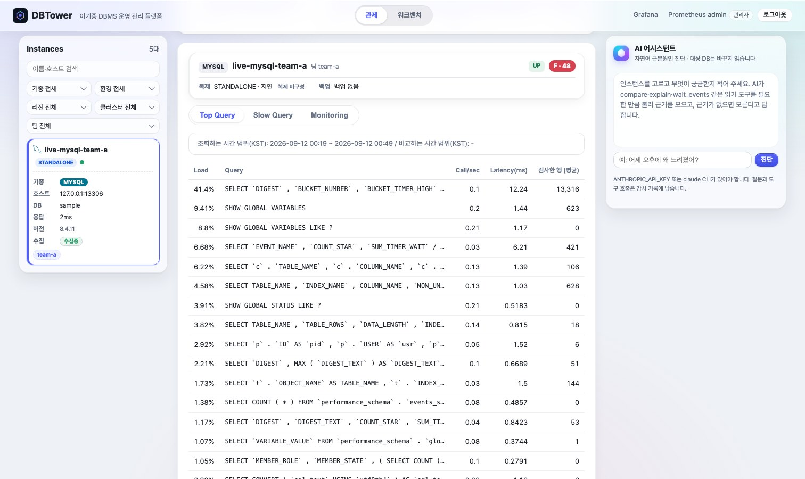
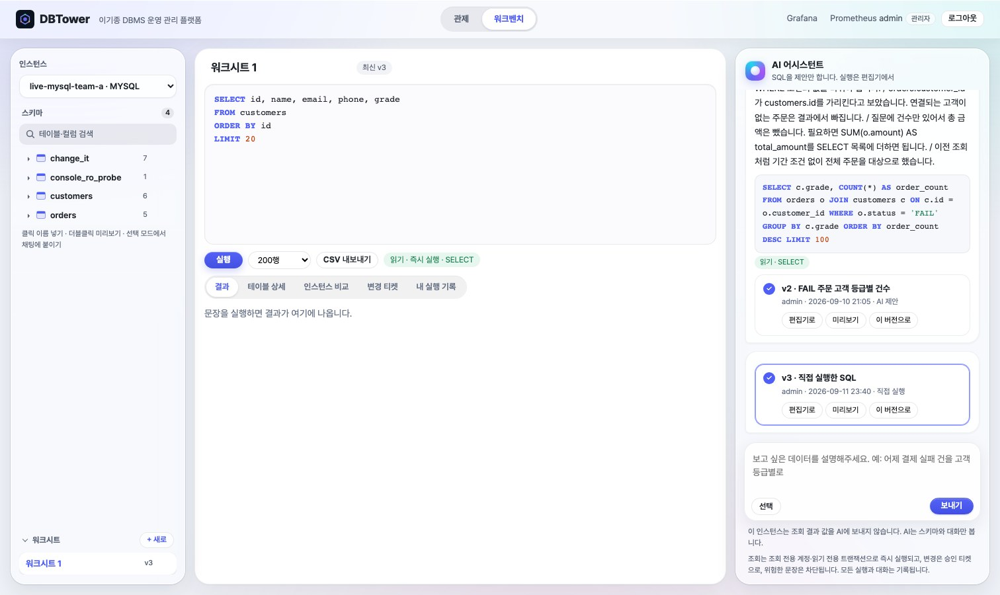

#  DBTower

[](https://github.com/dj258255/dbtower/actions/workflows/ci.yml)

MySQL, PostgreSQL, SQL Server, Oracle, MongoDB를 한곳에서 관제하고 안전하게 변경하는
셀프호스트 DB 운영 플랫폼입니다. 기종별 차이는 `DbmsOperator` 뒤로 숨기고, 관제부터
진단, 승인, 실행, 전후 비교까지 하나의 흐름으로 연결합니다.

Java 21 + Spring Boot 4로 만들었으며 웹 콘솔은 별도 빌드 체인이 없는 정적 SPA입니다.



## 핵심 흐름

```text
관제 -> 문제 구간 비교 -> 실행계획·원인 분석 -> 변경 요청 -> 승인 -> 실행 -> 전후 비교
```

변경은 승인된 티켓만 실행합니다. 실행 직전 행을 복사하고, 복사한 행 수와 실제 영향 행
수가 다르면 커밋하지 않습니다. 되돌리기도 사본과 현재 행이 같은 경우에만 허용합니다.


## 주요 기능

| 영역 | 제공 기능 |
|---|---|
| 관제 | 쿼리 통계, 활동 그래프, 시점 비교, Wait Event, 세션·블로킹, 복제·백업 상태 |
| 진단 | 실행계획 규칙 분석, AI 1차 분석, 심층 원인 진단, 플랜 변경·이상·데드락 감지 |
| 운영 | 통합 헬스 스코어, SLO·에러 버짓, Advisors, FinOps 신호, 백업·복원 검증 |
| 변경 관리 | 읽기 전용 워크벤치, 마스킹, 변경 리뷰, 승인 티켓 실행·되돌리기 |
| 연동 | 웹 콘솔, MCP stdio·HTTP, Discord·Slack 웹훅, K8s·Terraform·Ansible |

기종별 통계와 실행 방식이 달라도 플랫폼 코드는 같은 운영 능력을 사용합니다.

| DBMS | 쿼리 통계 | 실행계획 | 백업 방식 |
|---|---|---|---|
| MySQL | `performance_schema` | JSON EXPLAIN | `mysqldump` 등 외부 CLI |
| PostgreSQL | `pg_stat_statements` | TEXT/JSON EXPLAIN | `pg_dump` 등 외부 CLI |
| SQL Server | DMV·Query Store | 플랜 XML | `BACKUP DATABASE` |
| Oracle | `V$SQL` | `DBMS_XPLAN` | `DBMS_DATAPUMP`·RMAN |
| MongoDB | profiler·server status | explain JSON | `mongodump` |

## 안전 경계

- 모니터링 조회는 읽기 전용 계정과 타임아웃을 사용합니다.
- 변경은 요청자, 승인자, 운영자의 역할을 분리하고 전 과정을 감사 기록에 남깁니다.
- MCP와 AI에는 변경 실행 도구를 노출하지 않습니다. AI는 사람이 정한 규칙 위에서
  분석만 합니다.
- 대상 DB 장애가 플랫폼 전체를 멈추지 않도록 커넥션과 수집 작업을 인스턴스별로
  격리합니다.
- 비밀번호는 AES-256-GCM으로 저장하며 API 응답과 외부 명령 인자에 노출하지 않습니다.

자세한 결정과 위협 경계는 [설계 문서](docs/DESIGN.md), [최소 권한 가이드](docs/least-privilege.md),
[검증 기록](docs/VERIFICATION.md)에서 확인할 수 있습니다.

## 빠른 시작

Docker와 Docker Compose만 있으면 앱과 전용 메타 DB를 실행할 수 있습니다.

```bash
cp .env.example .env
```

`.env`에서 최소 두 값을 설정합니다.

```dotenv
DBTOWER_DB_PASSWORD=change-me-strong-password
DBTOWER_ENCRYPTION_KEY=<openssl rand -base64 32 결과>
```

그다음 컨테이너를 시작합니다.

```bash
docker compose -f docker-compose.app.yml up -d
```

웹 콘솔은 <http://localhost:8080>에서 열립니다. `DBTOWER_ADMIN_PASSWORD`를 비워 두었다면
최초 관리자 비밀번호는 다음 명령으로 확인합니다.

```bash
docker compose -f docker-compose.app.yml logs dbtower
```

이 구성은 DBTower와 메타 DB만 실행합니다. 관리 대상 DB는 로그인 후 웹 콘솔에서
등록합니다.
배포와 프록시, 백업 설정은 [운영 가이드](docs/operations.md)를 참고하세요.

## 로컬 개발

JDK 21과 Docker가 필요합니다. 아래 compose는 개발용 대상 DB 5종과 모니터링 스택을 띄웁니다.

```bash
docker compose up -d
DBTOWER_WEBHOOK_URL="" DBTOWER_ADMIN_PASSWORD=devpass \
DBTOWER_ENCRYPTION_KEY=$(openssl rand -base64 32) ./gradlew bootRun
```

Apple Silicon의 Rosetta 없는 Colima에서는 amd64 전용 SQL Server 2022가 기동되지 않습니다.
이 머신에서 `docker-compose.arm64.yml`의 Azure SQL Edge도 `S_SbtUnimplementedInstruction`로
종료됐다. SQL Server까지 확인할 때는 Rosetta를 켠 별도 Colima 프로필에 실제 2022 이미지를 띄운다.

```bash
colima start mssql2022 --vm-type vz --vz-rosetta --cpu 4 --memory 6 --disk 20
MSSQL_SA_PASSWORD='...' docker --context colima-mssql2022 run -d \
  --name dbtower-mssql2022 --platform linux/amd64 \
  -e ACCEPT_EULA=Y -e MSSQL_SA_PASSWORD -p 14330:1433 \
  mcr.microsoft.com/mssql/server:2022-latest
```

계정·데모 데이터 준비와 실제 SQL Server 2022 검증 결과는
[VERIFICATION.md](docs/VERIFICATION.md) 132·164절에 기록했습니다. 이 실행은 Microsoft가
지원하는 네이티브 ARM64 구성이 아니라 로컬 개발용 번역 환경이다.

등록한 대상의 비밀번호를 다음 실행에서도 사용하려면 암호화 키를 고정해서
보관해야 합니다.
키 없이 로컬에서만 실행하려면 `SPRING_PROFILES_ACTIVE=dev`를 사용할 수 있습니다.

변경을 마치기 전에는 저장소 규칙에 따라 세 검증을 모두 실행합니다.

```bash
./gradlew compileJava
./scripts/check-conventions.sh
./gradlew test
```

## 한 플랫폼, 사람별 입구

| 역할 | 주 사용자 | 주요 권한 |
|---|---|---|
| `VIEWER` | 온콜·팀장 | 관제, 비교, 리포트 조회 |
| `REQUESTER` | 개발자·데이터 요청자 | 워크벤치 조회, 변경 요청 |
| `APPROVER` | DBA 리드 | 변경 승인·반려, 드라이런 |
| `OPERATOR` | DBA 운영자 | 승인 티켓 실행·되돌리기, 백업, 세션 종료 |
| `ADMIN` | 플랫폼 관리자 | 인스턴스, 계정, 보안, 감사 관리 |

승인자와 운영자는 서로를 포함하지 않습니다. 화면은 `/api/me`가 반환한 능력으로 동작을
표시하고, 최종 권한은 서버가 검사합니다.

직접 역할을 바꿔 가며 확인하는 순서는 [역할별 수동 테스트](docs/MANUAL-TEST.md)에 있습니다.



## 아키텍처

플랫폼은 Spring Modulith 기반 16개 모듈로 나뉩니다. 다른 모듈은 공개 서비스와 DTO만
사용하며 구현, 엔티티, 저장소는 각 모듈의 `internal` 패키지에 숨깁니다. 순환 의존과
레이어 위반은 테스트와 규약 검사에서 실패합니다.


핵심은 `operator` 모듈입니다. 새 DBMS 지원은 Operator 구현체가 본체이고 enum, 팩토리,
백업 도구, JDBC 드라이버, 화면 자산은 등록 절차로 다룹니다. 전체 구조는
[DESIGN.md](docs/DESIGN.md), 생성된 모듈 문서는 [docs/modules/](docs/modules/)에 있습니다.

## 실측 결과

성능과 안정성 주장은 모두 재현 가능한 로그를 남깁니다. 대표 결과만 추리면 다음과
같습니다.

| 검증 | Before | After |
|---|---:|---:|
| 시점 비교 조회, 50만 행 | 21.269 ms | 0.062 ms |
| 같은 부하의 인덱스 티켓 전후 평균 지연 | 46.378 ms | 0.521 ms |
| 무응답 대상이 폴러 전체를 막던 시간 | 25초 초과 | 약 2초 |
| 세션 화면 10명의 30초간 대상 조회 | 150회 | 14회 |

측정 환경, 명령, 원문 출력은 [VERIFICATION.md](docs/VERIFICATION.md)의 9, 132, 134,
140절에 있습니다.

## 문서

문서가 길어져도 README가 다시 목차가 되지 않도록 별도의 [문서 안내](docs/README.md)에
목적별 읽기 순서와 기록 위치를 정리했습니다.

- 처음 둘러보기: [한 장 요약](docs/PORTFOLIO-ONEPAGER.md), [5분 시연](docs/DEMO-5MIN.md)
- 설계 이해하기: [설계](docs/DESIGN.md), [AI 판단 규칙](docs/ai-analysis-rules.md)
- 운영·배포하기: [운영](docs/operations.md), [최소 권한](docs/least-privilege.md)
- API 연동하기: [API 빠른 참조](docs/API.md)
- 직접 눌러보기: [역할별 수동 테스트](docs/MANUAL-TEST.md)
- 현재 화면 보기: [화면 갤러리](docs/SCREENSHOTS.md)
- 근거 확인하기: [검증 기록](docs/VERIFICATION.md), [변경 이력](CHANGELOG.md)
- 개발에 참여하기: [기여 가이드](CONTRIBUTING.md), [저장소 규칙](AGENTS.md)

## 요구사항

| 용도 | 요구사항 |
|---|---|
| 셀프호스트 | Docker, Docker Compose, 앱 컨테이너 메모리 512MB~1GB 권장 |
| 소스 개발 | JDK 21, Docker |
| 메타 DB | PostgreSQL 16, compose에 포함 |
| 관리 대상 | MySQL 8.0+, PostgreSQL 13+, SQL Server 2019+, Oracle 19c/Free, MongoDB 6.0+ |

Apache-2.0 라이선스로 배포합니다. 자세한 내용은 [LICENSE](LICENSE)와 [NOTICE](NOTICE)를
참고하세요.
