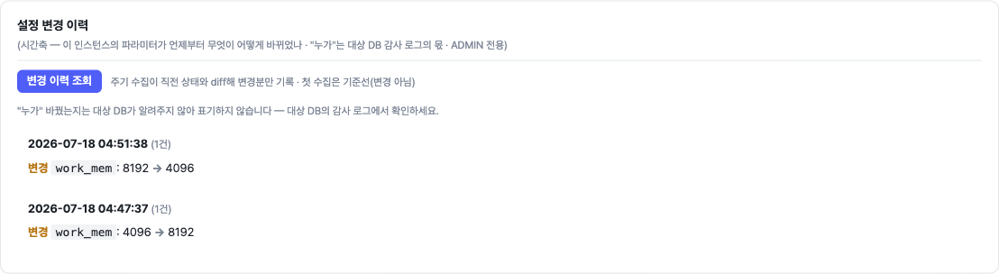
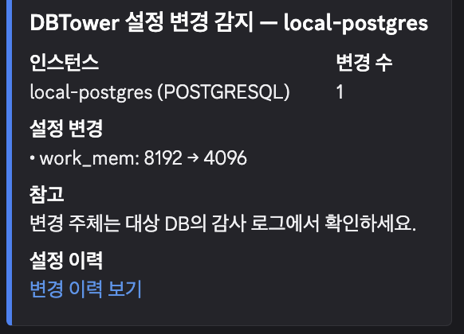
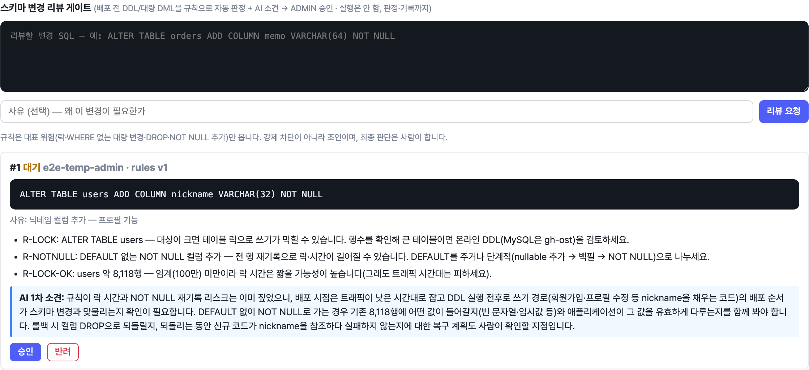
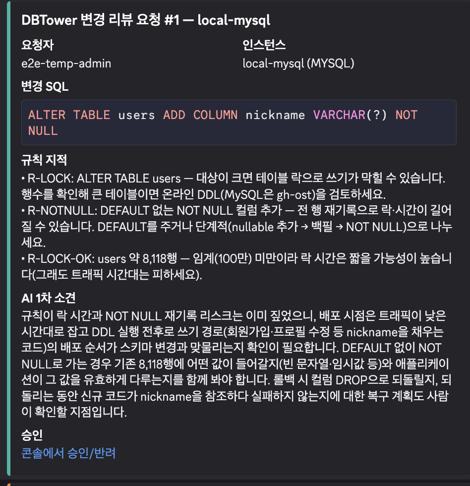
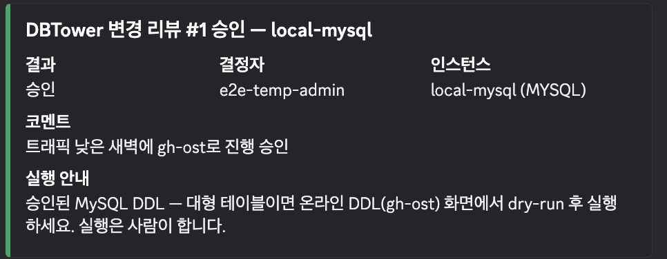
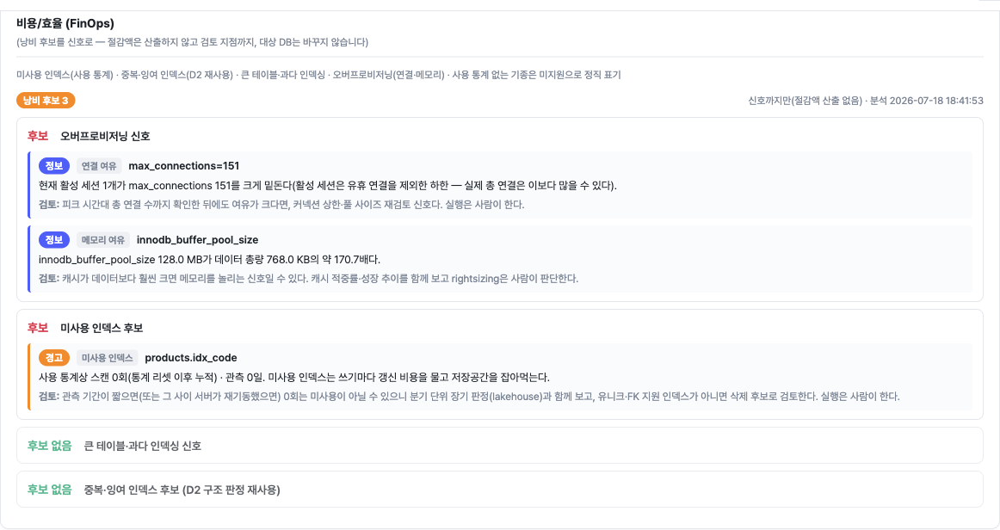
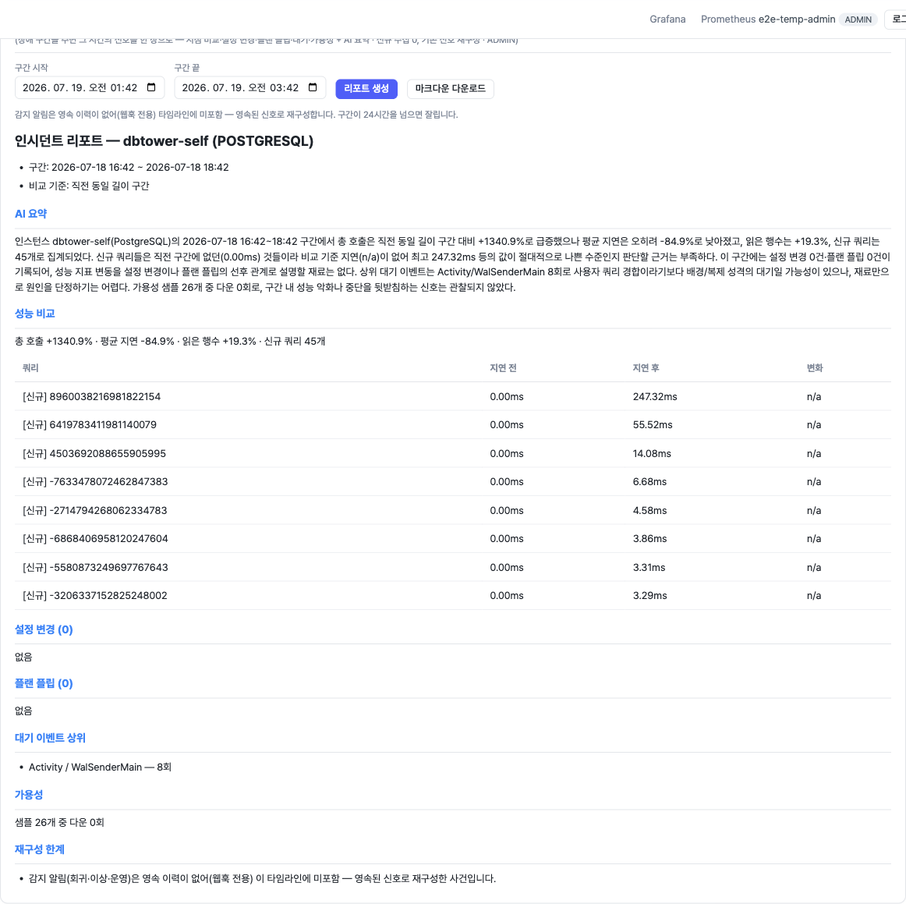
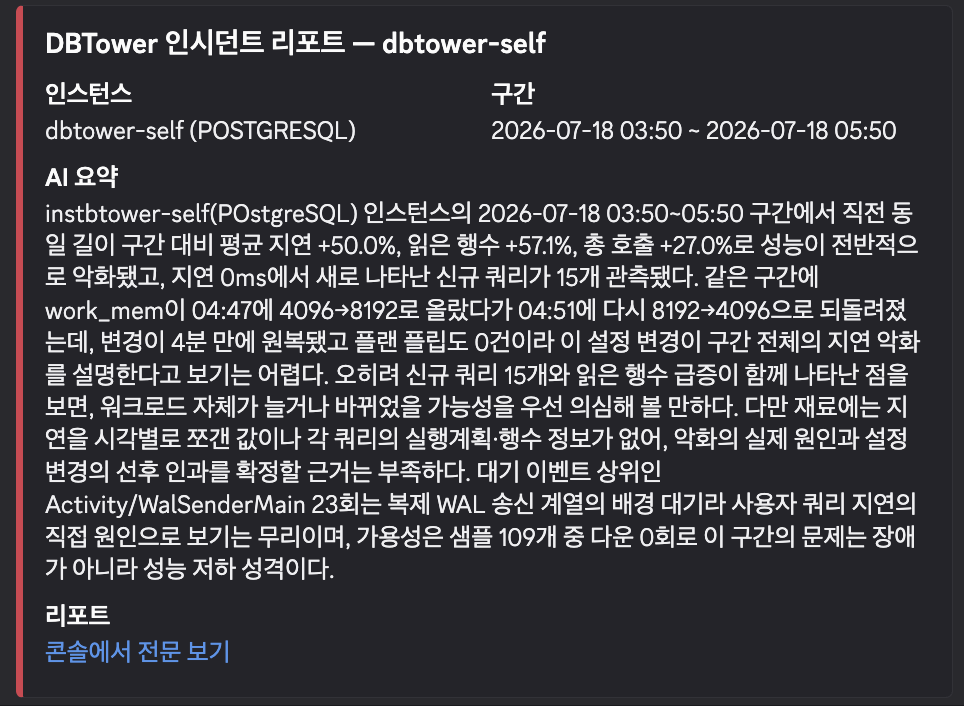
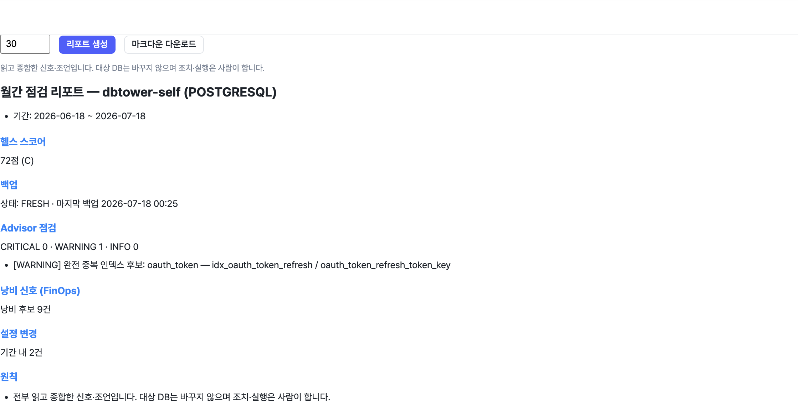

# 운영 병목 아크 (B1~B5) + lakehouse 17단계 — 작업 종합

현업 DBA의 손이 아직 붙어 있던 다섯 지점을 기능으로 끊고, 미사용 인덱스 장기 판정을
lakehouse에 잇는 작업의 종합 기록이다. 2026-07-18 구현.

관통 원칙: **읽고 판정하고 기록하는 것은 깊게, 대상 DB를 바꾸는 실행은 기존 경계
(ADMIN·gh-ost·사람) 뒤에 둔다.** 관제탑이 대상 DB에 임의 DDL을 실행하면 다른 제품이 된다.

- 상세 재현 기록: [VERIFICATION.md](VERIFICATION.md) 105~109절
- 블로그 서사: [dbtower 20편](https://github.com/dj258255/IT-Oasis)(운영 병목 다섯 곳)
- 로드맵 명세: [ROADMAP.md](ROADMAP.md) "운영 병목 아크 B1~B5"

---

## 한눈 요약

| 아크 | 기능 | 신규 수집 | 실행 여부 | 마이그레이션 | VERIFICATION |
|---|---|---|---|---|---|
| B1 | 설정 드리프트 이력 | 0 (parameters 재사용) | 안 함(이력만) | V27 | 105 |
| B2 | 스키마 변경 리뷰 게이트 | — | 안 함(gh-ost 안내) | V28 | 106 |
| B3 | 인덱스 사용 통계 주기 영속 | indexUsage 잡 | — | V29 | 107 |
| B4 | 인시던트 리포트 원클릭 | 0 (기존 신호 조합) | — | — | 108 |
| B5 | 월간 정기 점검 리포트 | 0 (기존 신호 조합) | — | — | 109 |
| lakehouse 17 | 미사용 인덱스 장기 판정 | — | — | — | (lakehouse 저장소) |

테스트 514건 그린 · ModularityTests 통과 · 신규 모듈 1개(review) · 공개 파사드 2개(score·finops).

---

## B1 — 설정 드리프트 이력

파라미터 diff의 공간축("A와 B가 다른가")에 시간축("언제부터 무엇이 바뀌었나")을 붙였다.

- **폭증 방지**: `config_current_param`이 현재 전량을 거울처럼 들고 변경분만 로그, 매 수집엔
  해시 한 줄. 무변경 주기엔 그 한 줄만 쌓인다.
- **첫 수집은 기준선**(baseline) — 기동하자마자 수백 개가 "변경됐다"고 카드 쏘는 사고 방지.
- **"누가"는 미표기**(정직) — 대상 DB가 안 주는 정보라 대상 감사 로그의 몫임을 안내.
- **플랜 플립 ±24h 대조** — 설정 변경이 플랜을 갈아탄 원인 후보로 잇는다.

파일: `alert/internal/ConfigDriftService.java`, `job/ConfigDriftDetector.java`,
`persistence/ConfigDriftDao.java`, `web/ConfigDriftController.java`, `V27__config_drift.sql`.

**덤(회귀 발견·수정)**: MongoDB `parameters()`가 `$clusterTime`·`operationTime` 같은 명령 봉투
gossip 필드를 흘려 매 수집 오탐. 파라미터 diff도 오염하던 기존 버그를 `MongoOperator`에서 수정.

라이브: work_mem 4096→8192 변경 → 같은 서버 인스턴스 2개 감지 → 웹훅 카드 발사.

---

## B2 — 스키마 변경 리뷰 게이트

배포 전 DDL/대량 DML을 규칙으로 판정·AI 소견·ADMIN 승인·자동 감사. 실행은 안 한다.

- "범위 밖"이던 SQL 변경 심의를 **판정·승인·기록까지**로 좁혀 부분 재결정. 실행 안 하니
  gh-ost MySQL 전용 문제 해소, 판정은 규칙 엔진 그 자체라 읽기·진단 DNA와 충돌 없음.
- **규칙**(R2): 락 위험(대테이블 ALTER), DEFAULT 없는 NOT NULL, DROP TABLE/COLUMN,
  TRUNCATE, WHERE 없는 UPDATE/DELETE. 대테이블은 tableDetail 실제 행수로 락 위험 확정.
- **AI 1차 소견**(R3): 규칙 반복 금지·배포 순서·롤백 관점만. **감사**(R4): AuditInterceptor 자동.
  **카드**(R5): 이벤트로 alert에 위임(Modulith 순환 회피). **실행 안내**(R6): gh-ost 화면만.

- **파서 강화**(후속): 판정을 정규식에서 JSqlParser(구문 트리)로 바꿔, 정상 다중 문장은 더
  이상 parseLimited가 아니고(문자열 안 세미콜론·달러 인용 오인 제거), ADD/DROP 컬럼을 정확히
  뽑아 실제 스키마와 대조한다 — "이미 있는 컬럼 추가"(R-COL-EXISTS)·"없는 컬럼 삭제"
  (R-COL-MISSING). 스냅샷에 테이블이 없거나 스키마리스면 판정 보류(오탐 방지). 파서 실패 시
  정규식 폴백(parseLimited=true 정직 표기).

파일: `review` 모듈(신규), `ReviewSubmittedEvent`/`ReviewDecidedEvent`,
`alert/internal/ReviewAlertListener.java`, `V28__change_review.sql`,
`review/internal/ChangeReviewRules.java`(JSqlParser), `ReviewService.java`(스키마 대조).

라이브: MySQL users `ADD COLUMN nickname VARCHAR(32) NOT NULL` → R-LOCK·R-NOTNULL·
R-LOCK-OK(8,118행) + AI 소견 → 승인 → 감사 2건.

---

## B3 — 인덱스 사용 통계 주기 영속

"이 인덱스 지워도 되나"는 재시작-누적 카운터의 순간값으론 못 답한다. lakehouse 분기 판정의 원료.

- **5기종**: PG pg_stat_user_indexes / MSSQL dm_db_index_usage_stats / MySQL
  table_io_waits_summary_by_index_usage / Mongo $indexStats. Oracle은 UNSUPPORTED 정직
  (MONITORING USAGE 침습·라이선스). 원천 indexUsage()는 이미 있어 신규 수집 메서드 0.
- **잡**(I2): V29 index_usage_snapshot, 6시간·7일 보존(size_snapshot과 대칭).
- **관측 기간 라벨**(I3): FinOps 미사용 인덱스 신호에 "관측 N일" — "미사용(관측 3일)"과
  "미사용(관측 90일)"을 구분. finops→insight 공개 서비스(IndexUsageHistoryService).

파일: `insight/internal/job/IndexUsageSnapshotJob.java`, `insight/IndexUsageHistoryService.java`,
`finops/internal/UnusedIndexAnalyzer.java`(라벨), `V29__index_usage_snapshot.sql`.

라이브: 4기종 적재·Oracle 0행(UNSUPPORTED)·심은 미사용 인덱스에 "관측 0일" 라벨.

---

## B4 — 인시던트 리포트 원클릭

장애 구간을 주면 그 시간의 이야기를 이미 저장된 신호로 재구성. 신규 수집 0.

- **재료 5종**: 시점 비교(직전 동일 구간)·설정 변경(B1)·플랜 플립·대기 이벤트·헬스 추이.
  신규 공개 조회 2개(WaitEventHistoryService·SloService.healthInWindow).
- **AI 요약**: 조립된 재료만으로(재료에 없는 수치·원인 생성 금지).
- **정직**: 감지 알림은 영속 이력이 없어(웹훅 전용) 미포함 — "영속된 신호로 재구성한 사건" 명시.
  24h 상한·top-N 절단 노트(silent truncation 금지).

파일: `alert/internal/IncidentReportService.java`, `web/IncidentController.java`.

라이브(dbtower-self 2시간): AI가 "지연이 읽은 행수와 나란히→워크로드 증가 가능성, work_mem은
4분 net-zero라 악화 설명 어려움, 근거 부족" 정직 판정.

---

## B5 — 월간 정기 점검 리포트

DBA가 매달 손으로 만드는 정기 점검 보고서 자동화. 기간 전체의 건강을 한 장으로.

- **재료**: 헬스 스코어·백업 신선도와 복원 검증·Advisor 스윕과 용량 예측·낭비 신호·설정 변경.
- **공개 파사드 2개**(Modulith 경계): score.ScoreQuery/HealthScoreView,
  finops.FinOpsQuery/WasteSummary. alert→score·advisor·finops 신규 의존(순환 없음).
- **@monthly 잡**: 전 인스턴스 롤업 카드 1장(나쁜 순). **수동 트리거**: 콘솔 마크다운 렌더·다운로드.

파일: `alert/internal/MonthlyReportService.java`, `job/MonthlyReportJob.java`,
`web/MonthlyReportController.java`, `score/ScoreQuery.java`, `finops/FinOpsQuery.java`.

라이브(dbtower-self 30일): 헬스 72점(C)·백업 FRESH·중복 인덱스 경고·낭비 9건·설정 변경 2건.

---

## lakehouse 17단계 — 미사용 인덱스 장기 판정

B3가 공급한 index_usage_snapshot을 받아 분기 창으로 "지워도 되나" 판정(dbtower-lakehouse 저장소).

- 레지스트리 편입 + stg/fct_index_daily(누적→일간 델타는 2편 first-vs-last·리셋 클램프 재사용)
  + mart_index_verdict(창 90일).
- **판정 4갈래**: 사용중 / 유니크·PK 제외 / 관측 부족 보류 / 삭제 후보. FK 뒷받침·레플리카 전용
  사용은 이 통계로 판정 불가라 note에 정직 표기.
- 검증: dbt build PASS=93(unit test 3종 신규 — 델타·리셋 클램프·판정 4갈래, verdict 값 계약 고정).

---

## 보안(백그라운드 리뷰 반영)

B2 커밋에서 발견된 리뷰 조회 IDOR 2건 즉시 수정:
- byInstance()는 registryService.findById로 LBAC 스코프 게이트(스코프 밖 404).
- /api/reviews/pending은 ADMIN 트리아지로 제한(팀 사용자에게 타 팀 리뷰 SQL 노출 차단).

---

## 후속 개선 — 파서 강화·리포트 통합 테스트

**리뷰 게이트 파서(JSqlParser)**: 위 B2 항목 참고. ChangeReviewRulesTest 13건 그린
(정상 다중 문장 정확 파싱·컬럼 추출·스키마 대조·폴백 각각 검증). JSqlParser 5.1은 순수 Java·
트랜지티브 의존 없음.

**B4/B5 엔드포인트 통합 테스트**: 조립기는 목 기반 유닛만 있었는데, `@SpringBootTest`+MockMvc로
컨트롤러 → 보안(ADMIN) → 조립기 → 마크다운 → JSON 직렬화까지 관통을 검증한다.
- IncidentReportIntegrationTest(3): 신호 없어도 각 절 생성·24h 절단·VIEWER 403.
- MonthlyReportIntegrationTest(2): 점수·각 절 생성·VIEWER 403.
- 스냅샷 테이블(query_snapshot·config_param_change·wait_event 등)은 JPA 엔티티가 없어 H2
  (create-drop, Flyway off) 테스트 DB에 없다 → 그 조회 원천 서비스만 목으로 대체하고
  나머지(컨트롤러·보안·조립기·직렬화)는 실빈으로 둔다(저장소의 스냅샷=목 유닛 방침 승계).

검증: `./gradlew test` 514건 그린(실패 0·에러 0). VERIFICATION.md 110절.
