# 현재 화면 갤러리

README와 발표·포트폴리오에서 사용할 현재 화면만 모았습니다. `VERIFICATION.md`의 이전 캡처와
전후 비교 이미지는 당시 결함과 수정 근거이므로 덮어쓰지 않습니다. 화면을 바꾸면 이 문서의 대표
이미지를 먼저 다시 확인하고, 과거 증거는 절 번호와 함께 그대로 보존합니다.

## v1.4.0 화면 (하늘 원톤, 166~187)

로그인 화면과 콘솔 전체를 하늘 원톤으로 바꾸고(172·175절), 관제 AI 칸을 채팅으로 다시 짰으며
(173·177절), 쿼리 상세·워크벤치·관리 화면·좁은 화면을 정리한 뒤의 화면입니다.

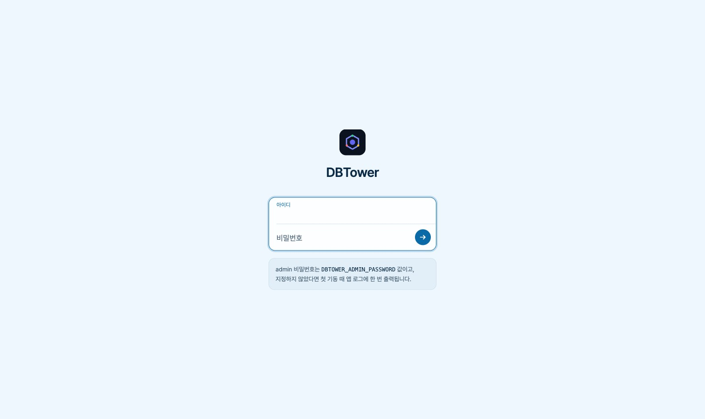

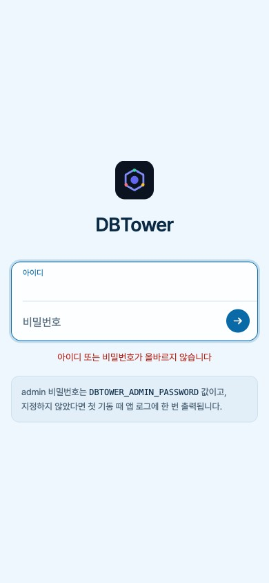

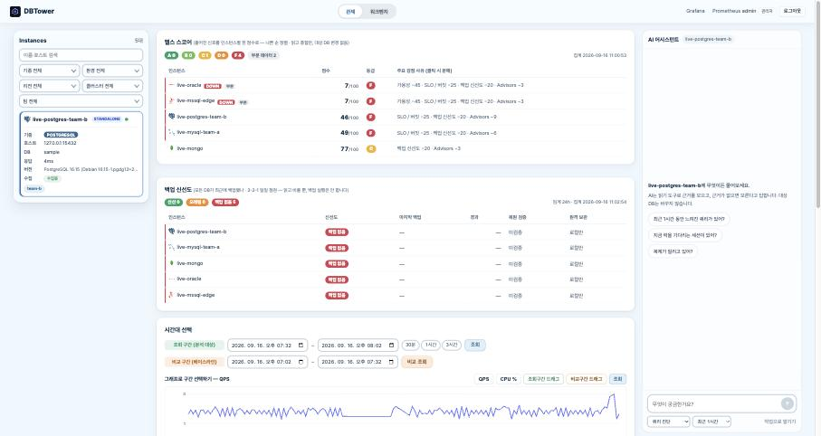

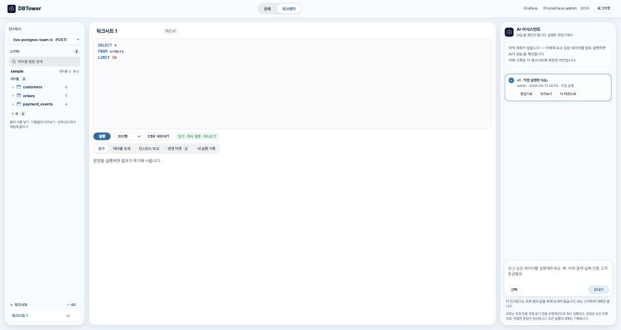

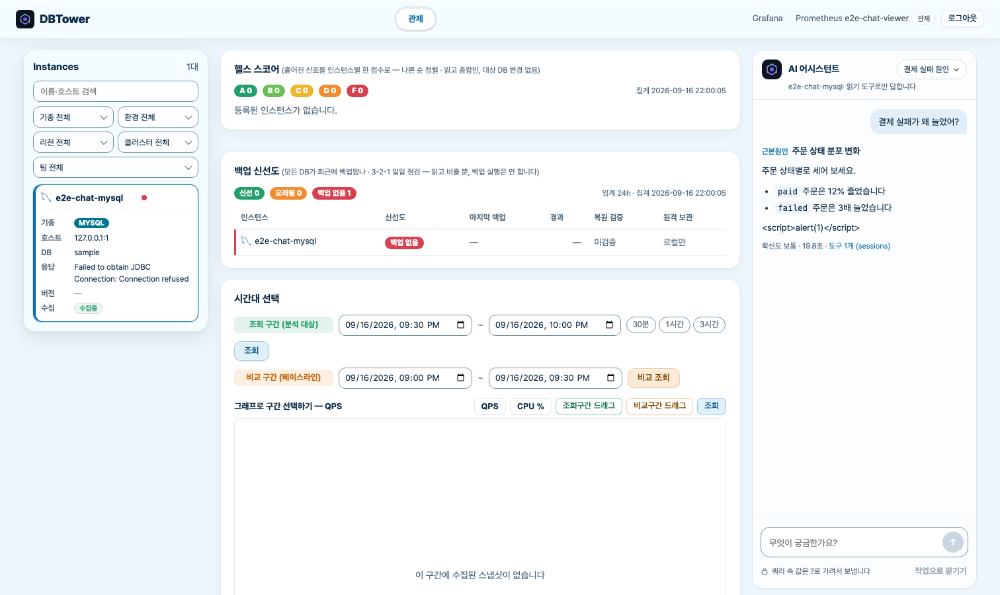

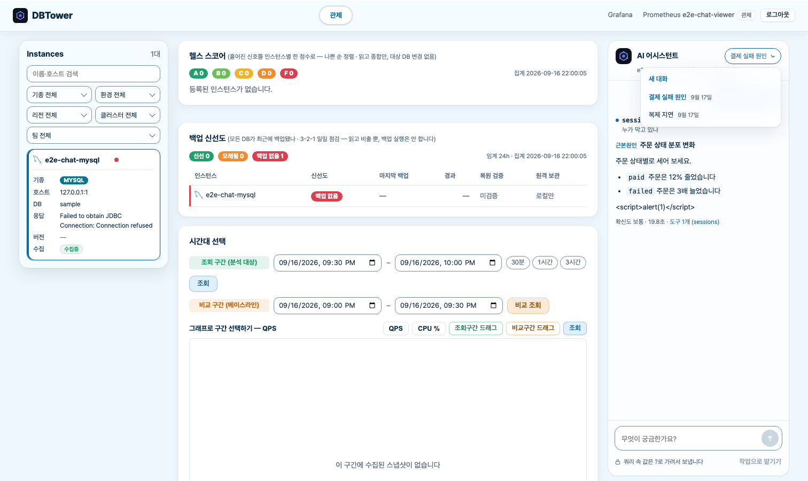

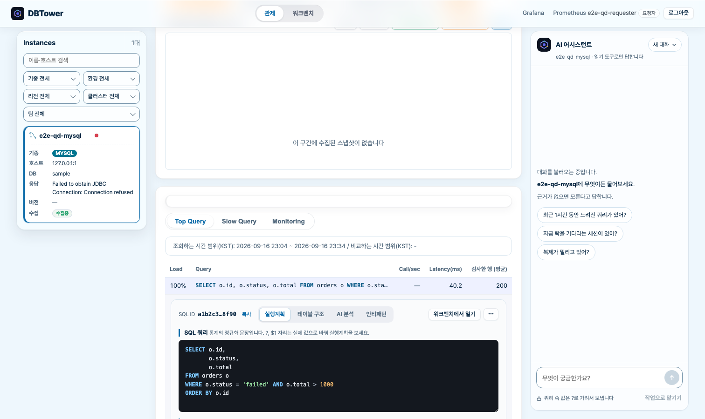

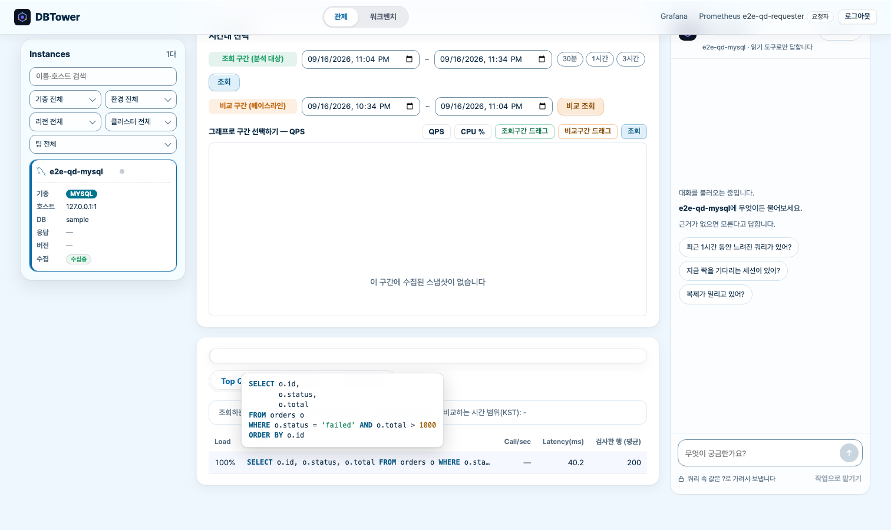

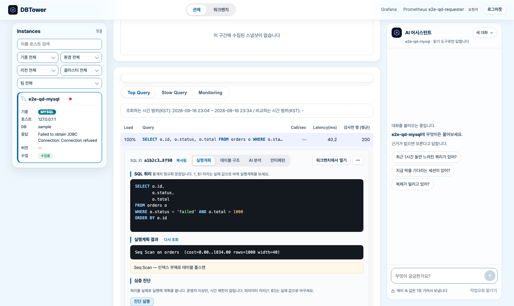

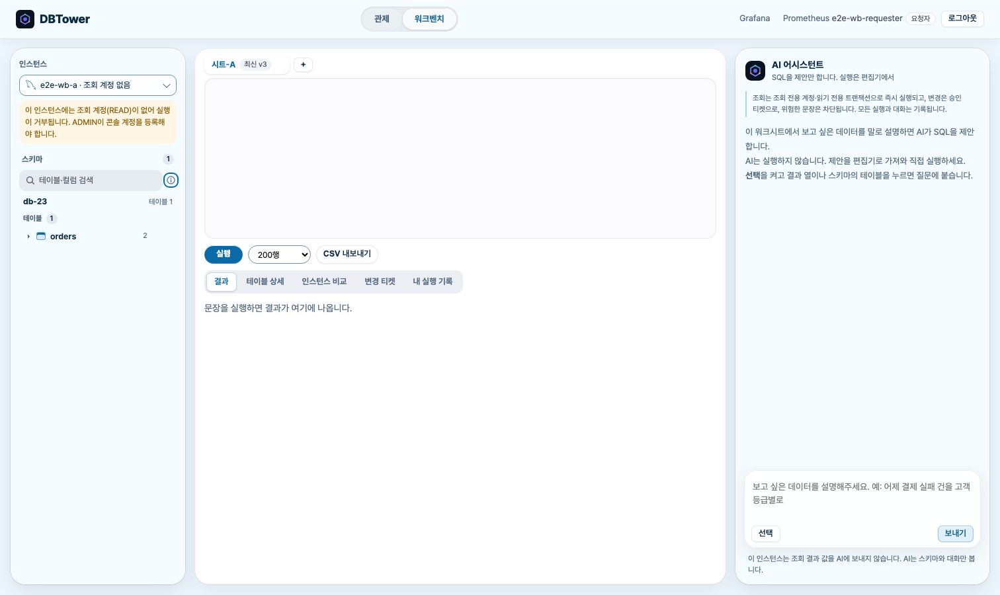

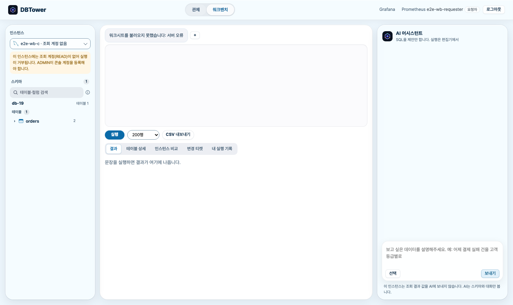

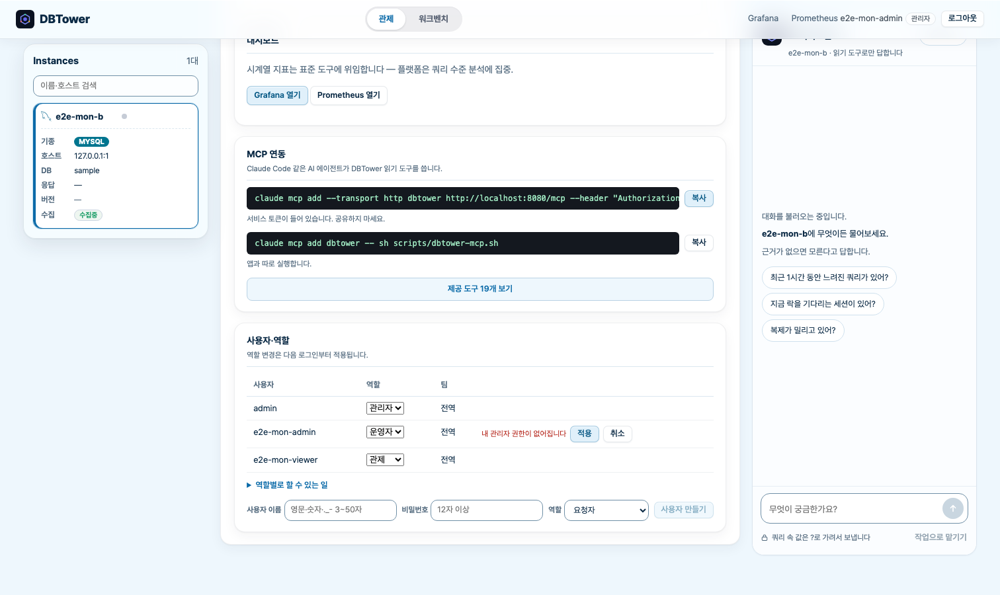

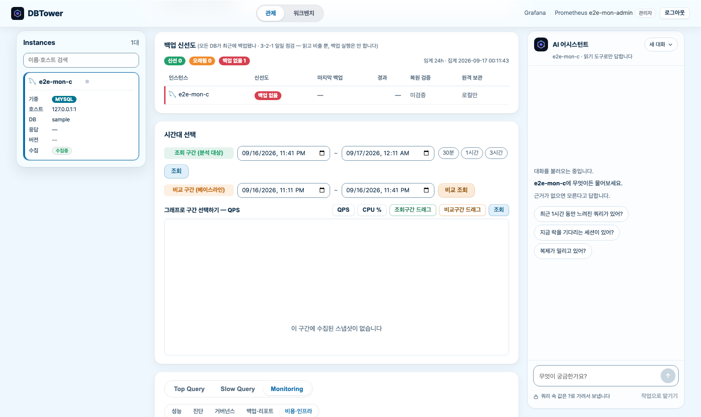

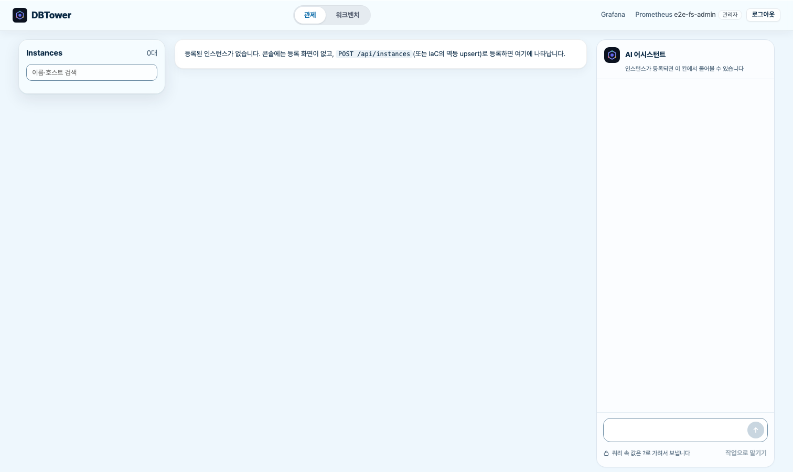

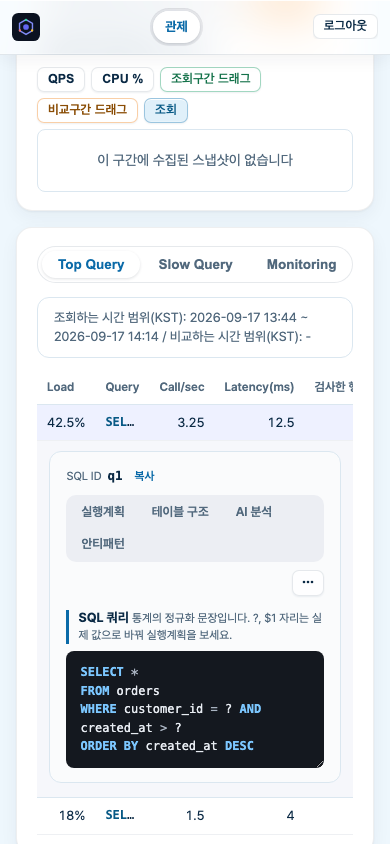

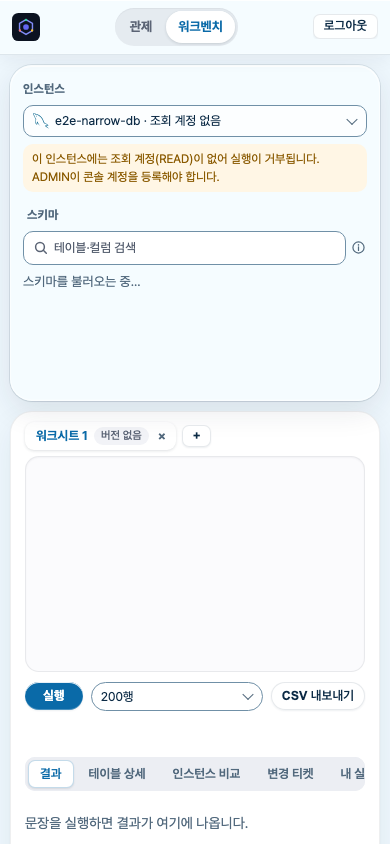

## v1.3 화면 (보라 원톤)

아래는 175절에서 하늘 원톤으로 바꾸기 전(v1.3.0·v1.3.1)에 찍은 화면입니다. v1.3 소개와
전후 비교용으로만 남기며, 현재 화면으로 소개하지 않습니다.

v1.3 SLO 화면의 `360,003.11ms`는 캡처에 함께 보이는 360초 부하 재현 SQL의 실제 통계입니다.
PostgreSQL이 제공하는 평균과 표준편차로 계산한 값이라 `추정`으로 표시하며, 실측 백분위인 것처럼
보이지 않습니다.

`164-session-table.jpg`는 PostgreSQL 세션 경과가 `-7.84ms`로 보이던 결함을 발견한 증거입니다.
현재 화면으로 소개하지 않고 [VERIFICATION 162절](VERIFICATION.md)에만 보존합니다. 현재 구현은
`clock_timestamp()`를 사용하고 0으로 바닥쳐 음수 경과를 내보내지 않습니다.

## 갱신 원칙

- 현재 화면 소개에는 이 문서에 선별한 캡처만 사용합니다.
- 전후 비교와 결함 발견 캡처는 파일을 교체하지 않고 `VERIFICATION.md`에 남깁니다.
- 캡처를 추가할 때 숫자의 단위, 범위, 시각, 출처 라벨을 함께 확인합니다.
- 이미지 파일은 디코딩과 가로·세로 크기를 검사하고, Markdown의 로컬 링크 누락도 확인합니다.
