# DBTower 설계 문서

## 1. 문제 정의

여러 기종의 DBMS(MySQL·PostgreSQL·MSSQL·Oracle·MongoDB)를 운영하는 조직에서 반복되는 문제:

1. **지표 분산** — 쿼리 통계·슬로우 쿼리·실행계획이 기종마다 다른 도구/구문에 흩어져 있다
2. **커뮤니케이션 비용** — 개발자가 스스로 DB 이슈를 분석하지 못해 DBA 문의가 반복된다
3. **운영 작업의 기종 종속** — 백업·계정·정책 작업이 기종별 구문에 묶여 자동화가 어렵다

목표: 반복 운영을 추상화·자동화해 **관리 대상이 늘어도 운영 인력이 선형으로 늘지 않게** 한다. (DBRE)

## 2. 아키텍처

현재 구조의 기준은 Spring Modulith 17개 모듈, `DbmsOperator` 구현 5종, MCP 도구 19개,
Flyway V46이다. 웹 콘솔과 MCP는 같은 서비스 코어와 호출자 권한을 사용하고, AI는 읽기와
변경 요청까지만 참여한다. 대상 DB 변경은 `review`가 승인한 티켓을 `workbench` 실행 계층이
검증할 때만 허용한다.

사람이 화면 앞에 없어도 도는 경로는 `aiops` 모듈이 맡는다 — Slack·경보·스케줄이 만든 비동기 작업을
같은 권한·사실·검증·감사로 처리하고, 큐·검색·알림은 플랫폼 밖 실행면(`integrations/ai-ops-gateway`)에 둔다.
모델이 낸 수치는 플랫폼이 모은 사실과 대조해 어긋나면 "검증되지 않음"으로 남긴다
([AI 운영 작업](AI-OPERATIONS-AUTOMATION.md)).

- [데이터 도메인 지도](../diagrams/erd.svg): V1~V41에서 역할이 큰 테이블과 증거의 연결
- [진단에서 실행까지](../diagrams/insight-flow.svg): AI와 사람의 책임, 승인·실행 불변식
- [CI/CD와 런타임](../diagrams/deployment-flow.svg): 테스트 게이트, 이미지 게시, 셀프호스트와 대상 프로비저닝
- [모듈 문서](../modules/): Spring Modulith가 코드에서 생성한 실제 의존 관계

## 3. 핵심 결정과 이유

### 3.1 인터페이스 경계 — DbmsOperator

플랫폼의 모든 기능은 `health / queryStats / slowQueries / explain / backup / replicationState`
여섯 개 연산에서 출발했다(이후 wait event·세션·파라미터·스키마 등으로 확장 — 현재 목록은
DbmsOperator 인터페이스가 권위). 기종 분기는 팩토리 한 곳에만 존재한다.

- 이렇게 나눈 이유: 운영 작업의 "무엇"(백업하라)과 "어떻게"(mysqldump vs BACKUP DATABASE)를 분리.
  새 DBMS 지원이 구현체 1개 추가로 끝나는지가 이 설계의 성공 기준
- 검증 방법: 새 기종을 추가할 때 플랫폼 코드 수정이 0인지 확인한다 — MSSQL로 1차, Oracle·MongoDB(비 JDBC)로 2차 검증 완료 (VERIFICATION 18절)

### 3.2 시점 비교 — 왜 상위 쿼리 나열로는 부족한가

부하 상위 쿼리가 곧 장애 원인이 아닐 수 있다. 평소에도 높던 쿼리일 수 있고,
진짜 범인은 "새로 유입된 쿼리"거나 "평소 대비 급증한 쿼리"다. (레퍼런스의 시점 비교와 같은 문제의식)

- 데이터 모델: 통계 소스의 calls/totalTime은 **누적 카운터** → 주기 스냅샷을 쌓고,
  구간 양 끝 배치의 차분 = 구간 내 실제 발생량
- 구간 길이가 달라도 비교 가능하도록 QPS로 정규화
- base 구간에 없던 쿼리는 newQuery로 표시

### 3.3 기종별 통계 소스의 차이 (추상화가 필요한 실제 근거)

| | MySQL | PostgreSQL | MSSQL | Oracle | MongoDB |
|---|---|---|---|---|---|
| 소스 | performance_schema digest | pg_stat_statements | dm_exec_query_stats | V$SQL | system.profile |
| 정규화 방식 | 텍스트 앞 N바이트 | 파싱 결과 기반 | query_hash | sql_id (child cursor 합산 필요) | queryHash |
| 함정 | max_digest_length(1024) 초과 시 긴 쿼리가 뭉개짐 → 4096으로 상향 | 프리로드 필요 | 플랜 캐시 축출 시 통계 소실 | 커서 축출 시 통계 소실, V$ 조회에 별도 권한 | capped collection이라 가득 차면 덮어씀 (누적 카운터가 아님) |
| 시간 단위 | 피코초 | ms | 마이크로초 | 마이크로초 | ms |

같은 "쿼리 통계"인데 소스·정규화·단위가 전부 다르다 — 이 표가 인터페이스 추상화의 존재 이유다.

### 3.4 시점 비교 검증에서 배운 것 (실측 기록)

샘플 워크로드(점조회 400회 → 점조회 800회 + 신규 풀스캔 LIKE 60회)로 검증한 결과:

- 신규 쿼리 플래그, QPS +100%, rows/call 8,000(풀스캔), 구간 읽은행수 +58,428% 전부 검출
- **함정**: 누적 카운터 차분 방식은 구간 경계가 스냅샷 배치 시각을 포함해야 한다.
  경계를 배치 1초 뒤로 잡으면 그 사이 발생량이 전부 이전 배치에 흡수돼 delta가 0이 된다.
  레퍼런스가 CPU 그래프 "드래그"로 구간을 선택하게 한 이유 — 사용자가 임의 시각을 입력하면
  이 함정에 빠진다. 개선: 배치 시각 목록 API를 제공하고, 요청 구간을 가장 가까운 배치로 스냅

### 3.5 안전 원칙

- 모니터 계정의 explain은 SELECT만 허용한다. 대상 DB 변경은 **승인된 티켓만** 분리된 변경 계정으로 실행한다(2026-09-10 재결정,
  VERIFICATION 130·131절) — 실행권은 조건부 UPDATE로 한 요청만 얻고, 같은 트랜잭션에서 변경 전 사본 행 수와 영향 행 수가 같을 때만
  커밋하며, 되돌리기는 실행 직후 사본과 현재 행이 같을 때만 파라미터 바인딩으로 쓴다. 안전을 SQL 해석에 걸지 않는다
- **대량 변경은 되돌리기의 근거를 바꿔 들여왔다**(2026-09-18, VERIFICATION 196·197절). 수십만 행은 사본 방식의 대가가 행 수에 비례해
  (10,000행 락 보유 PostgreSQL 67.1ms·MySQL 75.2ms) 쓸 수 없다. 기본 키 범위로 쪼개 구간마다 따로 커밋하고, 되돌리기는 사본이 아니라
  **복원 검증에 성공한 최근 백업**을 실행 전 조건으로 건다. 이 경로의 실행 계층 불변식은 "영향 행 수가 목표 배치 크기를 넘으면 커밋하지 않는다"이다 —
  경계를 키로 잡았으니 넘었다면 키 열이 유일하지 않다는 뜻이다. 취소·실패는 이미 커밋한 배치를 되돌리지 않는다(부분 적용이 정상 상태다)
- 사람이 여는 자유 조회는 모니터 계정이 아니라 조회 전용 콘솔 계정 + 읽기 전용 트랜잭션 + 결과 마스킹으로 실행한다(128절)
- 대상이 연결만 받고 말이 없어도 플랫폼 스레드가 묶이지 않는다 — 풀은 첫 연결을 늦게 열고(맵 락 안에서 연결하지 않음), SQL Server·Oracle은
  로그인 단계에만 읽기 제한을 걸었다가 로그인 뒤 푼다(긴 BACKUP·RESTORE·Data Pump를 끊지 않게). 수정 전에는 대상 하나가 모든 대상의 폴러와
  삭제 API를 세웠다(134절, 재현 테스트 UnresponsiveTargetTest)
- 채널이 코어를 대신 부를 때도 주체는 사람이다 — MCP HTTP 전송은 요청을 인증한 호출자의 토큰으로 REST에 위임한다. 서비스 토큰으로
  바꿔 부르면 요청자·감사 기록이 사람을 잃고, 요청자·승인자 분리가 같은 사람을 다른 주체로 본다(132절, 수정 전 자기 승인 200)
- 변경을 승인하는 사람과 실행하는 사람을 역할에서부터 나눈다 — 승인자(APPROVER)와 운영자(OPERATOR)는 서로를 포함하지 않고,
  관리자만 둘 다 가진다. 요청자 본인의 자기 승인은 `dbtower.review.require-separate-approver`를 켜면 이름으로 막고(기본 꺼짐),
  역할 분리는 설정과 무관하게 승인과 실행을 다른 사람에게 둔다(135절)
- MSSQL 실행계획은 쿼리 재실행 대신 플랜 캐시 조회 (운영 부하 방지)
- 수집 실패는 인스턴스 단위로 격리 (한 대상 장애가 전체 수집을 막지 않음)
- failover는 관측만, 실행은 안 함 — 역할 변경·split-brain은 감지·경보하되, 승격·펜싱·전환은
  정족수·펜싱을 가진 클러스터 매니저(WSFC/Pacemaker/Patroni) 몫이다. 감지기가 실행기까지 겸하면
  그것이 죽을 때 둘 다 잃고, 소유자와 판단이 갈리면 스플릿 브레인 위험 (VERIFICATION 123.17)
- 복제 상태는 "설정 vs 지금 실제"를 구분 — 동기 설정인데 실제 async면 UNAVAILABLE로 강등(침묵 금지)
- 접속 계정은 API 응답에 노출하지 않음. 저장 암호화는 Phase A2에서 구현(AES-256-GCM,
  VERIFICATION 21절) — 다음 단계는 Vault 동적 계정

### 3.6 한 플랫폼, 사람별 입구 (2026-09-11, VERIFICATION 135절)

관제(대시보드)와 거버넌스 워크벤치를 두 제품으로 나눌지 검토했다. 나누지 않았다 — 인스턴스 등록·팀 범위(LBAC)·감사·변경 티켓·AI 진단을
둘 다 쓰고, 운영자가 "관제에서 이상을 보고 -> 워크벤치에서 데이터로 확인하고 -> 변경을 올리고 -> 실행 뒤 관제에서 전후를 보는" 한 흐름이
두 화면을 오간다. 제품을 나누면 이 흐름이 시스템 경계를 넘어 인증·범위·감사를 두 번 맞춰야 한다.

대신 쓰는 사람을 나눴다. 예전 역할 둘(VIEWER·ADMIN)로는 백업을 돌리는 DBA가 인스턴스 등록·보안 설정 권한까지 가져야 했고,
관제만 보는 사람도 워크벤치에서 대상 DB의 행 값을 볼 수 있었다.

| 역할 | 포함 | 입구 |
|---|---|---|
| VIEWER | — | 대시보드(관제·리포트 조회) |
| REQUESTER | VIEWER | 워크벤치(행 값 조회·변경 요청) |
| APPROVER | REQUESTER | 대시보드·워크벤치의 승인·반려·드라이런 |
| OPERATOR | REQUESTER | 실행·되돌리기·백업·세션 종료·심층 진단 |
| ADMIN | APPROVER, OPERATOR | 인스턴스·접속 계정·보안·감사·사용자 |

- 포함 관계는 Spring Security RoleHierarchy 하나(`PlatformRoles`)에 둔다. 인가(SecurityConfig의 hasRole)와 화면(`/api/me`의 capabilities)이
  같은 정의를 읽어, 역할이 늘어도 화면 분기는 능력 이름 그대로다
- 기존 VIEWER 사용자는 워크벤치·변경 요청을 써 왔으므로 V40이 REQUESTER로 옮긴다(권한을 조용히 잃지 않게). VIEWER는 새로 만드는 관제 전용 역할이다
- MCP 채널 입구는 ADMIN에서 VIEWER로 낮췄다 — 도구 호출이 호출자 토큰으로 REST에 위임되므로(132절) 채널이 따로 막을 이유가 없고, 막으면
  요청자가 에이전트로 변경 요청을 올릴 수 없다
- 넘김 셋: 쿼리 상세 -> 워크벤치(SQL은 URL이 아니라 localStorage 한 번 쓰기, 요청 줄 상한 8KB 때문), 인덱스 제안 -> 변경 요청 창(가상 인덱스
  비용을 사유로), 실행 기록 -> 대시보드 시점 비교(실행 시각 앞뒤 30분)
- 로그인 뒤 첫 화면은 역할로 고르되 저장된 요청(딥링크·OAuth 인가)이 먼저다. 저장된 요청이 쿼리 없는 루트면 버린다 — 호스트만 치고 온
  요청자까지 대시보드로 보내면 역할별 첫 화면이 의미가 없다

### 3.7 화면 재질 — Liquid Glass는 뜨는 계층에만 (2026-09-11, VERIFICATION 138절)

Apple Liquid Glass(WWDC25)의 재질감을 웹 콘솔에 들이되, 운영 콘솔은 표와 수치를 읽는 화면이라 가독성을 먼저 둔다.

- **어디에 쓰나.** Apple HIG의 원칙대로 콘텐츠 위에 뜨는 탐색·컨트롤 계층에만 — 상단바, 사이드바, 세그먼트 탭, 드롭다운, 툴팁, 모달 대화상자, 로그인 카드.
  표·카드·코드·편집기 같은 콘텐츠 계층은 불투명하게 두고 모서리·그림자만 맞춘다. 유리 위 유리(드롭다운 등)는 더 불투명하게 한다
- **무엇으로 내나.** 반투명 채움 + `backdrop-filter: blur(22px) saturate(180%)` + 가장자리 하이라이트(inset 1px) + 위쪽 광택 한 겹 + 옅은 배경 광원.
  굴절(SVG 변위 맵을 backdrop-filter로)은 Chromium에서만 되고 표면을 한 번 더 그리므로 쓰지 않는다. 움직이는 효과도 넣지 않는다(NN/G가 짚은 산만함)
- **대비는 계산으로 지킨다.** 작은 글씨 4.5:1(WCAG AA). 보조 글자 `#7b8494`(흰 바탕 3.77:1)를 `#667085`(4.97:1)로, 유리 안에서는 광원이 가장 진한 자리 기준으로
  `#5b6475`(5.12:1)로 올렸다. 기본 버튼 광택 그라데이션은 흰 글자가 위쪽에서도 4.73:1이 되게 골랐다
- **2026-09-16 개정(175절): 장식을 뺐다.** 위쪽 광택 한 겹·배경 광원·버튼 광택 그라데이션은 "AI가 만든 화면 같다"는 평의 원인이었다.
  재질감은 반투명·흐림·가장자리 하이라이트만 남기고, 배경은 하늘 단색 `#eef7fd`, 기본색은 `#0a6aa8` 하나로 둔다.
  광원이 없어져 유리 안팎 보조 글자를 `#52697d` 한 값(흰 바탕 5.71:1, 배경 5.27:1)으로 합쳤다
- **끄는 길을 둔다.** `prefers-reduced-transparency`(iOS "투명도 줄이기"와 같은 뜻)·`prefers-contrast: more`·`backdrop-filter` 미지원이면 같은 자리에 불투명 표면이 온다
- **좁은 화면의 표 스크롤과 행 상세(2026-09-17, 181절).** 페이지 가로 넘침 0(`scrollWidth == innerWidth`)은 "쓸 수 있다"가 아니다.
  Top Query 표의 행 안에 끼우는 상세(쿼리·헬스 스코어·백업 신선도)는 표 폭(`width: 0; min-width: 100%`)만큼 넓어져 가로 스크롤 상자 밖에서
  잘리는데, 이는 scrollWidth 측정으로 잡히지 않는다. 상세를 `position: sticky; left: 0`으로 두고 스크롤 상자의 보이는 폭(`clientWidth`)을 준다

### 3.8 대상 조회의 동시 실행 제한 (2026-09-17, VERIFICATION 182절)

인스턴스를 고르면 화면이 대상 조회 12개를 한꺼번에 보냈고, 그중 하나라도 응답하지 않으면 브라우저의 호스트당 연결 6자리를 쥐어
대화 목록·역할 적용 같은 플랫폼 조회와 사용자 조작까지 줄을 섰다(대화 목록 10,073ms). 서버가 아니라 브라우저 연결이 병목이므로
서버 커넥션 풀 튜닝으로는 풀리지 않는다.

- 대상 DB를 만지는 조회만 동시 2개로 제한한다(실시간 SSE 1자리를 더해 3자리, 나머지는 플랫폼 조회·사용자 조작 몫)
- 헬스가 down으로 판정된 대상에는 대상 조회를 보내지 않고 카드마다 사유와 다시 시도를 둔다. 플랫폼만 읽는 카드는 그대로 조회한다
- 인스턴스를 바꾸면 세대를 올려 이전 대상의 대기·진행 중 조회를 버린다. 이전 대상의 5초짜리 늦은 응답이 새 대상 카드를 덮지 않게
- 실측: 대화 목록 10,073ms -> 8ms, 동시 진행 중인 대상 조회 최대 15 -> 2

## 4. 성능 개선 아크 (측정 → 개선 → 수치 검증)

포트폴리오의 핵심 서사. 각 항목은 반드시 before/after 수치와 함께 기록한다.

| # | 병목 (의도적 초기 구현) | 개선 | 측정 방법 |
|---|---|---|---|
| 1 | 수집마다 DriverManager 새 커넥션 | 인스턴스별 HikariCP 풀 | 완료 — MySQL 47.1→11.8ms(4.0배), PG 34.1→14.4ms, MSSQL 49.5→14.6ms (VERIFICATION.md 6절) |
| 2 | 스냅샷 JPA saveAll 단건 insert | JDBC batchUpdate + reWriteBatchedInserts | 완료 — PG 행당 1.51->0.11ms(13.8배), MySQL 2.33->0.95ms (VERIFICATION.md 7절) |
| 3 | 시점 비교 조회 풀스캔 | (instanceId, capturedAt) 복합 인덱스 | 완료 — 도그푸딩으로 Seq Scan 진단 후 21.269->0.062ms(343배) (VERIFICATION.md 9절) |
| 4 | max_digest_length 1024 | 4096 상향 | 완료 — 기본값에선 다른 쿼리 2개가 digest 1개로 병합됨을 side-by-side 재현 (VERIFICATION.md 10절) |
| 5 | API 전체 | k6 부하 | 완료 — 10VU 30s, 2,832 req/s, P95 5.86ms, 실패 0% (VERIFICATION.md 11절) |

## 5. 로드맵 (이 문서의 완성 기준: 확장3까지 — 이후는 ROADMAP.md)

확장3 이후(확장4~6 채널·5기종, Phase A 운영 안전 ~ Phase E 셀프호스트 제품화)는
[ROADMAP.md](../work/ROADMAP.md)로 이관해 관리했고 전부 완료됐다. 아래는 초기 설계 시점의 기록이다.

- [x] MVP1: 이기종 등록 + Operator 추상화 (MySQL/PG/MSSQL)
- [x] MVP2: 시점 비교 검증 — 신규 쿼리/급증/rows-call 폭증 검출 (VERIFICATION.md 3절)
- [x] MVP3: EXPLAIN 규칙 분석 — 3종 감지 + 판단 근거 문서화 (db-hobby 원리 연결) — ai-analysis-rules.md
- [x] 성능 개선 아크 1~5 (VERIFICATION.md 6~11절)
- [x] 확장1: 백업 정책 (추상 정책 -> 기종별 실행) — VERIFICATION.md 12절
- [x] 확장2: Prometheus/Grafana + 복제 상태 — VERIFICATION.md 13절
- [x] 확장3: 회귀 자동 감지 + 웹훅(Discord/Slack) + 규칙 프롬프트 기반 AI 1차 분석 — VERIFICATION.md 15절

## 6. 참고

- 한 DB 밋업 "개발자를 위한 DB 분석 도구와 방법" (레퍼런스 데이터베이스 인사이트) — 시점 비교·판단 기준 명시 프롬프트·MCP 연동
- AWS Performance Insights의 AAS 개념과 한계
- db-hobby(자작 RDBMS)에서 구현한 WAL·MVCC·2PL — 지표를 해석하는 내부 지식의 출처
